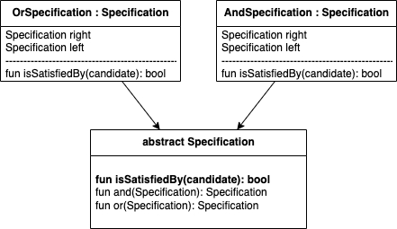

# Introduction of Specification Pattern

* Status: proposed
* Date: 2022-03-31

## Context and Problem Statement

During the implementation of Headless Checkout [Pull Request](https://github.com/Sylius/Sylius/pull/13793) we encountered
need to use Specification pattern as there are multiple business requirements that must be met before completing checkout.

### What Headless Checkout is?
Current checkout system is highly coupled with UI, therefore to maintain current checkout system, but use it via API
user had to make at least 5 requests in specific order (add to cart, address, payment select, shipping select, complete).
The new concept would reduce amount of requests to the API and get rid of the order requirement.

## Decision Drivers

* User must be able to create, change and extend logic of completing order requirements
* Solution may be generic (abstract) from implementation
* Specification or Composite must be able to be passed via Dependency Injection  

## Considered Options

### Option 1 - Tree-Based Specification Pattern
#### Diagram


#### Code Example

```php
abstract class Specification
{
    public abstract function isSatisfiedBy(object $candidate): bool;
    
    public function and(Specification $specification): Specification
    {
        return new AndSpecification($this, $specification);
    }
    
    public function or(Specification $specification): Specification
    {
        return new OrSpecification($this, $specification);
    }
}

final class OrSpecification extends Specification
{
    public function __construct(
        private Specification $left,
        private Specification $right,
    ) {
    }

    public function isSatisfiedBy(object $candidate): bool
    {
        return $this->left->isSatisfiedBy($candidate) || $this->right->isSatisfiedBy($candidate);
    }
}

final class AndSpecification extends Specification
{
    public function __construct(
        private Specification $left,
        private Specification $right,
    ) {
    }

    public function isSatisfiedBy(object $candidate): bool
    {
        return $this->left->isSatisfiedBy($candidate) && $this->right->isSatisfiedBy($candidate);
    }
}

final class Guard
{
    /**
     * @param iterable<Specification> $requirements
     */
    public function __construct(
        private iterable $requirements
    ) {
    }

    public function isSatisfiedByIterableApproach(OrderInterface $order): bool
    {
        // Iterable approach
        foreach ($this->requirements as $requirement) {
            if (!$requirement->isSatisfiedBy($order)) {
                return false;
            }
        }

        return true;
    }

    public function isSatisfiedByDynamicTreeApproach(OrderInterface $order): bool
    {
        // Dynamic Tree approach
        $first = array_shift($this->requirements);

        foreach ($this->requirements as $requirement) {
           $first = $first->and($requirement);
        }

        return $first->isSatisfiedBy($order);
    }
}
```
DI example
```xml
```

* Good, because [argument a]
* Bad, because [argument b]
* … <!-- numbers of pros and cons can vary -->

### Option 2

```php
interface SpecificationInterface
{
    public function isSatisfiedBy(object $candidate): bool;
}

final class AndSpecification implements SpecificationInterface
{
    /** @var array<int,SpecificationInterface> */
    private array $specifications;

    public function __construct(SpecificationInterface ...$specifications)
    {
        $this->specifications = $specifications;
    }

    public function isSatisfiedBy(object $candidate): bool
    {
        foreach ($this->specifications as $specification) {
            if (!$specification->isSatisfiedBy($candidate)) {
                return false;
            }
        }

        return true;
    }
}

final class OrSpecification implements SpecificationInterface
{
    /** @var array<int,SpecificationInterface> */
    private array $specifications;

    public function __construct(SpecificationInterface ...$specifications)
    {
        $this->specifications = $specifications;
    }

    public function isSatisfiedBy(object $candidate): bool
    {
        foreach ($this->specifications as $specification) {
            if ($specification->isSatisfiedBy($candidate)) {
                return true;
            }
        }

        return false;
    }
}

final class Guard
{
    public function __construct(
        private SpecificationInterface $requirement
    ) {
    }

    public function isSatisfiedBy(OrderInterface $order): bool
    {
        return $this->requirement->isSatisfiedBy($order);
    }
}

new OrSpecification(
    new AndSpecification(
        new XSpecification(),
        new YSpecification(),
    ),
    new ZSpecification(),
);
```


DI example
```xml
```

* Good, because [argument a]
* Bad, because [argument b]
* … <!-- numbers of pros and cons can vary -->
* Good, because Guards may not be needed

## Decision Outcome

Chosen option: "[option 1]", because [justification. e.g., only option, which meets k.o. criterion decision driver | which resolves force force | … | comes out best (see below)].

## References <!-- optional -->

* [Link type] [Link to ADR] <!-- example: Refined by [ADR-0005](0005-example.md) -->
* … <!-- numbers of links can vary -->
