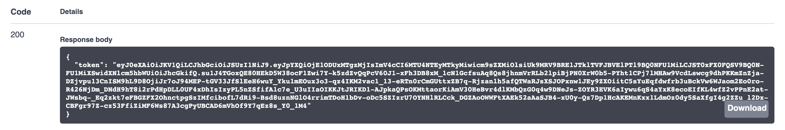
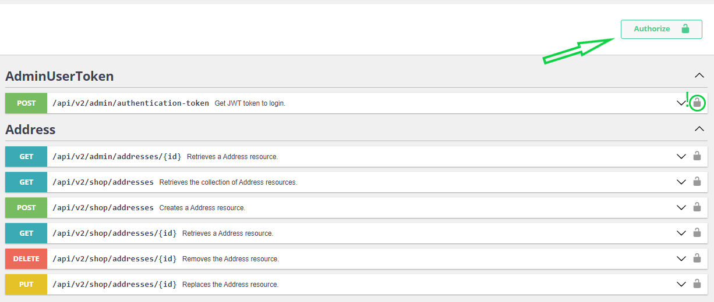

The Sylius API
==============

.. warning::

    The new, unified Sylius API is still under development.

We have decided that we should rebuild our API and use API Platform to build a truly mature, multi-purpose API
which can define a new standard for headless e-commerce backends.

We will be supporting API Platform out-of-the-box. Secondly, it means that both APIs (Admin API and Shop API) will
be deprecated. We are not dropping them right now, but they will not receive further development. In the later phase,
we should provide an upgrade path for currently working apps. Last, but not least, you can already track our progress.
All the PR’s will be aggregated `in this issue <https://github.com/Sylius/Sylius/issues/11250>`_ and the documentation
can be already found `here <http://master.demo.sylius.com/new-api/docs>`_.

Authorization
-------------

In the new API all admin routes are protected by JWT authentication. If you would like to test these endpoints
`in our Swagger UI docs <http://master.demo.sylius.com/new-api/docs>`_, you need to retrieve a JWT token first.
You could do that by using an endpoint with default credentials for API administrators:

.. image:: ../_images/sylius_api/api_platform_authentication_endpoint.png
    :align: center
    :scale: 50%

|

In the response, you will get a token that has to be passed in each request header. In the Swagger UI, you can set
the authentication token for each request.

|

Notice the **Authorize** button and unlocked padlock near the available URLs:

|

Click the **Authorize** button and put the authentication token (remember about the ``Bearer`` prefix):

.. image:: ../_images/sylius_api/api_platform_authorization.png
    :align: center
    :scale: 50%

|

After clicking **Authorize**, you should see locked padlock near URLs and the proper header should be added to each API call:

.. image:: ../_images/sylius_api/api_platform_authorized.png
    :align: center
    :scale: 50%

|

The Admin API
-------------

This part of the documentation is about the old Admin API for the Sylius platform.

.. toctree::
    :hidden:

    admin_api/index

.. include:: /api/admin_api/map.rst.inc
