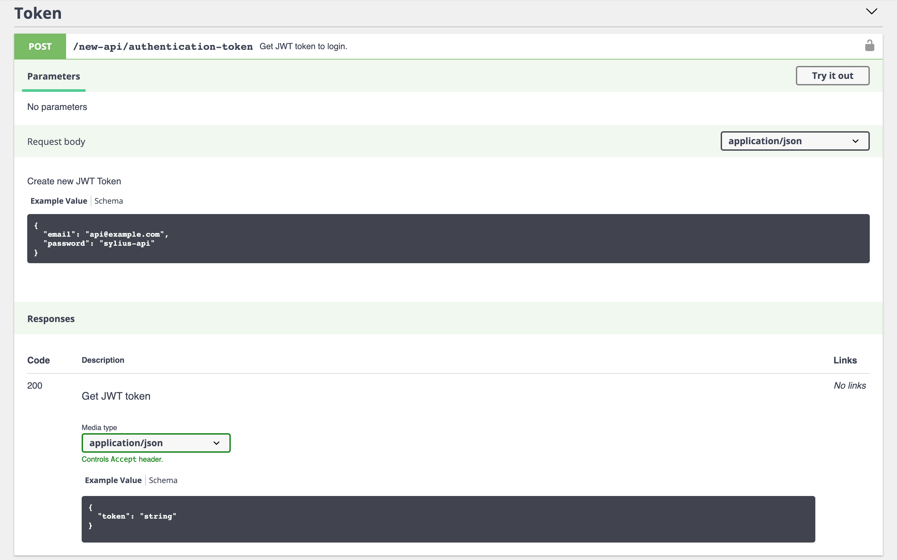
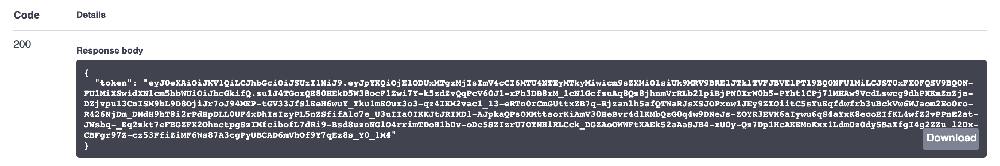
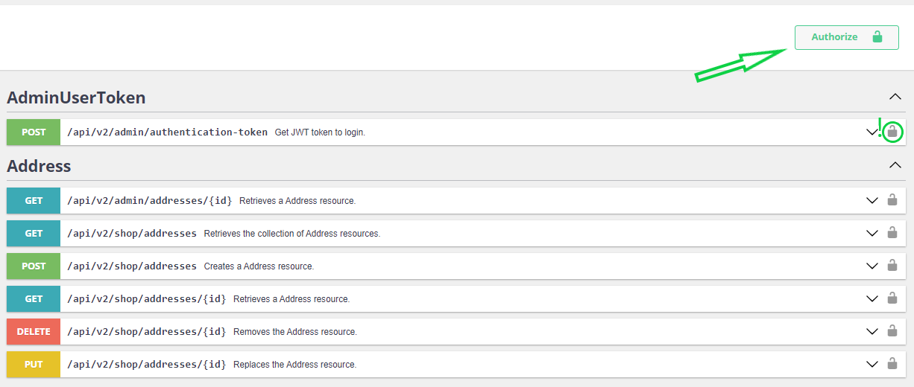
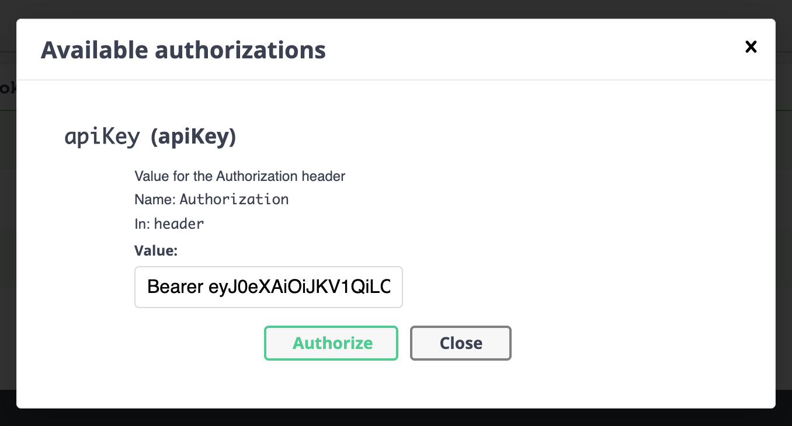
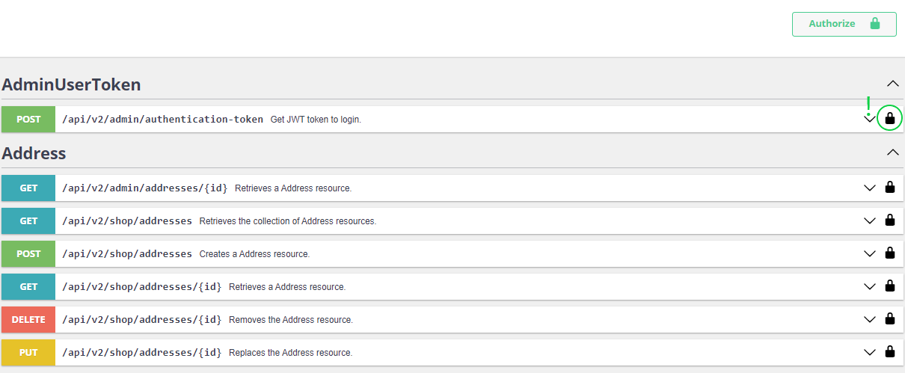

Authorization
=============

In the new API all admin routes are protected by JWT authentication. If you would like to test these endpoints
`in our Swagger UI docs <http://master.demo.sylius.com/api/v2/docs>`_, you need to retrieve a JWT token first.
You could do that by using an endpoint with default credentials for API administrators:

|

In the response, you will get a token that has to be passed in each request header. In the Swagger UI, you can set
the authentication token for each request.

|

Notice the **Authorize** button and unlocked padlock near the available URLs:

|

Click the **Authorize** button and put the authentication token (remember about the ``Bearer`` prefix):

|

After clicking **Authorize**, you should see locked padlock near URLs and the proper header should be added to each API call:

