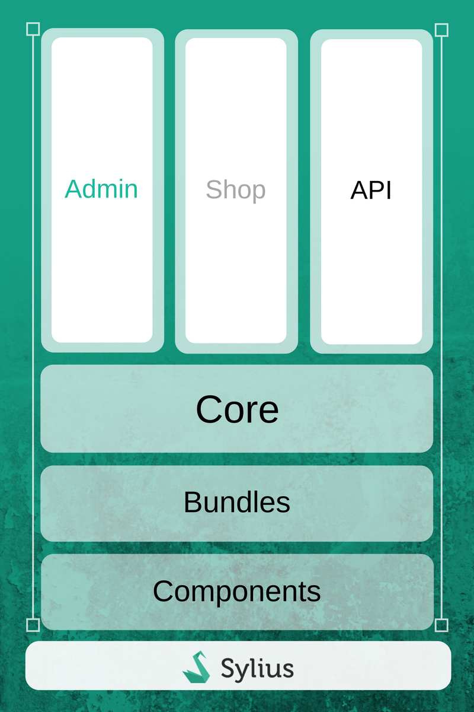

.. index::
   single: Architecture

Architecture Overview
=====================

Before we dive separately into every Sylius concept, you need to have an overview of how our main application is structured.
You already know that Sylius is built from components and Symfony bundles, which are integration layers with the framework.

All bundles share the same conventions for naming things and the way of data persistence. Sylius, by default, uses the Doctrine ORM for managing all entities.

For deeper understanding of how Doctrine works, please refer to the `excellent documentation on their official website <http://doctrine-orm.readthedocs.org/en/latest/>`_.

Fullstack Symfony
-----------------

**Sylius** is based on Symfony, which is a leading PHP framework to create web applications. Using Symfony allows
developers to work better and faster by providing them with certainty of developing an application that is fully compatible
with the business rules, that is structured, maintainable and upgradable, but also it allows to save time by providing generic re-usable modules.

`Learn more about Symfony <http://symfony.com/what-is-symfony>`_.

Doctrine
--------

**Doctrine** is a family of PHP libraries focused on providing data persistence layer.
The most important are the object-relational mapper (ORM) and the database abstraction layer (DBAL).
One of Doctrine's key features is the possibility to write database queries in Doctrine Query Language (DQL) - an object-oriented dialect of SQL.

To learn more about Doctrine - see `their documentation <http://www.doctrine-project.org/about.html>`_.

Twig
----

**Twig** is a modern template engine for PHP that is really fast, secure and flexible. Twig is being used by Symfony.

To read more about Twig, `go here <http://twig.sensiolabs.org/>`_.

Architecture
------------

On the below image you can see the symbolic representation of Sylius architecture.

|

Keep on reading this chapter to learn more about each of its parts: Shop, Admin, API, Core, Components and Bundles.

Division into Components, Bundles, Platform
-------------------------------------------

Components
~~~~~~~~~~

Every single component of Sylius can be used standalone. Taking the ``Taxation`` component as an example,
it's only responsibility is to calculate taxes, it does not matter whether these will be taxes for products or anything else, it is fully decoupled.
In order to let the Taxation component operate on your objects you need to have them implementing the ``TaxableInterface``.
Since then they can have taxes calculated.
Such approach is true for every component of Sylius.
Besides components that are strictly connected to the e-commerce needs, we have plenty of components that are more general. For instance Attribute, Mailer, Locale etc.

All the components are packages available via `Packagist <https://packagist.org/>`_.

:doc:`Read more about the Components </components/index>`.

Bundles
~~~~~~~

These are the Symfony Bundles - therefore if you are a Symfony Developer, and you would like to use the Taxation component in your system,
but you do not want to spend time on configuring forms or services in the container. You can include the ``TaxationBundle`` in your application
with minimal or even no configuration to have access to all the services, models, configure tax rates, tax categories and use that for any taxes you will need.

:doc:`Read more about the Bundles </bundles/index>`.

Platform
~~~~~~~~

This is a fullstack Symfony Application, based on Symfony Standard. Sylius Platform gives you the classic, quite feature rich webshop.
Before you start using Sylius you will need to decide whether you will need a full platform with all the features we provide, or maybe you will use decoupled bundles and components
to build something very custom, maybe smaller, with different features.
But of course the platform itself is highly flexible and can be easily customized to meet all business requirements you may have.

.. _division-into-core-shop-admin-api:

Division into Core, Admin, Shop, Api
------------------------------------

Core
~~~~

The Core is another component that integrates all the other components. This is the place where for example the ``ProductVariant`` finally learns that it has a ``TaxCategory``.
The Core component is where the ``ProductVariant`` implements the ``TaxableInterface`` and other interfaces that are useful for its operation.
Sylius has here a fully integrated concept of everything that is needed to run a webshop.
To get to know more about concepts applied in Sylius - keep on reading :doc:`The Book </book/index>`.

Admin
~~~~~

In every system with the security layer the functionalities of system administration need to be restricted to only some users with a certain role - Administrator.
This is the responsibility of our ``AdminBundle`` although if you do not need it, you can turn it off. Views have been built using the `SemanticUI <http://semantic-ui.com/>`_.

Shop
~~~~

Our ``ShopBundle`` is basically a standard B2C interface for everything that happens in the system.
It is made mainly of yaml configurations and templates.
Also here views have been built using the `SemanticUI <http://semantic-ui.com/>`_.

Api
~~~

Our API uses the REST approach. Since our controllers are format agnostic they have become reusable in the API.
Therefore if you request products in the shop frontend you are using exactly the same action as when you are placing the api request.
Read more about our API in the :doc:`Sylius API Guide </api/index>`.

Third Party Libraries
---------------------

Sylius uses a lot of libraries for various tasks:

* `Payum <https://github.com/Payum/Payum>`_ for payments
* `KnpMenu <http://symfony.com/doc/current/bundles/KnpMenuBundle/index.html>`_ - for shop and admin menus
* `Gaufrette <https://github.com/KnpLabs/Gaufrette>`_ for filesystem abstraction (store images locally, Amazon S3 or external server)
* `Imagine <https://github.com/liip/LiipImagineBundle>`_ for images processing, generating thumbnails and cropping
* `Pagerfanta <https://github.com/whiteoctober/Pagerfanta>`_ for pagination
* `Winzou State Machine <https://github.com/winzou/StateMachineBundle>`_ -  for the state machines handling
