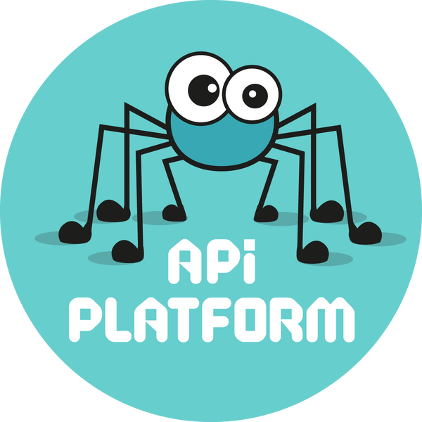

.. index::
   single: Architectural Drivers

Architectural Drivers
=====================

Architectural Drivers are the key factors that influence all the decisions we take during the application development.
Historically, a lot of them were taken unconsciously, but, happily, resulted in good decisions that we can undoubtedly justify
today. All of them have a significant influence on the Sylius as an application - they can and should be used to guide us
during the development, to take the best decision for the product.

Technical constraints
---------------------

Programming language
~~~~~~~~~~~~~~~~~~~~

**PHP**

Due to the decision to base Sylius on the **Symfony** framework (see below), **PHP** was the only possible option as
a programming language. Nevertheless, a good decision! This language is dynamically developing for the last few years and
still power up most of the websites and application in the world wide web.

Currently supported PHP versions can be seen in `this chapter <https://docs.sylius.com/en/1.11/book/installation/requirements.html#php-required-modules-and-configuration>`_.

Main frameworks and libraries
~~~~~~~~~~~~~~~~~~~~~~~~~~~~~

**Fullstack Symfony**

.. image:: ../../_images/symfonyfs.png
    :scale: 15%
    :align: center

Sylius is based on Symfony, which is a leading PHP framework to create web applications. Using Symfony allows
developers to work better and faster by providing them with certainty of developing an application that is fully compatible
with the business rules, that is structured, maintainable and upgradable. Also it allows to save time by providing generic re-usable modules.

`Learn more about Symfony <https://symfony.com/what-is-symfony>`_.

**Doctrine**

.. image:: ../../_images/doctrine.png
    :align: center

Sylius, by default, uses the Doctrine ORM for managing all entities. Doctrine is a family of PHP libraries focused on providing data persistence layer.
The most important are the object-relational mapper (ORM) and the database abstraction layer (DBAL).
One of Doctrine's key features is the possibility to write database queries in Doctrine Query Language (DQL) - an object-oriented dialect of SQL.

For deeper understanding of how Doctrine works, please refer to the `excellent documentation on their official website <http://doctrine-orm.readthedocs.org/en/latest/>`_.

**Twig**

.. image:: ../../_images/twig.png
    :scale: 30%
    :align: center

Twig is a modern template engine for PHP that is really fast, secure and flexible. Twig is being used by Symfony.

To read more about Twig, `go here <http://twig.sensiolabs.org/>`_.

**API Platform**

API Platform is a modern solution for developing high quality APIs. API Platform works by default with Symfony and depends on its components.

**Third Party Libraries**

Sylius uses a lot of libraries for various tasks:

* `Payum <https://github.com/Payum/Payum>`_ for payments
* `KnpMenu <https://symfony.com/doc/current/bundles/KnpMenuBundle/index.html>`_ - for shop and admin menus
* `Flysystem <https://github.com/thephpleague/flysystem>`_ for filesystem abstraction (store images locally, Amazon S3 or external server)
* `Imagine <https://github.com/liip/LiipImagineBundle>`_ for images processing, generating thumbnails and cropping
* `Pagerfanta <https://github.com/whiteoctober/Pagerfanta>`_ for pagination
* `Winzou State Machine <https://github.com/winzou/StateMachineBundle>`_ -  for the state machines handling

Functional requirements
-----------------------

All of the functionality provided by default with Sylius is described as user stories using Behat scenarios. Take a look
`here <https://github.com/Sylius/Sylius/tree/1.11/features>`_ to browse them.

Quality attributes
------------------

Sylius focuses a lot on the software quality since its very beginning. We use test-driven methodologies like
:doc:`TDD and BDD </bdd/index>` to ensure reliability of the provided functionalities. Moreover, as Sylius is not the
end-project (it rarely used in a *vanilla* version), but serves as the base for the actual applications, it's crucial
to take care about its ability to fulfill such a role.

Extendability
~~~~~~~~~~~~~

Sylius offers a lot of standard e-commerce features, that could and should be used as a base to introduce more advanced
and business-specific functionalities.

**Question to be asked:** is it possible to easily add new, more advanced functionality to the module/class/service I implement?
**Examples:**

* promotions `actions <https://github.com/Sylius/Sylius/blob/1.11/src/Sylius/Bundle/CoreBundle/Resources/config/services/promotion.xml#L65>`_ and
  `rules <https://github.com/Sylius/Sylius/blob/1.11/src/Sylius/Bundle/PromotionBundle/Resources/config/services.xml#L39>`_ registered with tags
* state machine `callbacks <https://github.com/Sylius/Sylius/blob/1.11/src/Sylius/Bundle/CoreBundle/Resources/config/app/state_machine/sylius_order.yml#L22>`_
* resource `events <https://github.com/Sylius/SyliusResourceBundle/blob/1.10/src/Bundle/Controller/ResourceController.php#L175>`_

Customizability
~~~~~~~~~~~~~~~

Seemingly similar to the previous one, but essentially different. Focuses on making it possible to override the standard functionality
with a different one, while still keeping the whole process working. The most important (but not the only) steps to reach it is
using interfaces with small, focused and granular services.
Customizability should be kept on all levels - from the single service, to the whole module/component.

**Question to be asked:** is it possible to replace this functionality and do not break the whole process?
**Examples:**

* service for `calculating variant price <https://github.com/Sylius/Sylius/blob/1.11/src/Sylius/Component/Core/Calculator/ProductVariantPriceCalculator.php>`_ that
  can be overridden to provide more advances pricing strategies
* `resource configuration <https://github.com/Sylius/SyliusResourceBundle/blob/1.10/docs/reference.md#configuration-reference>`_, that gives possibility to configure
  any service as resource-specific controller/factory/repository etc.

Testability
~~~~~~~~~~~

As mentioned before, Sylius embraces test-driven methodologies from its very beginning. Therefore, every class (with some exceptions) should be described with
unit tests, every functionality should be designed through Behat acceptance scenarios. Highly tested code is crucial to ensure other, also important
driver, which is **reliability** of the software.

**Question to be asked:** is my module/class easy to be tested, to protect it from the potential regression?

As history has shown, if something is difficult to be tested, there is a huge chance it's not designed or written properly.

Sources and inspirations
------------------------

This chapter was created inspired by the following sources:

* `Architectural Drivers in Modern Software Architecture <https://medium.com/@janerikfra/architectural-drivers-in-modern-software-architecture-cb7a42527bf2>`_ by Erik Franzen
* `Modular Monolith: Architectural Drivers <http://www.kamilgrzybek.com/design/modular-monolith-architectural-drivers/>`_ by Kamil Grzybek
* [PL] `Droga Nowoczesnego Architekta <https://droganowoczesnegoarchitekta.pl/>`_ - online course for software architects and engineers
