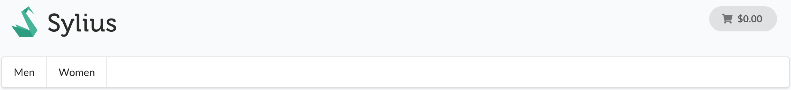

.. index::
   single: Channels

Channels
========

In the modern world of e-commerce your website is no longer the only point of sale for your goods.

**Channel** model represents a single sales channel, which can be one of the following things:

* Webstore
* Mobile application
* Cashier in your physical store

Or pretty much any other channel type you can imagine.

**What may differ between channels?** Particularly anything from your shop configuration:

* products,
* currencies,
* locales (language),
* countries,
* themes,
* hostnames,
* taxes,
* payment and shipping methods,
* menu.

A **Channel** has a ``code``, a ``name`` and a ``color``.

In order to make the system more convenient for the administrator - there is just one, shared admin panel. Also users are shared among the channels.

.. tip::

   In the dev environment you can easily check what channel you are currently on in the Symfony debug toolbar.

   .. image:: ../../_images/channel_toolbar.png
    :align: center

Different menu root
-------------------

By default, Sylius will render the same menu for all channels defined in the store, which will be all the children of the
taxon with the code `category`. You can customize this behaviour by specifying a menu taxon in the "Look & feel" section
of desired channel.

With this configuration, this particular channel will expose a menu starting from the children of the chosen taxon
(T-Shirt taxon in this example):

Rest of the channels will still render only children of `category` taxon.

**How to get the current channel?**

You can get the current channel from the channel context.

.. code-block:: php

   $channel = $this->container->get('sylius.context.channel')->getChannel();

.. warning::

   Beware! When using multiple channels, remember to configure ``hostname`` for **each** of them.
   If missing, default context would not be able to provide appropriate channel and it will result in an error.

.. note::

   The channel is by default determined basing on the hostname, but you can customize that behaviour.
   To do that you have to implement the ``Sylius\Component\Channel\Context\ChannelContextInterface``
   and register it as a service under the ``sylius.context.channel`` tag. You should also add a ``priority="64"``
   since the default ChannelContext has a ``priority="0"`` (and by default a ``priority="0"`` is assigned).

.. note::

   Moreover if the channel depends mainly on the request you can implement the ``Sylius\Component\Channel\Context\RequestBased\RequestResolverInterface``
   with its ``findChannel(Request $request)`` method and register it under the ``sylius.context.channel.request_based.resolver`` tag.

Shop Billing Data
-----------------

For :doc:`Invoicing </book/orders/invoices>` and :doc:`Credit Memo </book/orders/refunds>` purposes Channels are
supplied with a section named Shop Billing Data, which is editable on the Channel create/update form.

.. image:: ../../_images/shop_billing_data.png
    :align: center

.. rst-class:: plus-doc

Business Units
~~~~~~~~~~~~~~

Sylius Plus is supplied with an enhanced version of Shop Billing Data from Sylius CE. It is also used for Invoicing and Refunds purposes,
but it is a separate entity, that you can create outside of the Channel and then just pick a previously created Business Unit
on the Channel form.

.. image:: ../../_images/sylius_plus/banner.png
    :align: center
    :target: https://sylius.com/plus/?utm_source=docs

Learn more
----------

* :doc:`Channel - Component Documentation </components_and_bundles/components/Channel/index>`.
