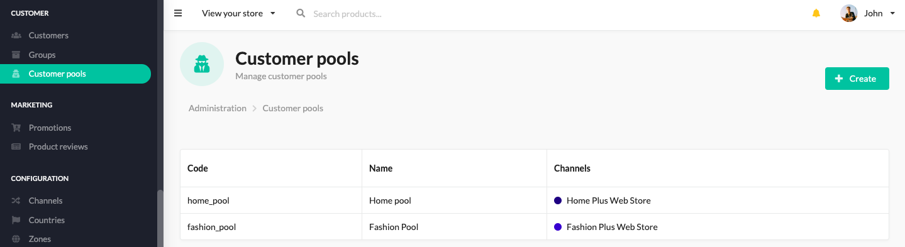

.. rst-class:: plus-doc

Customer Pools
==============

Customer Pool is a collection of Customers that is assigned to a specific channel. Thanks to this concept, if you have two
channels, each of them has a separate customer pool, then customers that have accounts in channel A, and have not registered in channel B,
will not be able to log in to channel B with credentials they have specified in channel A (which is the behaviour happening in
Sylius CE). This feature allows you to sell via multiple channels, creating a illusion of shopping in
completely different stores, while you still have one administration panel.

Managing Customer Pools
-----------------------

Customer pools management is available in the administration panel in the Customers section.

New customer pools can be added through the admin UI in the section Customer pools or via fixtures,
as it is configured in ``src/Resource/config/fixtures.yaml`` for the ``plus`` fixture suite.

The configuration looks like that:

.. code-block:: yaml

   sylius_fixtures:
       suites:
           default:
               fixtures:
                   customer_pool:
                       priority: 1
                       options:
                           custom:
                               default:
                                   name: "Default"
                                   code: "default"

Customer Pool can be assigned to a Channel, but only during its _creation_ in Admin panel. Currently it is not possible
to modify the User Pool after the channel is created, as it would lead to certain edge cases with customers losing access to channels,
after improper admin operations.

There is also a possibility to choose a specific customer pool during channel or shop customer creation in fixtures
(remember to create a customer pool before assigning it to a channel):

.. code-block:: yaml

   sylius_fixtures:
       suites:
           default:
               fixtures:
                   channel:
                       options:
                           custom:
                               mobile:
                                   name: "Mobile"
                                   code: "mobile"
                                   locales:
                                       - "en_US"
                                   currencies:
                                       - "USD"
                                   customer_pool: "default"
                                   enabled: true
                   shop_user:
                       options:
                           custom:
                               -
                                   email: "plus@example.com"
                                   first_name: "John"
                                   last_name: "Doe"
                                   password: "sylius"
                                   customer_pool: "default"

How to create a Customer Pool programmatically?
-----------------------------------------------

As usual, use a factory. The only required fields for the CustomerPool entity are ``code`` and ``name``, provide them
before adding it to the repository.

.. code-block:: php

   /** @var CustomerPoolInterface $customerPool */
   $customerPool = $this->container->get('sylius_plus.factory.customer_pool')->createNew();

   $customerPool->setCode('HOME_POOL');
   $customerPool->setName('Home Pool');

   $this->container->get('sylius_plus.repository.customer_pool')->add($customerPool);

In order to assign a Customer Pool to a Channel programmatically use this simple trick:

.. code-block:: php

   // given that you have a $channel from repository, and a $customerPool just created above

   $channel->setCustomerPool($customerPool);

Learn more
----------

* :doc:`Channels - Concept Documentation </book/configuration/channels>`

.. image:: ../../_images/sylius_plus/banner.png
   :align: center
   :target: https://sylius.com/plus/?utm_source=docs
