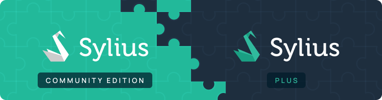

.. index::
   single: Introduction

Introduction to Sylius
======================

Sylius is a game-changing e-commerce solution for PHP, based on the Symfony framework.

Philosophy
----------

Sylius is completely open source (MIT license) and free, maintained by a diverse and creative community of developers and companies.

What are our core values and what makes us different from other solutions?

* Components based approach
* Unlimited flexibility and simple customization
* Developer-friendly, using latest technologies
* Developed using best practices and BDD approach
* `Highest quality of code <https://scrutinizer-ci.com/g/Sylius/Sylius/>`_

And much more, but we will let you discover it yourself.

|

Sylius Community Edition (CE)
^^^^^^^^^^^^^^^^^^^^^^^^^^^^^

The free, open source distribution of Sylius that can be found in the `Sylius/Sylius <https://github.com/Sylius/Sylius>`_ repository
is called the Community Edition, abbreviated **Sylius CE**.

Sylius Plus
^^^^^^^^^^^

There exists a commercial edition of Sylius, which is called `Sylius Plus <https://sylius.com/plus/>`_.

Sylius Plus gives you all the power of Open Source and much more. It comes with a set of enterprise-grade features
and technical support from its creators. As the state-of-the-art eCommerce platform, it reduces risks and increases your ROI.

In this documentation you will find also chapters dedicated to features introduced by the Sylius Plus edition, they will
be marked with a frame just like this section.

The Three Natures of Sylius
---------------------------

Sylius is constructed from fully decoupled and flexible e-commerce components for PHP. It is also a set of Symfony bundles, which integrate the components into the full-stack framework.
On top of that, Sylius is also a complete e-commerce platform crafted from all these building blocks.

It is your choice how to use Sylius, you can benefit from the components with any framework, integrate selected bundles into existing or new Symfony app or built your application on top of Sylius platform.

Sylius Platform
---------------

This book is about our **full-stack e-commerce platform**, which is a standard Symfony application providing the most common webshop and a foundation for custom systems.

Leveraging Symfony Bundles
--------------------------

If you prefer to build your very custom system step by step and from scratch, you can integrate the standalone Symfony bundles. For the installation instructions, please refer to the appropriate bundle documentation.

E-Commerce Components for PHP
-----------------------------

If you use a different framework than Symfony, you are welcome to use Sylius components, which will make it much easier to implement a webshop with any PHP application and project.
They provide you with default models, services and logic for all aspects of e-commerce, completely separated and ready to use.

Roadmap
-------

Are you wondering about Sylius plans for the next releases? If so then you should follow our `Roadmap <https://sylius.com/roadmap>`_.
Through our :doc:`Slack </book/support/index>` you can contribute by conversation and votes on the most desired features and improvements.

Final Thoughts
--------------

Depending on how you want to use Sylius, continue reading The Book, which
covers the usage of the full stack solution, browse the Bundles Reference or learn about The Components.
