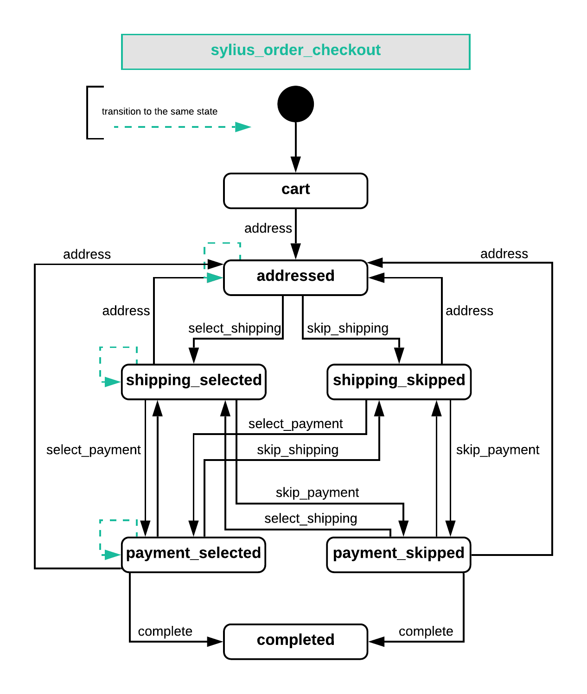

.. index::
   single: Checkout

Checkout
========

**Checkout** is a process that begins when the Customer decides to finish their shopping and pay for their order.
The process of specifying address, payment and a way of shipping transforms the **Cart** into an **Order**.

Checkout State Machine
----------------------

The Order Checkout state machine has 5 states available: ``cart``, ``addressed``, ``shipping_selected``, ``payment_selected``, ``completed``
and a set of defined transitions between them.
These states are saved as the **checkoutState** of the **Order**.

Besides the steps of checkout, each of them can be done more than once. For instance if the Customer changes their mind
and after selecting payment they want to change the shipping address they have already specified, they can of course go back and readdress it.

The transitions on the order checkout state machine are:

.. code-block:: yaml

   transitions:
      address:
          from: [cart]
          to: addressed
      readdress:
          from: [payment_selected, shipping_selected, addressed]
          to: cart
      select_shipping:
          from: [addressed]
          to: shipping_selected
      reselect_shipping:
          from: [payment_selected, shipping_selected]
          to: addressed
      select_payment:
          from: [shipping_selected]
          to: payment_selected
      reselect_payment:
          from: [payment_selected]
          to: shipping_selected
      complete:
          from: [payment_selected]
          to: completed

Steps of Checkout
-----------------

Checkout in Sylius is divided into 4 steps. Each of these steps occurs when the Order goes into a certain state.
See the Checkout state machine in the `state_machine.yml <https://github.com/Sylius/Sylius/blob/master/src/Sylius/Bundle/CoreBundle/Resources/config/app/state_machine.yml>`_
together with the routing file for checkout: `checkout.yml <https://github.com/Sylius/Sylius/blob/master/src/Sylius/Bundle/ShopBundle/Resources/config/routing/checkout.yml>`_.

.. note::

    Before performing Checkout :doc:`you need to have an Order created </book/orders/orders>`.

Addressing
~~~~~~~~~~

This is a step where the customer provides both **shipping and billing addresses**.

+--------------------------+----------------------------------------------------+
| Transition after step    | Template                                           |
+--------------------------+----------------------------------------------------+
| ``cart``-> ``addressed`` | ``SyliusShopBundle:Checkout:addressing.html.twig`` |
+--------------------------+----------------------------------------------------+

How to perform the Addressing Step programmatically?
''''''''''''''''''''''''''''''''''''''''''''''''''''

Firstly if the **Customer** is not yet set on the Order it will be assigned depending on the case:

* An already logged in **User** - the Customer is set for the Order using the `CartBlamerListener <https://github.com/Sylius/Sylius/blob/master/src/Sylius/Bundle/CoreBundle/EventListener/CartBlamerListener.php>`_, that determines the user basing on the event.
* An existent **User** that is not logged in - If there is an account in the system registered under the e-mail that has been provided - they are asked for a password to log in before continuing inside the addressing form.
* A **Customer** that was present in the system before (we've got their e-mail) - the Customer instance is updated via cascade, the order is assigned to it.
* A new **Customer** with unknown e-mail - a new Customer instance is created and assigned to the order.

.. hint::

    If you do not understand the Users and Customers concept in Sylius go to the :doc:`Users Concept documentation </book/customers/customer_and_shopuser>`.

The typical **Address** consists of: country, city, street and postcode - to assign it to an Order either create it manually or retrieve from the repository.

.. code-block:: php

     /** @var AddressInterface $address */
     $address = $this->container->get('sylius.factory.address')->createNew();

     $address->setFirstName('Anne');
     $address->setLastName('Shirley');
     $address->setStreet('Avonlea');
     $address->setCountryCode('CA');
     $address->setCity('Canada');
     $address->setPostcode('C0A 1N0');

     $order->setShippingAddress($address);
     $order->setBillingAddress($address);

Having the **Customer** and the **Address** set you can apply a state transition to your order.
Get the StateMachine for the Order via the StateMachineFactory with a proper schema, and apply a transition
and of course flush your order after that via the manager.

.. code-block:: php

    $stateMachineFactory = $this->container->get('sm.factory');

    $stateMachine = $stateMachineFactory->get($order, OrderCheckoutTransitions::GRAPH);
    $stateMachine->apply(OrderCheckoutTransitions::TRANSITION_ADDRESS);

    $this->container->get('sylius.manager.order')->flush();

**What happens during the transition?**

The method ``process($order)`` of the `CompositeOrderProcessor <https://github.com/Sylius/Sylius/blob/master/src/Sylius/Component/Core/OrderProcessing/CompositeOrderProcessor.php>`_ is run.

Selecting shipping
~~~~~~~~~~~~~~~~~~

It is a step where the customer selects the way their order will be shipped to them.
Basing on the ShippingMethods configured in the system the options for the Customer are provided together with their prices.

+---------------------------------------+--------------------------------------------------+
| Transition after step                 | Template                                         |
+---------------------------------------+--------------------------------------------------+
| ``addressed``-> ``shipping_selected`` | ``SyliusShopBundle:Checkout:shipping.html.twig`` |
+---------------------------------------+--------------------------------------------------+

How to perform the Selecting shipping Step programmatically?
''''''''''''''''''''''''''''''''''''''''''''''''''''''''''''

Before approaching this step be sure that your Order is in the ``addressed`` state. In this state your order
will already have a default ShippingMethod assigned, but in this step you can change it and have everything recalculated automatically.

Firstly either create new (see how in the `Shipments concept </book/orders/shipments>`_) or retrieve a **ShippingMethod**
from the repository to assign it to your order's shipment created defaultly in the addressing step.

.. code-block:: php

    // Let's assume you have a method with code 'DHL' that has everything set properly
    $shippingMethod = $this->container->get('sylius.repository.shipping_method')->findOneByCode('DHL');

    // Shipments are a Collection, so even though you have one Shipment by default you have to iterate over them
    foreach ($order->getShipments() as $shipment) {
        $shipment->setMethod($shippingMethod);
    }

After that get the StateMachine for the Order via the StateMachineFactory with a proper schema,
and apply a proper transition and flush the order via the manager.

.. code-block:: php

    $stateMachineFactory = $this->container->get('sm.factory');

    $stateMachine = $stateMachineFactory->get($order, OrderCheckoutTransitions::GRAPH)
    $stateMachine->apply(OrderCheckoutTransitions::TRANSITION_SELECT_SHIPPING);

    $this->container->get('sylius.manager.order')->flush();

**What happens during the transition?**

The method ``process($order)`` of the `CompositeOrderProcessor <https://github.com/Sylius/Sylius/blob/master/src/Sylius/Component/Core/OrderProcessing/CompositeOrderProcessor.php>`_ is run.
Here this method is responsible for: controlling the **shipping charges** which depend on the chosen ShippingMethod,
controlling the **promotions** that depend on the shipping method.

Skipping shipping step
''''''''''''''''''''''

What if in the order you have only products that do not require shipping (they are downloadable for example)?

.. note::

    When all of the :doc:`ProductVariants </book/products/products>` of the order have the ``shippingRequired``
    property set to ``false``, then Sylius assumes that the whole order **does not require shipping**,
    and **the shipping step of checkout will be skipped**.

Selecting payment
~~~~~~~~~~~~~~~~~

This is a step where the customer chooses how are they willing to pay for their order.
Basing on the PaymentMethods configured in the system the possibilities for the Customer are provided.

+----------------------------------------------+-------------------------------------------------+
| Transition after step                        | Template                                        |
+----------------------------------------------+-------------------------------------------------+
| ``shipping_selected``-> ``payment_selected`` | ``SyliusShopBundle:Checkout:payment.html.twig`` |
+----------------------------------------------+-------------------------------------------------+

How to perform the Selecting payment step programmatically?
'''''''''''''''''''''''''''''''''''''''''''''''''''''''''''

Before this step your Order should be in the ``shipping_selected`` state. It will have a default Payment selected after the addressing step,
but in this step you can change it.

Firstly either create new (see how in the `Payments concept </book/orders/payments>`_) or retrieve a **PaymentMethod**
from the repository to assign it to your order's payment created defaultly in the addressing step.

.. code-block:: php

    // Let's assume that you have a method with code 'paypal' configured
    $paymentMethod = $this->container->get('sylius.repository.payment_method')->findOneByCode('paypal');

    // Payments are a Collection, so even though you hve one Payment by default you have to iterate over them
    foreach ($order->getPayments() as $payment) {
        $payment->setMethod($paymentMethod);
    }

After that get the StateMachine for the Order via the StateMachineFactory with a proper schema,
and apply a proper transition and flush the order via the manager.

.. code-block:: php

    $stateMachineFactory = $this->container->get('sm.factory');

    $stateMachine = $stateMachineFactory->get($order, OrderCheckoutTransitions::GRAPH)
    $stateMachine->apply(OrderCheckoutTransitions::TRANSITION_SELECT_PAYMENT);

    $this->container->get('sylius.manager.order')->flush();

**What happens during the transition?**

The method ``process($order)`` of the
`CompositeOrderProcessor <https://github.com/Sylius/Sylius/blob/master/src/Sylius/Component/Core/OrderProcessing/CompositeOrderProcessor.php>`_
is run and checks all the adjustments on the order.
The method ``update($order)`` of the
`OrderExchangeRateAndCurrencyUpdater <https://github.com/Sylius/Sylius/blob/master/src/Sylius/Component/Core/OrderProcessing/OrderExchangeRateAndCurrencyUpdater.php>`_ is run.
Here this method is responsible for controlling the **exchangeRate** of the order's currency.

Finalizing
~~~~~~~~~~

In this step the customer gets an order summary and is redirected to complete the payment they have selected.

+--------------------------------------+-------------------------------------------------+
| Transition after step                | Template                                        |
+--------------------------------------+-------------------------------------------------+
| ``payment_selected``-> ``completed`` | ``SyliusShopBundle:Checkout:summary.html.twig`` |
+--------------------------------------+-------------------------------------------------+

How to complete Checkout programmatically?
''''''''''''''''''''''''''''''''''''''''''

Before executing the completing transition you can set some notes to your order.

.. code-block:: php

    $order->setNotes('Thank you dear shop owners! I am allergic to tape so please use something else for packaging.')

After that get the StateMachine for the Order via the StateMachineFactory with a proper schema,
and apply a proper transition and flush the order via the manager.

.. code-block:: php

    $stateMachineFactory = $this->container->get('sm.factory');

    $stateMachine = $stateMachineFactory->get($order, OrderCheckoutTransitions::GRAPH)
    $stateMachine->apply(OrderCheckoutTransitions::TRANSITION_COMPLETE);

    $this->container->get('sylius.manager.order')->flush();

**What happens during the transition?**

* The Order will have the **checkoutState** - ``completed``,
* The Order will have the general **state** - ``new`` instead of ``cart`` it has had before the transition,
* When the Order is transitioned from ``cart`` to ``new`` the **paymentState** is set to ``awaiting_payment`` and the **shippingState** to ``ready``

The Checkout is finished after that.

Checkout related events
-----------------------

On each step of checkout a dedicated event is triggered.

+-----------------------------------------+
| Event id                                |
+=========================================+
| ``sylius.order.pre_address``            |
+-----------------------------------------+
| ``sylius.order.post_address``           |
+-----------------------------------------+
| ``sylius.order.pre_select_shipping``    |
+-----------------------------------------+
| ``sylius.order.post_select_shipping``   |
+-----------------------------------------+
| ``sylius.order.pre_payment``            |
+-----------------------------------------+
| ``sylius.order.post_payment``           |
+-----------------------------------------+
| ``sylius.order.pre_complete``           |
+-----------------------------------------+
| ``sylius.order.post_complete``          |
+-----------------------------------------+

Learn more
----------

* :doc:`State Machine - Documentation </book/architecture/state_machine>`
* :doc:`Orders - Concept Documentation </book/orders/orders>`
