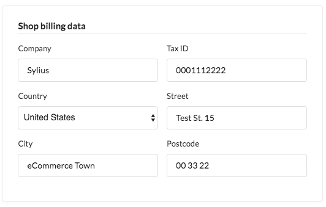

.. index::
   single: Invoices

.. rst-class:: plugin-feature

Invoices
========

An Invoice is a commercial document issued by the shop, that is a sort of confirmation of the sale transaction. It indicates the
products, quantities, agreed prices for these products. An invoice contains usually also payment terms (like due date,
or if it was already paid). From the shop's point of view, an invoice is a sales invoice. From the customer's point of view,
an invoice is a purchase invoice.

Invoicing in Sylius
-------------------

Sylius is providing invoicing engine via a `free open-source plugin. <https://github.com/Sylius/InvoicingPlugin>`_
The plugin installation guide you will find in the plugin's README.

Having the plugin installed, you will notice a new main menu item among "Sales" section - "Invoices". It allows you to access the index
of all invoices issued at your shop (sortable and with filters as most of the grids).

Moreover a section on admin Order show page is added: Invoices. This same section will appear also
on the Order show page for customers in the shop.

|

When is the Invoice issued?
~~~~~~~~~~~~~~~~~~~~~~~~~~~

The invoices are generated by default **when the Order is placed** (so after the customer clicks the Confirm button at the end of checkout).
After that the Invoice is already downloadable for both the Admin and Customer.

.. tip::

    In order to customize the moment when the Invoice is generated, you will need to override the logic around
    `a specific event listener and the OrderPlacedProducer. <https://github.com/Sylius/InvoicingPlugin/blob/master/src/Resources/config/services/events.xml#L13:L23>`

Sending and downloading Invoices
~~~~~~~~~~~~~~~~~~~~~~~~~~~~~~~~

Sending invoice is an action separate from its generation.
By default the Invoice is sent to customer **when the Order's payment is paid**.

Of course you can customize it by overriding a part of configuration placed in config.yml file.
You can customize this file by adding new state machine event listeners or editing existing ones.

Shop Billing Data
~~~~~~~~~~~~~~~~~

The Invoicing plugin for the invoicing sake is using a feature of Sylius Channels.
Each channel has a separate section for providing billing data of the shop, that will be placed on the invoice.

|

Learn more
----------

* `Sylius/InvoicingPlugin <https://github.com/Sylius/InvoicingPlugin>`_
* :doc:`Other Sylius plugins </book/plugins/index>`
