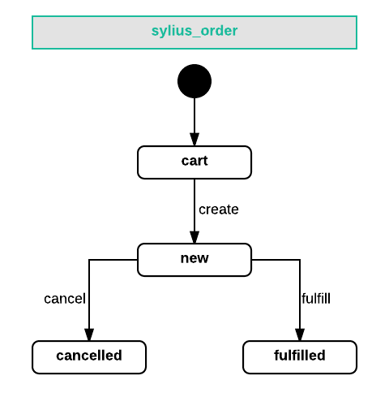
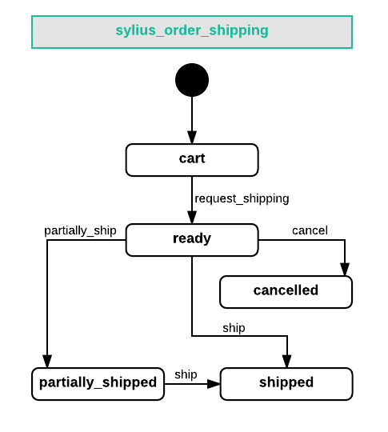
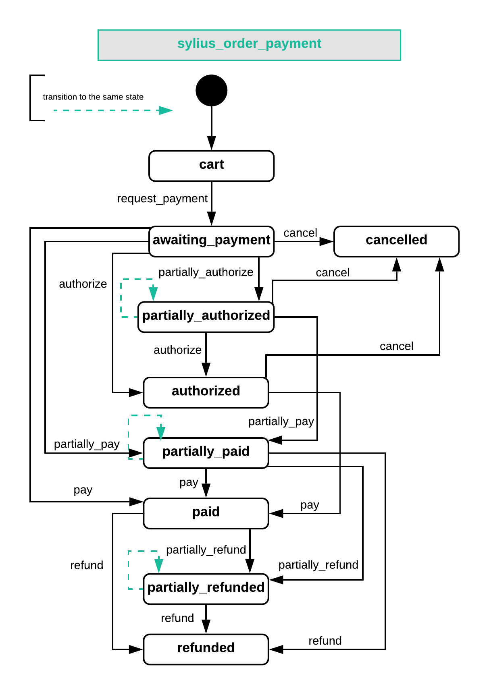

.. index::
   single: Orders

Orders
======

**Order** model is one of the most important in Sylius, where many concepts of e-commerce meet.
It represents an order that can be either placed or in progress (cart).

**Order** holds a collection of **OrderItem** instances, which represent products from the shop,
as its physical copies, with chosen variants and quantities.

Each Order is **assigned to the channel** in which it has been created. Moreover the **language** the customer was using
and the **currency with its exchange rate** at the moment of creation are saved.

How to create an Order programmatically?
----------------------------------------

To programmatically create an Order you will of course need a factory.

.. code-block:: php

    /** @var FactoryInterface $order */
    $orderFactory = $this->container->get('sylius.factory.order');

    /** @var OrderInterface $order */
    $order = $orderFactory->createNew();

Then get a channel to which you would like to add your Order. You can get it from the context or from the repository by code for example.

.. code-block:: php

    /** @var ChannelInterface $channel */
    $channel = $this->container->get('sylius.context.channel')->getChannel();

    $order->setChannel($channel);

Next give your order a locale code.

.. code-block:: php

    /** @var string $localeCode */
    $localeCode = $this->container->get('sylius.context.locale')->getLocaleCode();

    $order->setLocaleCode($localeCode);

And a currency code:

.. code-block:: php

    $currencyCode = $this->container->get('sylius.context.currency')->getCurrencyCode();

    $order->setCurrencyCode($currencyCode);

What is more the proper Order instance should also have the **Customer** assigned.
You can get it from the repository by email.

.. code-block:: php

    /** @var CustomerInterface $customer */
    $customer = $this->container->get('sylius.repository.customer')->findOneBy(['email' => 'shop@example.com']);

    $order->setCustomer($customer);

A very important part of creating an Order is adding **OrderItems** to it.
Assuming that you have a **Product** with a **ProductVariant** assigned already in the system:

.. code-block:: php

    /** @var ProductVariantInterface $variant */
    $variant = $this->container->get('sylius.repository.product_variant')->findOneBy([]);

    // Instead of getting a specific variant from the repository
    // you can get the first variant of off a product by using $product->getVariants()->first()
    // or use the **VariantResolver** service - either the default one or your own.
    // The default product variant resolver is available at id - 'sylius.product_variant_resolver.default'

    /** @var OrderItemInterface $orderItem */
    $orderItem = $this->container->get('sylius.factory.order_item')->createNew();
    $orderItem->setVariant($variant);

In order to change the amount of items use the **OrderItemQuantityModifier**.

.. code-block:: php

    $this->container->get('sylius.order_item_quantity_modifier')->modify($orderItem, 3);

Add the item to the order. And then call the **CompositeOrderProcessor** on the order to have everything recalculated.

.. code-block:: php

    $order->addItem($orderItem);

    $this->container->get('sylius.order_processing.order_processor')->process($order);

Finally you have to save your order using the repository.

.. code-block:: php

    /** @var OrderRepositoryInterface $orderRepository */
    $orderRepository = $this->container->get('sylius.repository.order');

    $orderRepository->add($order);

The Order State Machine
-----------------------

Order has also its own state, which can have the following values:

* ``cart`` - before the checkout is completed, it is the initial state of an Order,
* ``new`` - when checkout is completed the cart is transformed into a ``new`` order,
* ``fulfilled`` - when the order payments and shipments are completed,
* ``cancelled`` - when the order was cancelled.

.. tip::

    The state machine of order is an obvious extension to the :doc:`state machine of checkout </book/orders/checkout>`.

Shipments of an Order
---------------------

An **Order** in Sylius holds a collection of Shipments on it. Each shipment in that collection has its own shipping method and has its own state machine.
This lets you to divide an order into several different shipments that have own shipping states (like sending physical objects via DHL and sending a link to downloadable files via e-mail).

.. tip::

    If you are not familiar with the shipments concept :doc:`check the documentation</book/orders/shipments>`.

State machine of Shipping in an Order
~~~~~~~~~~~~~~~~~~~~~~~~~~~~~~~~~~~~~

How to add a Shipment to an Order?
~~~~~~~~~~~~~~~~~~~~~~~~~~~~~~~~~~

You will need to create a shipment, give it a desired shipping method and add it to the order.
Remember to process the order using order processor and then flush the order manager.

.. code-block:: php

    /** @var ShipmentInterface $shipment */
    $shipment = $this->container->get('sylius.factory.shipment')->createNew();

    $shipment->setMethod($this->container->get('sylius.repository.shipping_method')->findOneBy(['code' => 'UPS']));

    $order->addShipment($shipment);

    $this->container->get('sylius.order_processing.order_processor')->process($order);
    $this->container->get('sylius.manager.order')->flush();

Shipping costs of an Order
~~~~~~~~~~~~~~~~~~~~~~~~~~

Shipping costs of an order are stored as Adjustments. When a new shipment is added to a cart the order processor assigns
a shipping adjustment to the order that holds the cost.

Shipping a Shipment with a state machine transition
~~~~~~~~~~~~~~~~~~~~~~~~~~~~~~~~~~~~~~~~~~~~~~~~~~~

Just like in every state machine you can execute its transitions manually. To **ship** a shipment of an order you have to apply
two transitions ``request_shipping`` and ``ship``.

.. code-block:: php

    $stateMachineFactory = $this->container->get('sm.factory');

    $stateMachine = $stateMachineFactory->get($order, OrderShippingTransitions::GRAPH);
    $stateMachine->apply(OrderShippingTransitions::TRANSITION_REQUEST_SHIPPING);
    $stateMachine->apply(OrderShippingTransitions::TRANSITION_SHIP);

    $this->container->get('sylius.manager.order')->flush();

After that the ``shippingState`` of your order will be ``shipped``.

Payments of an Order
--------------------

An **Order** in Sylius holds a collection of Payments on it. Each payment in that collection has its own payment method and has its own payment state.
It lets you to divide paying for an order into several different methods that have own payment states.

.. tip::

    If you are not familiar with the Payments concept :doc:`check the documentation</book/orders/payments>`.

State machine of Payment in an Order
~~~~~~~~~~~~~~~~~~~~~~~~~~~~~~~~~~~~

How to add a Payment to an Order?
~~~~~~~~~~~~~~~~~~~~~~~~~~~~~~~~~

You will need to create a payment, give it a desired payment method and add it to the order.
Remember to process the order using order processor and then flush the order manager.

.. code-block:: php

    /** @var PaymentInterface $payment */
    $payment = $this->container->get('sylius.factory.payment')->createNew();

    $payment->setMethod($this->container->get('sylius.repository.payment_method')->findOneBy(['code' => 'offline']));

    $payment->setCurrencyCode($currencyCode);

    $order->addPayment($payment);

Completing a Payment with a state machine transition
~~~~~~~~~~~~~~~~~~~~~~~~~~~~~~~~~~~~~~~~~~~~~~~~~~~~

Just like in every state machine you can execute its transitions manually. To **pay** for a payment of an order you have to apply
two transitions ``request_payment`` and ``pay``.

.. code-block:: php

    $stateMachineFactory = $this->container->get('sm.factory');

    $stateMachine = $stateMachineFactory->get($order, OrderPaymentTransitions::GRAPH);
    $stateMachine->apply(OrderPaymentTransitions::TRANSITION_REQUEST_PAYMENT);
    $stateMachine->apply(OrderPaymentTransitions::TRANSITION_PAY);

    $this->container->get('sylius.manager.order')->flush();

**If it was the only payment assigned to that order** now the ``paymentState`` of your order will be ``paid``.

Learn more
----------

* :doc:`Order - Component Documentation </components/Order/index>`
* :doc:`Order - Bundle Documentation </bundles/SyliusOrderBundle/index>`
