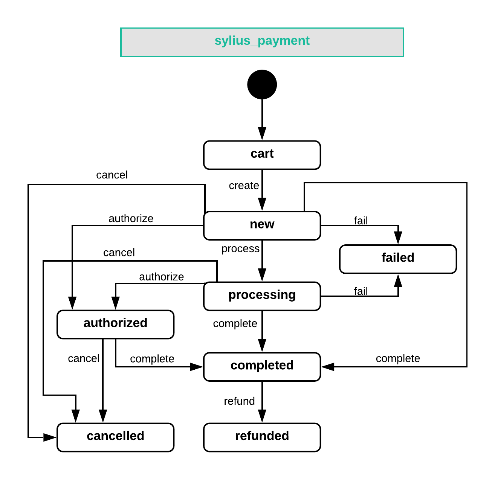

.. index::
   single: Payments

Payments
========

Sylius contains a very flexible payments management system with support for many gateways (payment providers).
We are using a payment abstraction library - `Payum <https://github.com/Payum/Payum>`_, which handles all sorts of capturing, refunding and recurring payments logic.

On Sylius side, we integrate it into our checkout and manage all the payment data.

Payment
-------

Every payment in Sylius, successful or failed, is represented by the **Payment** model, which contains basic information and a reference to appropriate order.

Payment State Machine
---------------------

A Payment that is assigned to an order will have it's own state machine with a few available states:
``cart``, ``new``, ``processing``, ``completed``, ``failed``, ``cancelled``, ``refunded``.

The available transitions between these states are:

.. code-block:: yaml

    transitions:
        create:
            from: [cart]
            to: new
        process:
            from: [new]
            to: processing
        complete:
            from: [new, processing]
            to: completed
        fail:
            from: [new, processing]
            to: failed
        cancel:
            from: [new, processing]
            to: cancelled
        refund:
            from: [completed]
            to: refunded

Of course, you can define your own states and transitions to create a workflow, that perfectly matches your needs.
Full configuration can be seen in the `PaymentBundle/Resources/config/app/state_machine.yml <https://github.com/Sylius/Sylius/blob/master/src/Sylius/Bundle/PaymentBundle/Resources/config/app/state_machine.yml>`_.

Changes to payment happen through applying appropriate transitions.

How to create a Payment programmatically?
'''''''''''''''''''''''''''''''''''''''''

We cannot create a Payment without an Order, therefore let's assume that you have an Order to which you will assign a new payment.

.. code-block:: php

    $payment = $this->container->get('sylius.factory.payment')->createNew();

    $payment->setOrder($order);
    $payment->setCurrencyCode('USD');

    $this->container->get('sylius.repository.payment')->add($payment);

.. tip::

    Not familiar with the Order concept? Check :doc:`here </book/orders/orders>`.

Payment Methods
---------------

A **PaymentMethod** represents a way that your customer pays during the checkout process.
It holds a reference to a specific ``gateway`` with custom configuration.
Gateway is configured for each payment method separately using the payment method form.

How to create a PaymentMethod programmatically?
'''''''''''''''''''''''''''''''''''''''''''''''

As usually, use a factory to create a new PaymentMethod and give it a unique code.

.. code-block:: php

    $paymentMethod = $this->container->get('sylius.factory.payment_method')->createWithGateway('offline');
    $paymentMethod->setCode('ALFA1');

    $this->container->get('sylius.repository.payment_method')->add($paymentMethod);

In order to have your new payment method available in the checkout remember to **add it to your desired channels**:

.. code-block:: php

    $channel->addPaymentMethod($paymentMethod);

Payment Gateway configuration
-----------------------------

Payment Gateways that already have a Sylius bridge
''''''''''''''''''''''''''''''''''''''''''''''''''

First you need to create the configuration form type for your gateway. Have a look at the configuration form types of
`Paypal <https://github.com/Sylius/Sylius/blob/master/src/Sylius/Bundle/PayumBundle/Form/Type/PaypalGatewayConfigurationType.php>`_
and `Stripe <https://github.com/Sylius/Sylius/blob/master/src/Sylius/Bundle/PayumBundle/Form/Type/StripeGatewayConfigurationType.php>`_.

Then you should register its configuration form type with ``sylius.gateway_configuration_type`` tag.
After that it will be available in the Admin panel in the gateway choice dropdown.

.. tip::

    If you are not sure how your configuration form type should look like, head to `Payum`_ documentation.

Other Payment Gateways
''''''''''''''''''''''

.. note::

    Learn more about integrating payment gateways in `the Payum docs <https://github.com/Payum/Payum/blob/master/docs/index.md>`_.

When the Payment Gateway you are trying to use does have a bridge available and you integrate them on your own,
use our guide on :doc:`extension development </plugins/creating-plugin>`.

.. tip::

    You'll probably need also this kind of configuration in your ``app/config/config.yml`` for the gateway's factory:

    .. code-block:: yaml

        payum:
            gateways:
                yourgateway:
                    factory: yourgateway

Troubleshooting
---------------

Sylius stores the payment output inside the **details** column of the **sylius_payment** table.
It can provide valuable information when debugging the payment process.

PayPal Error Code 10409
-----------------------

The 10409 code, also known as the *"Checkout token was issued for a merchant account other than yours"* error.
You have most likely changed the PayPal credentials from ``config.yml`` during the checkout process. Clear the cache and try again:

.. code-block:: bash

    bin/console cache:clear

Payment complete events
-----------------------

There are two events that are triggered on the payment complete action:

+-------------------------------------+
| Event id                            |
+=====================================+
| ``sylius.payment.pre_complete``     |
+-------------------------------------+
| ``sylius.payment.post_complete``    |
+-------------------------------------+

Learn more
----------

* :doc:`Payment - Component Documentation </components/Payment/index>`
* `Payum - Project Documentation <https://github.com/Payum/Payum/blob/master/src/Payum/Core/Resources/docs/index.md>`_
