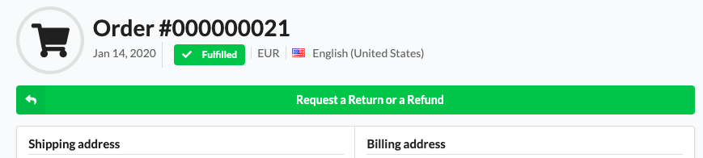
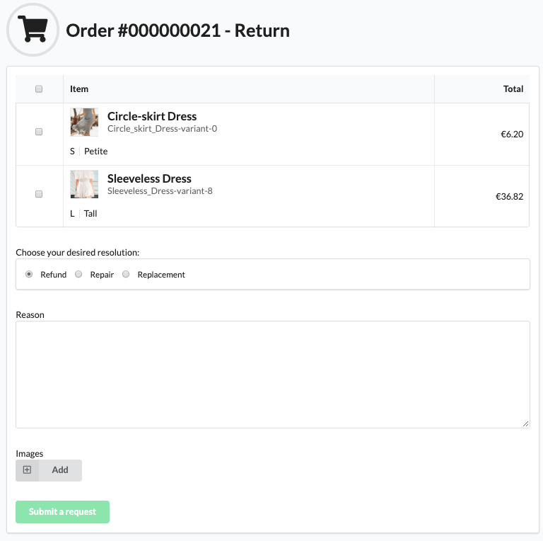
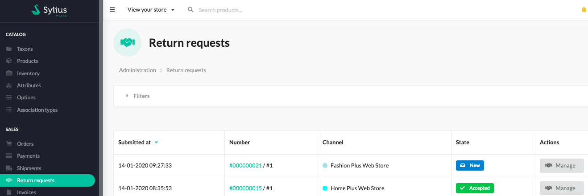
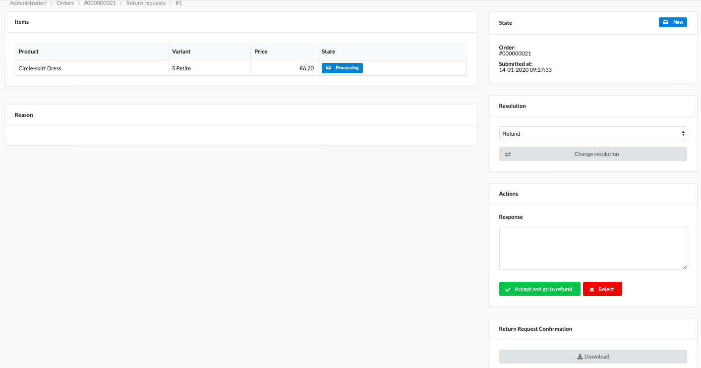
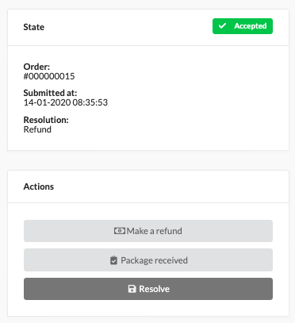
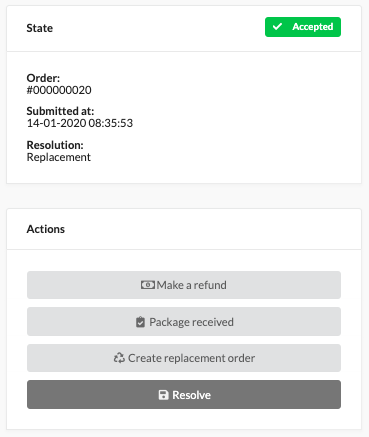
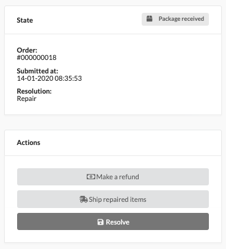

.. rst-class:: plus-doc

Returns
=======

Return is the process of requesting and then bringing back merchandise, from a customer to the merchant, for a refund or exchange.
In distance sales like e-commerce returns (especially in the cooling-off period) are required by legislation.

Return Requests (Return Merchandise Agreements)
-----------------------------------------------

After a registered Customer makes an Order in a Sylius Plus shop, they are able to access it in their ``My Account`` section in shop.
Each fulfilled (paid and sent) Order has a Returns section, where the Customer can request a Return.

As you can see above, the Customer can choose which items they want to return, what resolution do they expect and provide
a written reason, including images as proofs of item damage for example.

There are three resolutions provided out-of-the-box:

* refund (give money back to the Customer)
* replacement (wrong items ordered, or sent should be replaced by the merchant to other specified by the customer)
* repair (the item(s) are damaged and should be repaired by the merchant according to the guarantee)

Customizing the available resolutions
^^^^^^^^^^^^^^^^^^^^^^^^^^^^^^^^^^^^^

In order to **remove one of the predefined resolutions**:

Removing one of possible resolutions
Overwrite the ``ReturnRequestResolutionsProvider`` service:

.. code-block:: yaml

  # services.yaml

  Sylius\Plus\Returns\Domain\Provider\ReturnRequestResolutionsProvider:
      class: Sylius\Plus\Returns\Application\Provider\StringReturnRequestResolutionsProvider
      arguments:
          - ['refund', 'repair'] # the "replacement" resolution has been removed

In order to **add a custom Resolution**:

Overwrite the ``ReturnRequestResolutionsProvider`` service and add a translation of the new resolution:

.. code-block:: yaml

  # services.yaml

  Sylius\Plus\Returns\Domain\Provider\ReturnRequestResolutionsProvider:
      class: Sylius\Plus\Returns\Application\Provider\StringReturnRequestResolutionsProvider
      arguments:
          - ['refund', 'repair', 'size_change']

.. code-block:: yaml

# messages.en.yaml

  sylius_plus:
      ui:
          returns:
              size_change: "Size change"

After the Customer places a Return Request for chosen items they will not be able to place another Return Requests for these
items, they although can cancel the Return Request and then place it again.

.. tip::

  Each placed Return Request has a pdf confirmation document on it, that can be downloaded from the return request show page
  by both administrator and customer.

New Return Requests management
------------------------------

Once a Return Request is placed it will become visible to the Administrators of the shop. They will get an email and be
able to see it in the Admin panel.

The administrators can manage the return request in state ``new`` (newly placed) here:

As you can see above the Admin can:

* change the resolution of the Return Request - if the chosen one cannot be fulfilled, the Customer will get a notifying email
* accept/reject the Return Request providing a reasoning to the Customer, the Customer will get a notifying email

A Return Request that becomes rejected can no longer get processed. The Customer needs to open a new one if they still feel
the need to return the items.

Accepted Return Requests management
-----------------------------------

After a Return Request gets accepted it can be processed according to the resolution that was chosen.

Refund
^^^^^^

Return requests that have the ``refund`` resolution chosen, have an option to at once accept the return request and proceed
to the refunding process with just one button.

If you do not do the refund then, after accepting, the return request management section will look like that:

Besides making a refund, you can mark here that a package from customer has been received; or resolve the return request,
after which you will no longer be able to process it.

.. tip::

  To learn about the refunding process check the :doc:`Refunds </book/orders/refunds>` documentation section.

Replacement
^^^^^^^^^^^
Same as for other resolutions you are able to mark returned items as received, make an additional refund, resolving the request.

But also, as you can see in the image above, you can make a replacement Order.
This will help you create a new Order with the items requested by the customer. While preparing a replacement Order you can modify the items
being replaced, so that you can for example change the size, color, quantity or even send a completely different item.
The Order will be free and marked as replacement, so you won't loose it. This feature let's you properly track the inventory and new shipment.

Repair
~~~~~~

Same as for other resolutions you are able to mark returned items as received, make an additional refund, resolving the request,
What is specific for return requests of repair type, you are able to the mark repaired items as sent, after you have received them.

API coverage
------------

Sylius Plus provides a route that allows accepting or rejecting return request with an API call:

.. code-block:: text

  POST /api/v1/return-requests/{id}/accept

The ``id`` is an id of return request that we want to accept. Content of the request may contain response of return request:

.. code-block:: json

  {
      "response": "Return request confirmed and accepted."
  }

.. code-block:: text

  POST /api/v1/return-requests/{id}/reject

The ``id`` is an id of return request that we want to accept. Content of the request may contain response of return request:

.. code-block:: json

  {
      "response": "We are not able to replace this item."
  }

The response can also be empty:

.. code-block:: json

  {}

Learn more
----------

* `Sylius/RefundPlugin <https://github.com/Sylius/RefundPlugin>`_
* :doc:`Refunds </book/orders/refunds>`
* :doc:`Emails related to Return Requests </book/architecture/emails>`

.. image:: ../../_images/sylius_plus/banner.png
  :align: center
  :target: https://sylius.com/plus/?utm_source=docs
