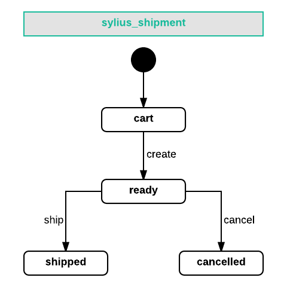

.. index::
   single: Shipments

Shipments
=========

A **Shipment** is a representation of a shipping request for an Order. Sylius supports multiple shipments per one Order.

How is a Shipment created for an Order?
'''''''''''''''''''''''''''''''''''''''

.. warning::

    Read more about creating :doc:`Orders </book/orders/orders>` where the process of assigning Shipments is clarified.

The Shipment State Machine
--------------------------

A Shipment that is attached to an Order will have its own state machine with such states available:
``cart``, ``ready``, ``cancelled``, ``shipped``.

The allowed transitions between these states are:

.. code-block:: yaml

   transitions:
        create:
            from: [cart]
            to: ready
        ship:
            from: [ready]
            to: shipped
        cancel:
            from: [ready]
            to: cancelled

Shipping Methods
----------------

**ShippingMethod** in Sylius is an entity that represent the way an order can be shipped to a customer.

How to create a ShippingMethod programmatically?
''''''''''''''''''''''''''''''''''''''''''''''''

As usually use a factory to create a new ShippingMethod. Give it a ``code``, set a desired shipping calculator and set a ``zone``.
It need also a configuration, for instance of the amount (cost).
At the end add it to the system using a repository.

.. code-block:: php

    $shippingMethod = $this->container->get('sylius.factory.shipping_method')->createNew();

    $shippingMethod->setCode('DHL');
    $shippingMethod->setCalculator(DefaultCalculators::FLAT_RATE);
    $shippingMethod->setConfiguration(['amount' => 50]);

    $zone = $this->container->get('sylius.repository.zone')->findOneByCode('US');
    $shippingMethod->setZone($zone);

    $this->container->get('sylius.repository.shipping_method')->add($shippingMethod);

In order to have your shipping method available in checkout add it to a desired channel.

.. code-block:: php

    $channel->addShippingMethod($shippingMethod);

Shipping Zones
--------------

Sylius has an approach of **Zones** used also for shipping. As in each e-commerce you may be willing to ship only to certain countries for example.
Therefore while configuring your **ShippingMethods** pay special attention to the zones you are assigning to them.
You have to prepare methods for each zone, because the available methods are retrieved for the zone the customer has basing on his address.

Shipping Cost Calculators
-------------------------

The shipping cost calculators are services that are used to calculate the cost for a given shipment.

The `CalculatorInterface <https://github.com/Sylius/Sylius/blob/master/src/Sylius/Component/Shipping/Calculator/CalculatorInterface.php>`_
has a method ``calculate()`` that takes object with a configuration and returns *integer* that is the cost of shipping for that subject.
It also has a ``getType()`` method that works just like in the forms.

To select a proper service we have a one that decides for us
- the `DelegatingCalculator <https://github.com/Sylius/Sylius/blob/master/src/Sylius/Component/Shipping/Calculator/DelegatingCalculator.php>`_.
Basing on the **ShippingMethod** assigned on the Shipment it will get its calculator type and configuration and calculate the cost properly.

.. code-block:: php

    $shippingCalculator = $this->container->get('sylius.shipping_calculator');

    $cost = $shippingCalculator->calculate($shipment);

Built-in Calculators
--------------------

The already defined calculators in Sylius are described as constants in the
`Sylius\Component\Shipping\Calculator\DefaultCalculators <https://github.com/Sylius/Sylius/blob/master/src/Sylius/Component/Shipping/Calculator/DefaultCalculators.php>`_

* **FlatRateCalculator** - just returns the ``amount`` from the ShippingMethod's configuration.
* **FlexibleRateCalculator** - on the ShippingMethod's configuration it should have the ``first_unit_cost``, ``additional_unit_cost`` and ``additional_unit_limit`` configured - it is useful if you want to have different cost for the first item than for the rest.
* **PerUnitRateCalculator** - returns the ``amount`` from the ShippingMethod's configuration multiplied by the ``units`` count.
* **VolumeRateCalculator** - returns the ``amount`` from the ShippingMethod's configuration multiplied by the ``units`` count divided by the configured ``division``.
* **WeightRateCalculator** - returns the ``fixed`` from the ShippingMethod's configuration multiplied plus the ``variable`` multiplied by the ``weight`` of the shipment and divided by the ``division`` from the configuration.

ProductVariant Configuration
----------------------------

In order to be able to calculate shipping costs basing on the volume and weight of products in an order
the ProductVariant has the ``depth``, ``width``, ``height`` and ``weight`` fields.

Shipment complete events
------------------------

There are two events that are triggered on the shipment ``ship`` action:

+-------------------------------------+
| Event id                            |
+=====================================+
| ``sylius.shipment.pre_ship``        |
+-------------------------------------+
| ``sylius.shipment.post_ship``       |
+-------------------------------------+

Learn more
----------

* :doc:`Shipping - Component Documentation </components/Shipping/index>`
