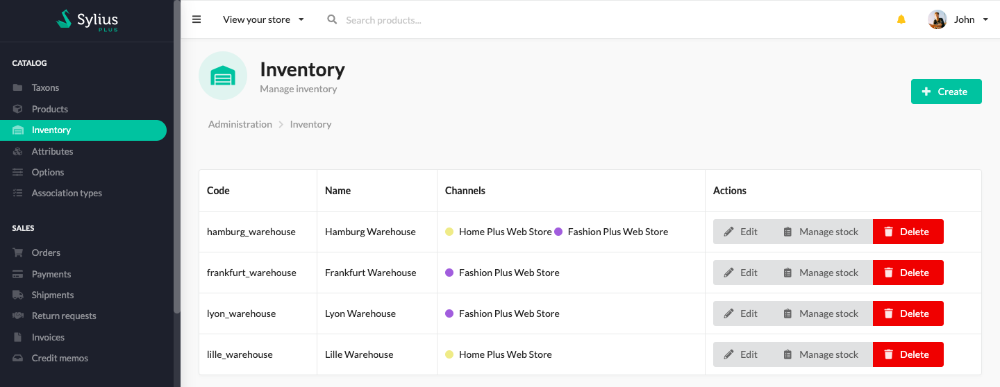
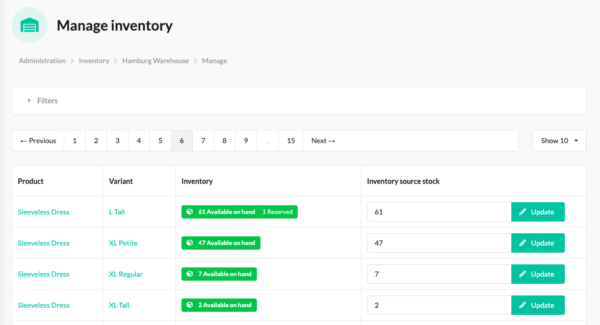
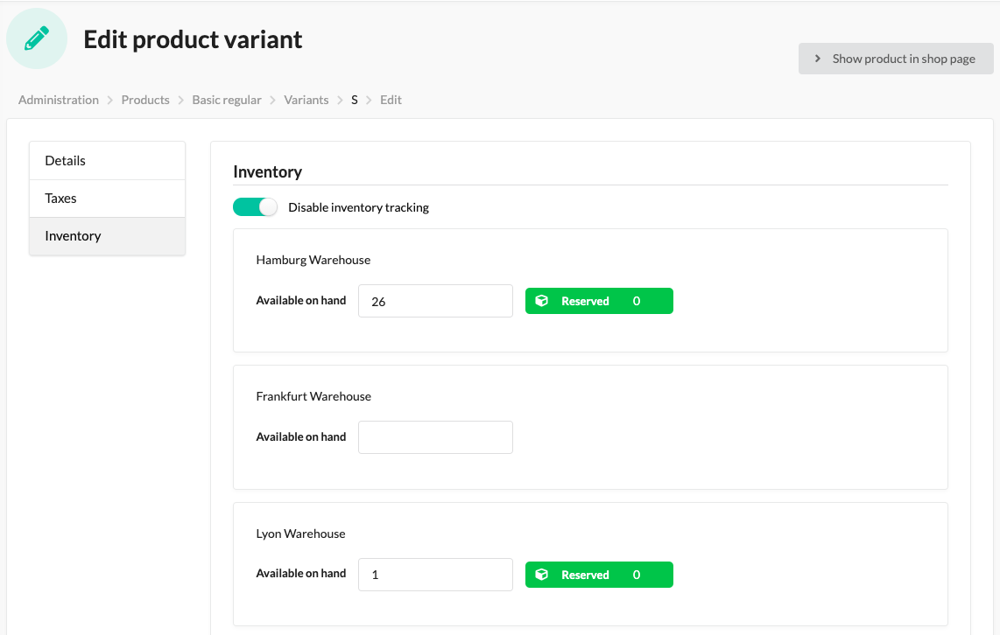
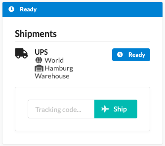

.. rst-class:: plus-doc

Multi-Source Inventory
======================

Sylius Plus has a much more complex approach to inventory management than the open source version. Unlike the open source
version, that allows to specify one stock amount value for each variant, the Sylius Plus Multi-Source Inventory gives you
a possibility to create several Inventory Sources and specify different stock amounts of variants for different Inventory Sources.

Admin can create multiple Inventory Sources (IS). For each IS they can choose Channels it will be available for.
Let's say you have 2 channels - "DACH" and "France", and you have three magazines in Paris, in Berlin, and in Vienna,
so you'd probably want the "France" channel to be fulfilled from the Parisian magazine only.

The experience for the Customer is seamless, they are not aware of multiple magazines, their orders are fulfilled just
like it was. As an Administrator, you will additionally see which Inventory Source was chosen for the Order's shipment
to be fulfilled from. The system is prepared to be supporting shipments splitting on one order and fulfilling from multiple
magazines in the near future.

Inventory Source
----------------

Inventory Source is the place from which a shipment of an order will be shipped from, it can be understood as a magazine,
a fulfillment centre, physical store etc.

Administrators can add, modify and remove Inventory Sources in the admin panel.

Each IS has its own inventory management page, where you can manage stock levels of all items available int his inventory.

In order to make a product tracked within an Inventory Source, you have to go to it's ProductVariant's Inventory tab on the edit page.

After an Order with tracked products is placed you will see from which IS its Shipment should be shipped.

InventorySourceStock on ProductVariant
--------------------------------------

Each simple Product and each Product Variant of a configurable Product can have stock in the Inventory Sources available
for channels the product is available in. You can specify stocks on products and then manage them also in the Inventory section,
where you will see the inventory of each IS separately.

``inventorySourceStock`` is a property that behaves exactly like the ``stockAmount`` field you know from open source single-source
inventory, so it has both ``onHand`` and ``onHold`` values that are modified when Orders are placed and fulfilled in your shop.

The tracking of a Product can be disabled.

Inventory Source resolving
--------------------------

The current implementation provides one main resolver, that can use multiple inventory sources filters.

There are two filters provided by default:

* *Sufficient*, with ``priority = 0``, that provides all inventory sources able to handle all ordered products;
* *EnabledChannel*, with ``priority = 8``, that provides inventory sources enabled for the current channel;

Filters always return an array of inventory sources, however resolver picks the first of them or throws an
``UnresolvedInventorySource`` exception if no inventory source can be resolved.

It's possible to add more inventory sources filter, with higher or lower priority. Such a service must implement Sylius\Plus\Inventory\Application\Filter\InventorySourcesFilterInterface and be registered with sylius_plus.inventory.inventory_sources_filter tag, with priority attribute set.

.. note::

   How to create a custom Inventory Sources Filter? Read :doc:`this Cookbook </cookbook/index>`.

Resolving InventorySourceStock for ordered products
---------------------------------------------------

.. warning::

    Standard Sylius distribution is releasing a stock inventory when the whole order is paid, while in Plus version,
    it has been switched to be released after shipment has been shipped.

How does Multi-Source Inventory work on examples?
-------------------------------------------------

.. tip::

   You can see all use cases we have designed in Sylius Plus by browsing the Behat scenarios for inventory in the vendor package
   after installing Sylius Plus.

Multi-source inventory fixtures
-------------------------------

Inventory Sources fixtures
''''''''''''''''''''''''''

This fixture creates Inventory Sources without products (empty) enabled in chosen channels:

.. code-block:: yaml

   hamburg_warehouse:
      code: 'hamburg_warehouse'
      name: 'Hamburg Warehouse'
      channels:
         - 'HOME_WEB'
         - 'FASHION_WEB'

Inventory Source Stocks fixtures
''''''''''''''''''''''''''''''''

This fixture adds inventory source stock to chosen Inventory Source, you can choose which taxons and channels you want
to include in each inventory source.

When declaring both options, a union of sets will be resolved.

.. code-block:: yaml

   stocks_in_frankfurt_warehouse:
       inventory_source: 'frankfurt_warehouse'
       products_from:
           taxons_codes:
               - 'caps'
               - 'dresses'
           channels_codes:
               - 'HOME_WEB'
               - 'FASHION_WEB'

Learn more
----------

* :doc:`Cookbook: How to create a custom inventory sources filter? </cookbook/inventory/custom-inventory-sources-filter>`
* :doc:`Order concept documentation </book/orders/orders>`
* :doc:`Single Source Inventory concept documentation </book/products/inventory>`

.. image:: ../../_images/sylius_plus/banner.png
   :align: center
   :target: https://sylius.com/plus/?utm_source=docs
