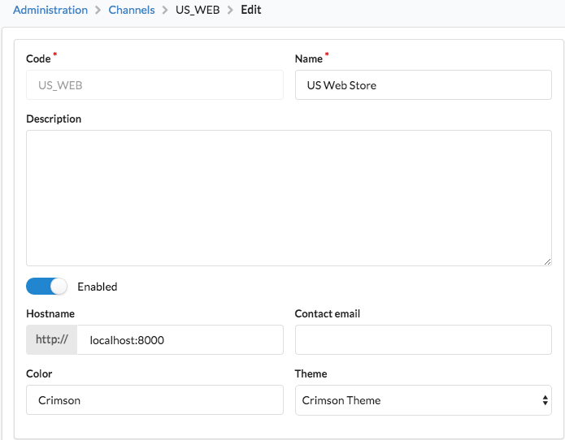

.. index::
   single: Themes

Themes
======

Theming is a method of customizing how your channels look like in Sylius. Each channel can have a different theme.

What is the purpose of using themes?
------------------------------------

There are some criteria that you have to analyze before choosing either :doc:`standard Symfony template overriding </customization/template>` or themes.

**When you should choose standard template overriding:**

* you have only one channel
* **or** you do not need different looks/themes on each of you channels
* you need only basic changes in the views (changing colors, some blocks rearranging)

**When you should use Sylius themes:**

* you have more than one channel for a single Sylius instance
* **and** you want each channel to have their own look and behaviour
* you change a lot of things in the views

How to enable themes in a project?
----------------------------------

To use themes inside of your project you need to add these few lines to your ``config/packages/sylius_theme.yaml``.

.. code-block:: yaml

   sylius_theme:
       sources:
           filesystem:
               directories:
                    - "%kernel.project_dir%/themes"

How to create themes?
---------------------

Let's see how to customize the login view inside of your custom theme.

1. Inside of the ``themes/`` directory create a new directory for your theme:

Let it be ``CrimsonTheme/`` for instance.

2. Create ``composer.json`` for your theme:

.. code-block:: yaml

   {
       "name": "acme/crimson-theme",
       "authors": [
           {
               "name": "James Potter",
               "email": "prongs@example.com"
           }
       ],
       "extra": {
           "sylius-theme": {
               "title": "Crimson Theme"
           }
       }
   }

3. Install theme assets

Theme assets are installed by running the ``sylius:theme:assets:install`` command, which is supplementary for and should be used after ``assets:install``.

.. code-block:: bash

   bin/console sylius:theme:assets:install

The command run with ``--symlink`` or ``--relative`` parameters creates symlinks for every installed asset file,
not for entire asset directory (eg. if ``AcmeBundle/Resources/public/asset.js`` exists, it creates symlink ``public/bundles/acme/asset.js``
leading to ``AcmeBundle/Resources/public/asset.js`` instead of symlink ``public/bundles/acme/`` leading to ``AcmeBundle/Resources/public/``).
When you create a new asset or delete an existing one, it is required to rerun this command to apply changes (just as the hard copy option works).

.. note::

   Whenever you install a new bundle with assets you will need to run ``sylius:theme:assets:install`` again to make sure they are accessible in your theme.

4. Customize a template:

In order to customize the login view you should take the content of ``@SyliusShopBundle/views/login.html.twig`` file
and paste it to your theme directory: ``themes/CrimsonTheme/SyliusShopBundle/views/login.html.twig``

Let's remove the registration column in this example:

.. code-block:: twig

   

   

   

   
       
       

           

               

                   <h4 class="ui dividing header">{{ 'sylius.ui.registered_customers'|trans }}</h4>
                   
{{ 'sylius.ui.if_you_have_an_account_sign_in_with_your_email_address'|trans }}.

                   {{ form_start(form, {'action': path('sylius_shop_login_check'), 'attr': {'class': 'ui loadable form', 'novalidate': 'novalidate'}}) }}
                       
                       <button type="submit" class="ui blue submit button">{{ 'sylius.ui.login'|trans }}</button>
                       <a href="{{ path('sylius_shop_request_password_reset_token') }}" class="ui right floated button">{{ 'sylius.ui.forgot_password'|trans }}</a>
                   {{ form_end(form, {'render_rest': false}) }}
               

           

       

   

.. tip::

   Learn more about customizing templates :doc:`here </customization/template>`.

5. Choose your new theme on the channel:

In the administration panel go to channels and change the theme of your desired channel to ``Crimson Theme``.

6. If changes are not yet visible, clear the cache:

.. code-block:: bash

   $ php bin/console cache:clear

Learn more
----------

* :doc:`Theme - Bundle Documentation </components_and_bundles/bundles/SyliusThemeBundle/index>`.
