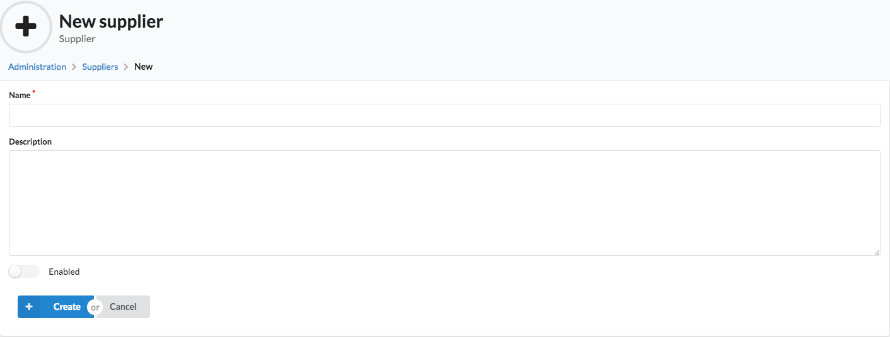
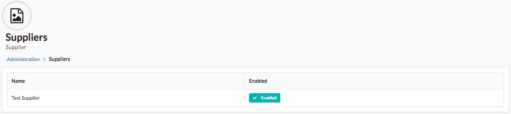
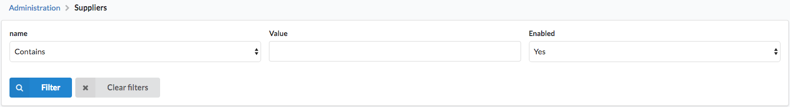
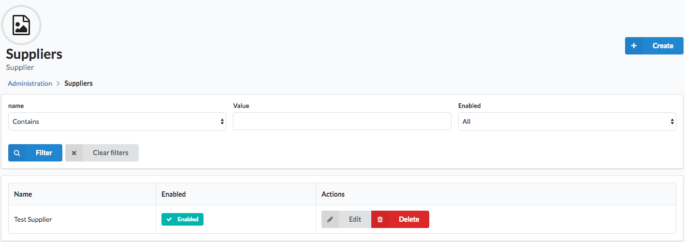

Your First Grid
===============

In order to use grids, we need to register your entity as a Sylius resource. Let us assume you have a Supplier model in your application,
which represents a supplier of goods in your shop and has several fields, including name, description and enabled field.

In order to make it a Sylius resource, you need to configure it under ``sylius_resource`` node.
If you don’t have it yet create a file ``app/config/resources.yml``, import it in the ``app/config/config.yml``.

.. code-block:: yaml

    # app/config/resources.yml
    sylius_resource:
        resources:
            app.supplier:
                driver: doctrine/orm
                classes:
                    model: AppBundle\Entity\Supplier

.. code-block:: yaml

    # app/config/config.yml
    imports:
        - { resource: "resources.yml" }

That's it! Your class is now a resource. In order to learn what does it mean, please refer to the :doc:`SyliusResourceBundle </components_and_bundles/bundles/SyliusResourceBundle/index>` documentation.

Grid Definition
---------------

Now we can configure our first grid:

.. note::

    Remember that a grid is **the way objects of a desired entity are displayed on its index view**. Therefore only fields that
    are useful for identification of objects are available - only ``string`` and ``twig`` type. Then even though a Supplier has also
    a description field, it is not needed on index and can't be displayed here.

.. code-block:: yaml

    # app/config/grids/admin/supplier.yml
    sylius_grid:
        grids:
            app_admin_supplier:
                driver:
                    name: doctrine/orm
                    options:
                        class: AppBundle\Entity\Supplier
                fields:
                    name:
                        type: string
                        label: sylius.ui.name
                    enabled:
                        type: twig
                        label: sylius.ui.enabled
                        options:
                            template: SyliusUiBundle:Grid/Field:enabled.html.twig # This will be a checkbox field

Remember to import your grid in the ``app/config/grids/grids.yml`` file which has to be imported in the ``app/config/config.yml``.

.. code-block:: yaml

    # app/config/grids/grids.yml
    imports:
        - { resource: 'admin/supplier.yml' }

.. code-block:: yaml

    # app/config/config.yml
    imports:
        - { resource: "grids/grids.yml" }

Generating The CRUD Routing
---------------------------

That's it. SyliusResourceBundle allows to generate a default CRUD interface including the grid we have just defined. Just put this in your routing configuration!

.. code-block:: yaml

    # app/config/routing/admin/supplier.yml
    app_admin_supplier:
        resource: |
            alias: app.supplier
            section: admin
            templates: SyliusAdminBundle:Crud
            except: ['show']
            redirect: update
            grid: app_admin_supplier
            vars:
                all:
                    subheader: app.ui.supplier # define a translation key for your entity subheader
                index:
                    icon: 'file image outline' # choose an icon that will be displayed next to the subheader
        type: sylius.resource

.. code-block:: yaml

    # app/config/routing/admin.yml
    app_admin_supplier:
        resource: 'supplier.yml'

.. code-block:: yaml

    # config/routes.yaml
    app_admin:
        resource: 'routing/admin.yml'
        prefix: /admin

This will generate the following paths:

 * */admin/suppliers/* - [``GET``] - Your grid.
 * */admin/suppliers/new* - [``GET/POST``] - Creating new supplier.
 * */admin/suppliers/{id}/edit* - [``GET/PUT``] - Editing an existing supplier.
 * */admin/suppliers/{id}* - [``DELETE``] - Deleting specific supplier.
 * */admin/suppliers/{id}* - [``GET``] - Displaying specific supplier.

.. tip::

    `In the Semantic UI documentation <http://semantic-ui.com/elements/icon.html>`_ you can find all possible icons you can choose for your grid.

.. tip::

    See :doc:`how to add links to your new entity administration in the administration menu </customization/menu>`.

.. tip::

    Adding translations to the grid (read more :doc:`here </customization/translation>`):

    .. code-block:: yaml

        # app/Resources/translations/messages.en.yml
        app:
            ui:
                supplier: Supplier
                suppliers: Suppliers
            menu:
                admin:
                    main:
                        additional:
                            header: Additional
                            suppliers: Suppliers

After that your new grid should look like that when accessing the */admin/suppliers/new* path in order to create new object:

And when accessing index on the */admin/suppliers/* path it should look like that:

Defining Filters
----------------

In order to make searching for certain things in your grid you can use filters.

.. code-block:: yaml

    sylius_grid:
        grids:
            app_admin_supplier:
                    ...
                filters:
                    name:
                        type: string
                    enabled:
                        type: boolean

How will it look like in the admin panel?

What about filtering by fields of related entities? For instance if you would like to filter your suppliers by their country of origin, which is a property of the associated address entity.

This first requires a :doc:`custom repository method </customization/repository>` for your grid query:

.. code-block:: yaml

    # app/config/grids/admin/supplier.yml
    sylius_grid:
        grids:
            app_admin_supplier:
                driver:
                    name: doctrine/orm
                    options:
                        class: AppBundle\Entity\Supplier
                        repository:
                            method: mySupplierGridQuery

.. note::

    The repository method has to return a queryBuilder object, since the query has to adjustable depending on the filters and sorting the user later applies.
    Furthermore, all sub entities you wish to use later for filtering have to be joined explicitely in the query.

Then you can set up your filter to accordingly:

.. code-block:: yaml

    sylius_grid:
        grids:
            app_admin_supplier:
                    ...
                filters:
                    ...
                    country:
                        type: string
                        label: origin
                        options:
                            fields: [address.country]
                        form_options:
                            type: contains

Default Sorting
---------------

You can define by which field you want the grid to be sorted and how.

.. code-block:: yaml

    # app/config/grids/admin/supplier.yml
    sylius_grid:
        grids:
            app_admin_supplier:
                    ...
                sorting:
                    name: asc
                    ...

Then at the fields level, define that the field can be used for sorting:

.. code-block:: yaml

    # app/config/grids/admin/supplier.yml
    sylius_grid:
        grids:
            app_admin_supplier:
                ...
                fields:
                    name:
                        type: string
                        label: sylius.ui.name
                        sortable: ~
                    ...

If your field is not of a "simple" type, f.i. a twig template with a specific path, you get sorting working with the following definition:

.. code-block:: yaml

    # app/config/grids/admin/supplier.yml
    sylius_grid:
        grids:
            app_admin_supplier:
                ...
                fields:
                    ....
                    origin:
                        type: twig
                        options:
                            template: "@AppBundle/Grid/Fields/myCountryFlags.html.twig"
                        path: address.country
                        label: app.ui.country
                        sortable: address.country
                    ...

Pagination
----------

You can limit how many items are visible on each page by providing an array of integers into the ``limits`` parameter.
The first element of the array will be treated as the default, so by configuring:

.. code-block:: yaml

    # app/config/grids/admin/supplier.yml
    sylius_grid:
        grids:
            app_admin_supplier:
                    ...
                limits: [30, 12, 48]
                ...

you will see thirty suppliers per page, also you will have the possibility to change the number of elements to either 12 or 48.

.. note::

    Pagination limits are set by default to 10, 25 and 50 items per page.
    In order to turn it off, configure `limits: ~`.

Actions Configuration
---------------------

Next step is adding some actions to the grid: create, update and delete.

.. note::

    There are two types of actions that can be added to a grid: ``main`` which "influence" the whole grid (like adding new objects)
    and ``item`` which influence one row of the grid (one object) like editing or deleting.

.. code-block:: yaml

    # app/config/grids/admin/supplier.yml
    sylius_grid:
        grids:
            app_admin_supplier:
                    ...
                actions:
                    main:
                        create:
                            type: create
                    item:
                        update:
                            type: update
                        delete:
                            type: delete

This activates such a view on the */admin/suppliers/* path:

Your grid is ready to use!
