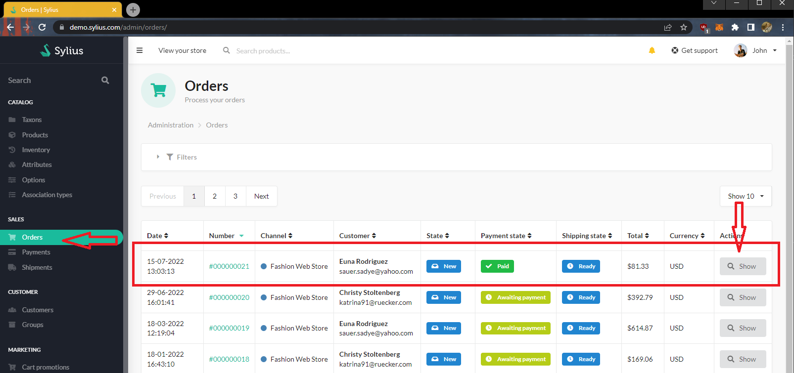
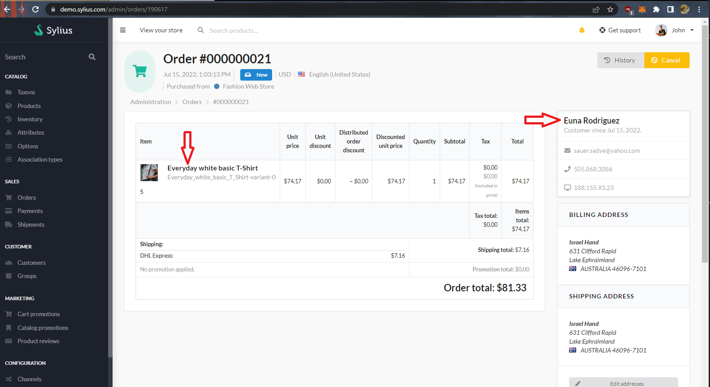
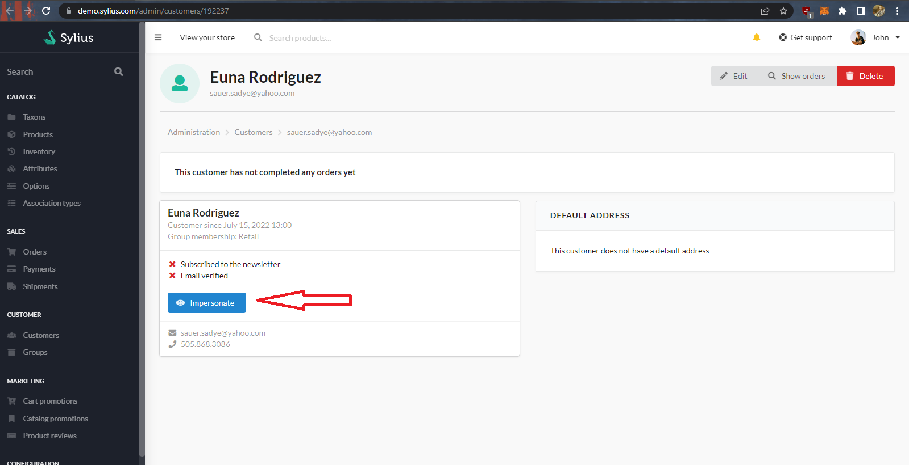
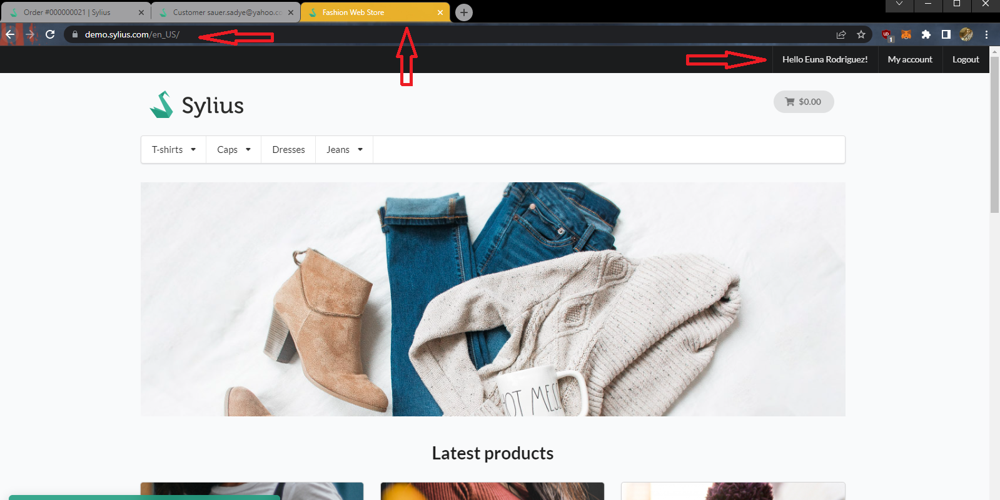
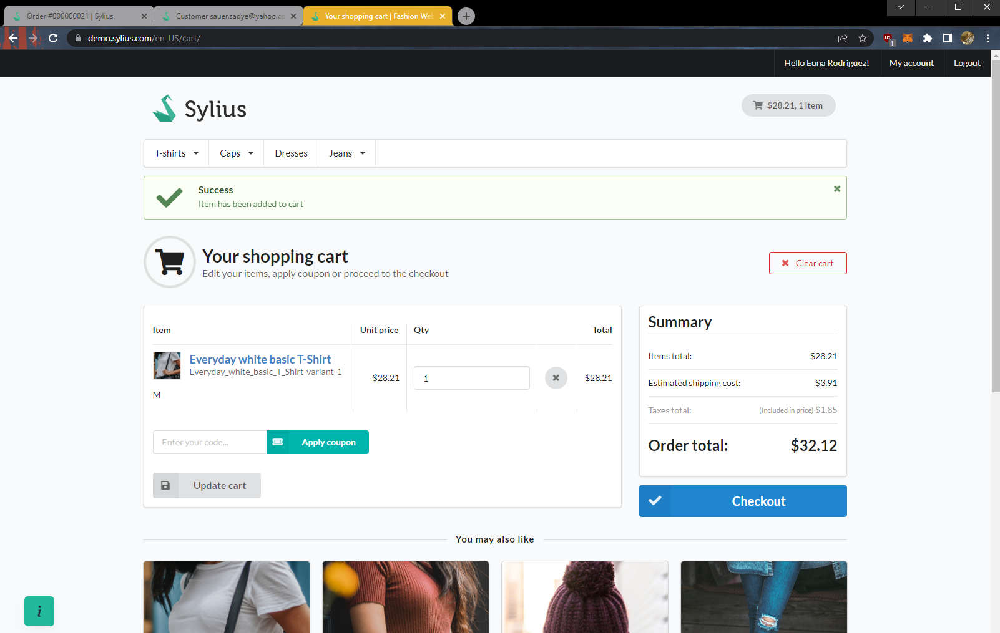
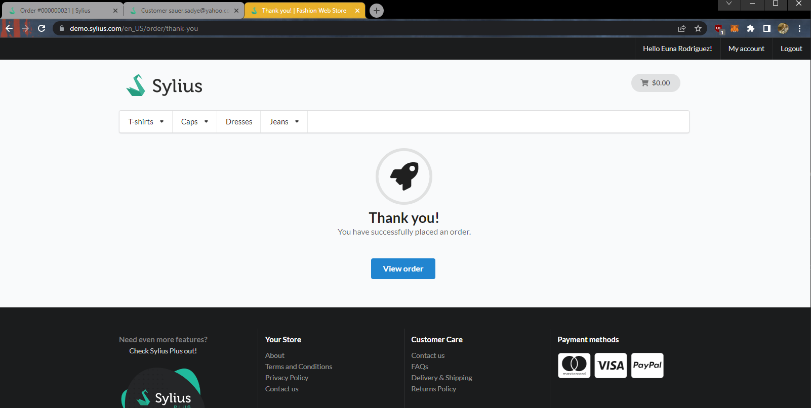
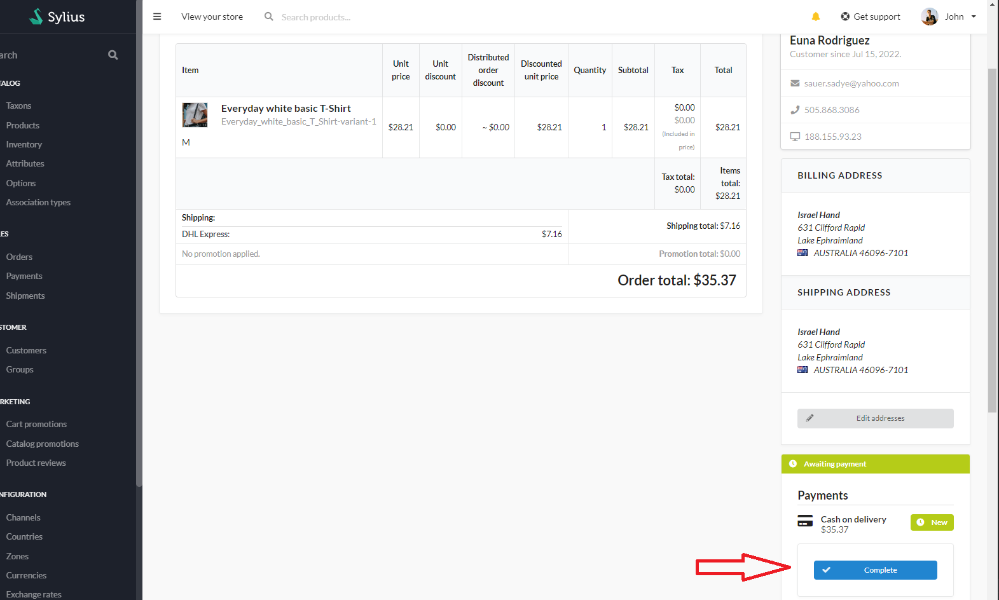
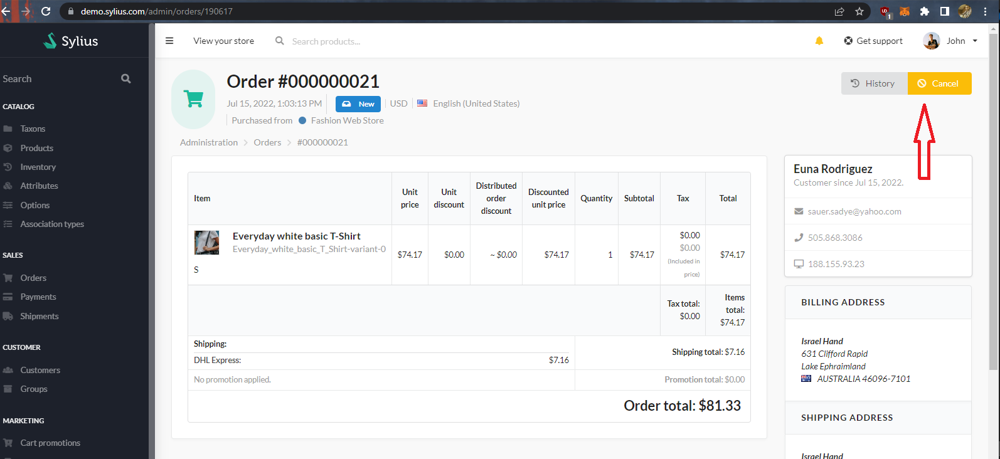

How to edit orders in Sylius?
=============================

Since time immemorial, people have been using trial and error methods to create or repeat processes that make their lives simpler.
Thanks to this, we live in a time where everything is easily available and within reach.
However, this time we will not focus on inventions, but on the mistakes that people still make.
Usually, e-commerce processes go smoothly, but from time to time there will be a customer who confuses something in his order (e.g. the size of the shorts they wear).
In this cookbook, we will try to show you how to easily fix this kind of mistake as a store administrator.

TL;DR
-----

Quick general steps of how to easily solve this issue:

* From admin panel go to the order you want to edit
* Click on the customer and go to their show page
* Login as this customer whose order you want to edit
* Place a new order with the required modifications (like, changing the size of one of the products)
* Choose offline payment as the payment method (as we already got the money)
* or choose any payment method and set payment as completed on admin order page
* In the order notes you can add a note that it is a modified order and add the original order number
* In the admin panel fulfill the order - complete its payment
* Go back to the original order and cancel it
* Proceed with the new "modified" order

Step by step instruction
------------------------

If you have troubles of going with shorter instruction, here we will go step by step so you are sure of what to do:

.. note::

    The tutorial steps are done on Sylius demo environment under link: https://demo.sylius.com
    If you want to test if Sylius suits you or try the steps, do not hesitate to check it out on your own.

Impersonate as user and create an order
~~~~~~~~~~~~~~~~~~~~~~~~~~~~~~~~~~~~~~~

Let's start with the steps that will let you impersonate a user and create new order as them.

First, log in as an administrator into the admin panel, go to ``orders`` tab, and find the incorrect order (in this example Order #000000021):

|

Let's show it as the data in it will be useful for us in creation of the new order.

|

In this order we can click on the name of the user to go directly to customer account.
Here we have an option ``impersonate``, click it and now it would be best to open a shop page in new tab.

|

Now on the shop page, we can see the greeting with name and surname of customer. This indicates we are impersonated correctly.

|

Now you need to find products with correct variants, add them and proceed to checkout

|

On the next checkout steps just fill out the data that was used in old order,
as a payment method - use one of the offline methods (if your shop supports one), or proceed with any - and we will complete payment manually.
You can also add a note to it that it is modification of original order.
In the end you will be greeted with message that your checkout has been completed.

|

Now let's go back to the customer page (where you can click the ``show orders`` button) or the orders page where you can search for the just-created order.

Here look for ``complete`` button on payment tab:

|

And let's get back to the old order once more and ``cancel`` this order:

|

From now you can proceed with new order with correct products.
