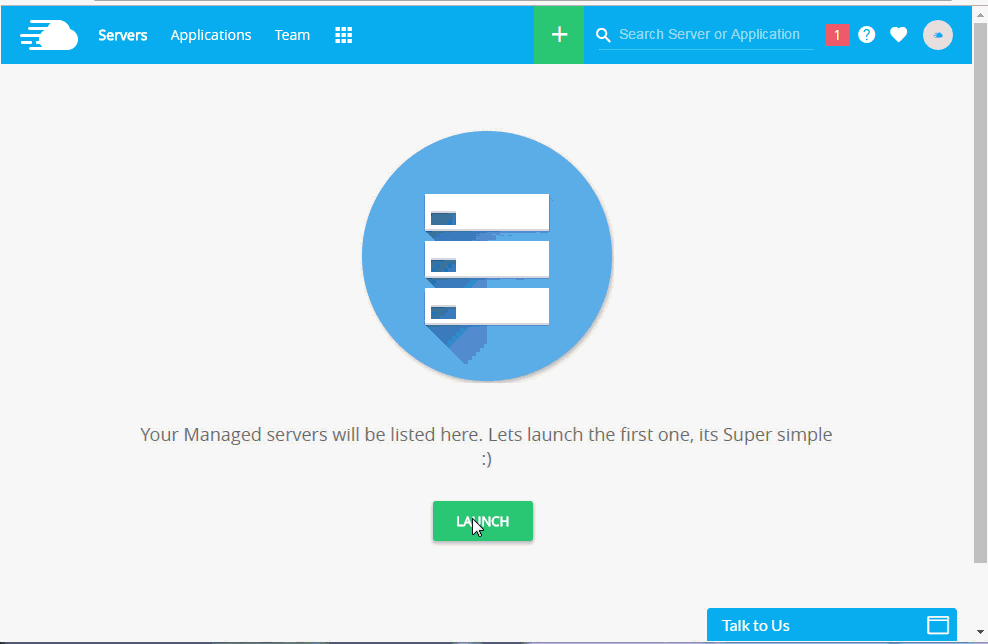
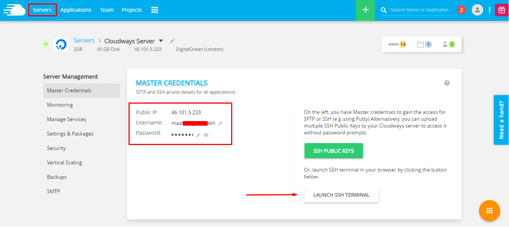
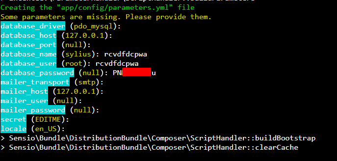
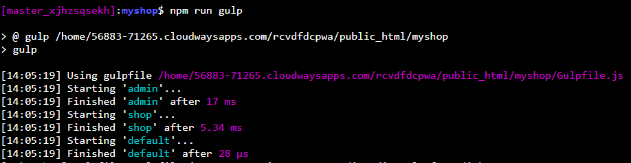
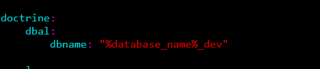
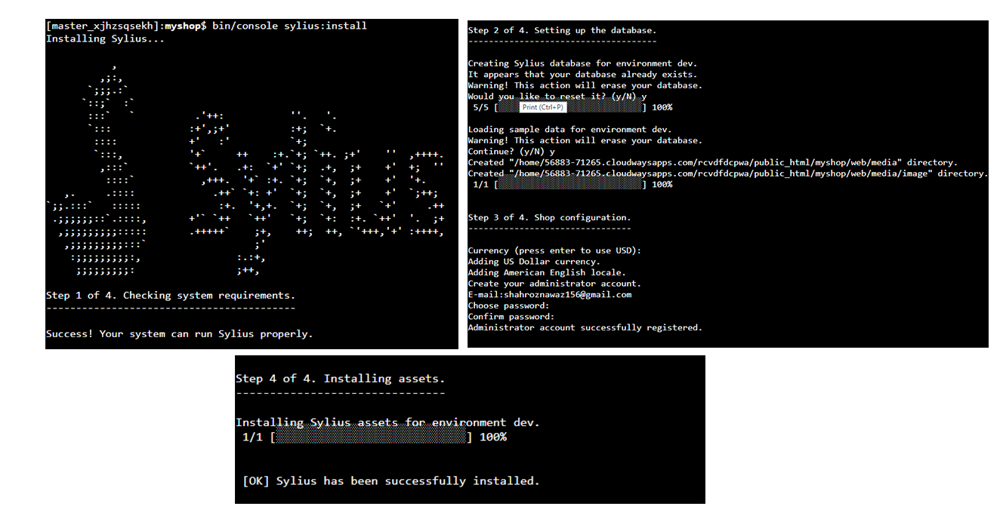
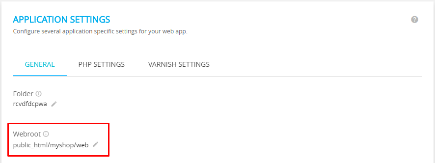
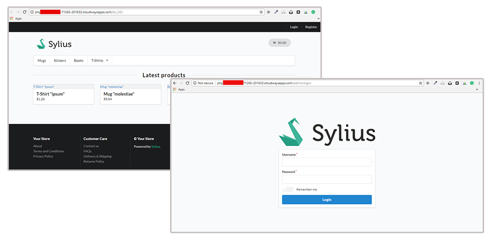

How to deploy Sylius to Cloudways PHP Hosting?
==============================================

The deployment process of Sylius on Cloudways is pretty much straight forward and easy.For the uninitiated,
Cloudways is a Managed hosting platform for custom PHP apps and PHP Framework like Symfony, Laravel, Codeigniter, Yii
CakePHP etc.You can launch the servers on any of the five providers including DigitalOcean, Vultr, AWS, GCE and KYUP containers.

Now to install Sylius you need to go through series of few steps:

1. Launch Server with Custom PHP App
------------------------------------

You can `signup at Cloudways <https://platform.cloudways.com/signup>`_ to buy the PHP servers from the above mentioned providers. Simply go to the pricing page and choose your required plan.
You then need to go through the verification process. Once it done login to platform and launch your first Custom PHP application. You can follow the Gif too.

Now let’s start the process of installing Sylius on Cloudways.

2. Install Sylius v1.0.0 via SSH
--------------------------------

Open the SSH terminal from the **Server Management tab**. You can also use PuTTY for this purpose. Find the SSH credentials under 
the **Master Credentials** heading and login to the SSH terminal:

After the login, move to the application folder using the `cd` command and run the following command to start installing Sylius:

.. code-block:: bash

    $ composer create-project -s beta sylius/sylius-standard myshop

The command will start installing the long list of dependencies for Sylius. Once the installation finishes, Sylius will ask for the database credentials.
You can find the database username and password in the Application Access Details.

.. image:: ../_images/cloudways-database.png
    :align: center

Enter the database details in the SSH terminal:

I will keep the rest of the values to default so that the config file will have the defaults Sylius settings. If the need arises, you can obviously change these settings later.

At this point, Sylius is half installed because I still need to setup the database and the shop credentials.

3. Install Node Dependencies
----------------------------

Sylius requires several Node packages, which also needs to be installed and updated before setting up the shop. In addition, I also need to start and setup gulp.

Now move to the myshop folder by using `cd myshop` and run the following command `npm install`. Once the command finishes, run the next command, `npm run gulp`.

You will observe that several automated tasks will be executed.

4. Populate the Database and Sylius
-----------------------------------

Before explaining this step, I want you to comment out the three lines in **config_dev.yml** file. This is because Sylius tries to find the database setup for the dev environment with the suffix **“_dev”**.
However, I want to use the main database from **parameters.yml** file.

Now run the following command:

.. code-block:: bash

    $ bin/console sylius:install

This command will perform several more steps in the installation including:

*Installing Sylius ecommerce shop
*Check system requirements
*Setting up the database
*Loading sample data for the environment
*Shop configurations
*Assets installation

In the Shop Configuration step, I would need to enter the email and password for the admin login.

5. Update The Webroot of the Application
----------------------------------------

Finally, the last step is to update the webroot of the application in the Platform. Move to the **Application Settings** tab and update it.

Now open the application URL as shown in the Access Details tab. Append “/admin” to this URL. Once the page loads up, use the 
credentials you provided earlier for admin login.

Learn more
----------

* Cloudways PHP Hosting documentation: `How to host PHP applications on DigitalOcean via Cloudways <https://www.cloudways.com/blog/host-php-on-digitalocean/>`_
* PHP FAQs And Features: `Know more about PHP Hosting <https://www.cloudways.com/en/php-cloud-hosting.php>`_
* `What You As A User Can Do With Cloudways PHP Stack <https://www.cloudways.com/blog/php-stack-user-guide/>`_
