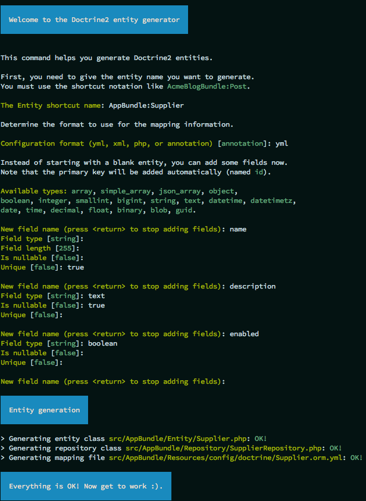
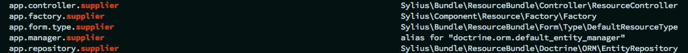

How to add a custom model?
==========================

In some cases you may be needing to add new models to your application in order to cover unique business needs.
The process of extending Sylius with new entities is simple and intuitive.

As an example we will take a **Supplier entity**, which may be really useful for shop maintenance.

1. Define your needs
--------------------

A Supplier needs three essential fields: ``name``, ``description`` and ``enabled`` flag.

2. Generate the entity
----------------------

Symfony, the framework Sylius uses, provides the `SensioGeneratorBundle <http://symfony.com/doc/current/bundles/SensioGeneratorBundle/index.html>`_,
that simplifies the process of adding a model.

.. warning::

    Remember to have the ``SensioGeneratorBundle`` imported in the AppKernel, as it is not there by default.

You need to use such a command in your project directory.

.. code-block:: bash

    $ php bin/console generate:doctrine:entity

The generator will ask you for the entity name and fields. See how it should look like to match our assumptions.

3. Update the database using migrations
---------------------------------------

Assuming that your database was up-to-date before adding the new entity, run:

.. code-block:: bash

    $ php bin/console doctrine:migrations:diff

This will generate a new migration file which adds the Supplier entity to your database.
Then update the database using the generated migration:

.. code-block:: bash

    $ php bin/console doctrine:migrations:migrate

4. Add ResourceInterface to your model class
--------------------------------------------

Go to the generated class file and make it implement the ``ResourceInterface``:

.. code-block:: php

    <?php

    namespace AppBundle\Entity;

    use Sylius\Component\Resource\Model\ResourceInterface;

    class Supplier implements ResourceInterface
    {
        // ...
    }

5. Register your entity as a Sylius resource
--------------------------------------------

If you don't have it yet create a file ``app/config/resources.yml``, import it in the ``app/config/config.yml``.

.. code-block:: yaml

    # app/config/config.yml
    imports:
        - { resource: "resources.yml" }

And add these few lines in the ``resources.yml`` file:

.. code-block:: yaml

    # app/config/resources.yml
    sylius_resource:
        resources:
            app.supplier:
                driver: doctrine/orm # You can use also different driver here
                classes:
                    model: AppBundle\Entity\Supplier

To check if the process was run correctly run such a command:

.. code-block:: bash

    $ php bin/console debug:container | grep supplier

The output should be:

6. Optionally try to use Sylius API to create new resource
----------------------------------------------------------

See how to work with API in :doc:`the separate cookbook here </cookbook/api>`.

.. note::

    Using API is not mandatory. It is just a nice moment for you to try it out. If you are not interested go to the next point of this cookbook.

7. Define grid structure for the new entity
-------------------------------------------

To have templates for your Entity administration out of the box you can use Grids. Here you can see how to configure a grid for the Supplier entity.

.. code-block:: yaml

    # app/config/grids/admin/supplier.yml
    sylius_grid:
        grids:
            app_admin_supplier:
                driver:
                    name: doctrine/orm
                    options:
                        class: AppBundle\Entity\Supplier
                fields:
                    name:
                        type: string
                        label: sylius.ui.name
                    description:
                        type: text
                        label: sylius.ui.description
                    enabled:
                        type: twig
                        label: sylius.ui.enabled
                        options:
                            template: "@SyliusUi/Grid/Field/enabled.html.twig"
                actions:
                    main:
                        create:
                            type: create
                    item:
                        update:
                            type: update
                        delete:
                            type: delete

Remember to import your grid in the ``app/config/grids/grids.yml`` file which has to be imported in the ``app/config/config.yml``.

.. code-block:: yaml

    # app/config/grids/grids.yml
    imports:
        - { resource: 'admin/supplier.yml' }

.. code-block:: yaml

    # app/config/config.yml
    imports:
        - { resource: "grids/grids.yml" }

8. Define routing for entity administration
-------------------------------------------

Having a grid prepared we can configure routing for the entity administration:

Create the ``app/config/routing/admin/supplier.yml`` file. Include it in the ``app/config/routing/admin/admin.yml``, which
should be also included in the ``app/config/routing.yml``.

.. code-block:: yaml

    # app/config/routing/admin/supplier.yml
    app_admin_supplier:
        resource: |
            alias: app.supplier
            section: admin
            templates: SyliusAdminBundle:Crud
            redirect: update
            grid: app_admin_supplier
            vars:
                all:
                    subheader: app.ui.supplier
                index:
                    icon: 'file image outline'
        type: sylius.resource

.. code-block:: yaml

    # app/config/routing/admin.yml
    app_admin_supplier:
        resource: 'admin/supplier.yml'

.. code-block:: yaml

    # app/config/routing.yml
    app_admin:
        resource: 'routing/admin.yml'
        prefix: /admin

9. Add entity administration to the admin menu
----------------------------------------------

.. tip::

    See :doc:`how to add links to your new entity administration in the administration menu </customization/menu>`.

9. Check the admin panel for your changes
-----------------------------------------

.. tip::

    To see what you can do with your new entity access the ``http://localhost:8000/admin/suppliers/`` url.

Learn more
----------

* :doc:`GridBundle documentation </bundles/SyliusGridBundle/index>`
* :doc:`ResourceBundle documentation </bundles/SyliusResourceBundle/index>`
* :doc:`Customization Guide </customization/index>`
