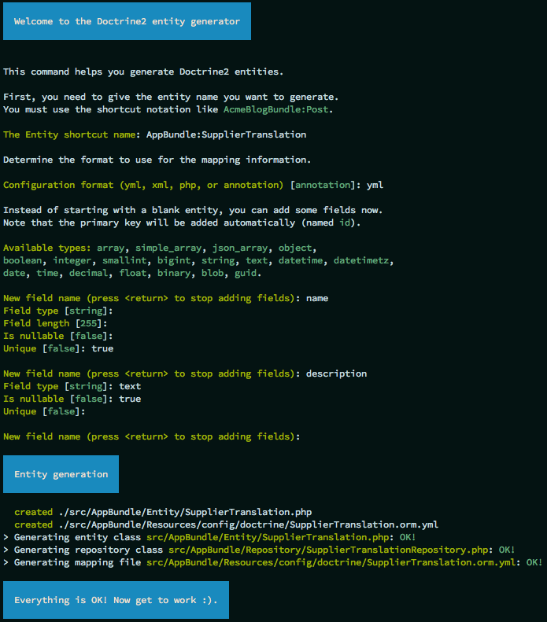
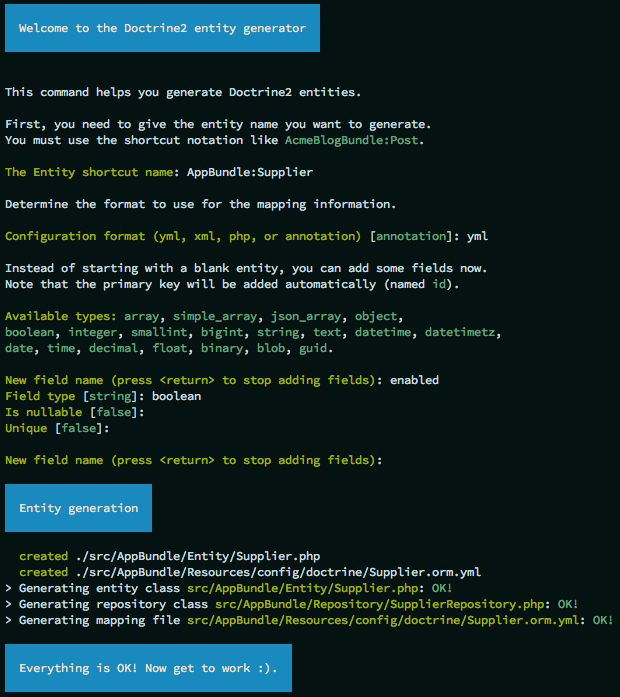
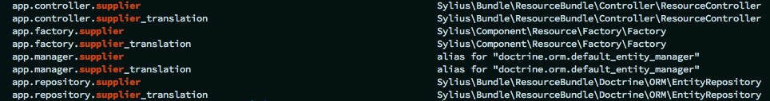

How to add a custom translatable model?
=======================================

In this guide we will create a new translatable model in our system, which is quite similar to :doc:`adding a simple model </cookbook/custom-model>`,
although it requires some additional steps.

As an example we will take a **translatable Supplier entity**, which may be really useful for shop maintenance.

1. Define your needs
--------------------

A Supplier needs three essential fields: ``name``, ``description`` and ``enabled`` flag.
The **name and description** fields need to be translatable.

2. Generate the SupplierTranslation entity
------------------------------------------

Symfony, the framework Sylius uses, provides the `SensioGeneratorBundle <http://symfony.com/doc/current/bundles/SensioGeneratorBundle/index.html>`_,
that simplifies the process of adding a model.

.. warning::

    Remember to have the ``SensioGeneratorBundle`` imported in the AppKernel, as it is not there by default.

You need to use such a command in your project directory.

.. code-block:: bash

    $ php bin/console generate:doctrine:entity

The generator will ask you for the entity name and fields. See how it should look like to match our assumptions.

As you can see we have provided only the desired translatable fields.

Below the final ``SupplierTranslation`` class is presented, it implements the ``ResourceInterface``.

.. code-block:: php

    <?php

    namespace AppBundle\Entity;

    use Sylius\Component\Resource\Model\AbstractTranslation;
    use Sylius\Component\Resource\Model\ResourceInterface;

    class SupplierTranslation extends AbstractTranslation implements ResourceInterface
    {
        /**
         * @var int
         */
        private $id;

        /**
         * @var string
         */
        private $name;

        /**
         * @var string
         */
        private $description;

        /**
         * @return int
         */
        public function getId()
        {
            return $this->id;
        }

        /**
         * @param string $name
         */
        public function setName($name)
        {
            $this->name = $name;
        }

        /**
         * @return string
         */
        public function getName()
        {
            return $this->name;
        }

        /**
         * @param string $description
         */
        public function setDescription($description)
        {
            $this->description = $description;
        }

        /**
         * @return string
         */
        public function getDescription()
        {
            return $this->description;
        }
    }

3. Generate the Supplier entity
-------------------------------

While generating the entity, similarly to the way the translation was generated, we are providing only non-translatable fields.
In our case only the ``enabled`` field.

Having the stubs generated, we need to extend our class with a connection to SupplierTranslation.

* implement the ``ResourceInterface``,
* implement the ``TranslatableInterface``,
* use the ``TranslatableTrait``,
* initialize the translations collection in the constructor,
* add the ``createTranslation()`` method,
* implement getters and setters for the properties that are held on the translation model.

As a result you should get such a ``Supplier`` class:

.. code-block:: php

    <?php

    namespace AppBundle\Entity;

    use Sylius\Component\Resource\Model\ResourceInterface;
    use Sylius\Component\Resource\Model\TranslatableInterface;
    use Sylius\Component\Resource\Model\TranslatableTrait;

    class Supplier implements ResourceInterface, TranslatableInterface
    {
        use TranslatableTrait {
            __construct as private initializeTranslationsCollection;
        }

        public function __construct()
        {
            $this->initializeTranslationsCollection();
        }

        /**
         * @var int
         */
        private $id;

        /**
         * @var bool
         */
        private $enabled;

        /**
         * @return int
         */
        public function getId()
        {
            return $this->id;
        }

        /**
         * @param string $name
         */
        public function setName($name)
        {
            $this->getTranslation()->setName($name);
        }

        /**
         * @return string
         */
        public function getName()
        {
            return $this->getTranslation()->getName();
        }

        /**
         * @param string $description
         */
        public function setDescription($description)
        {
            $this->getTranslation()->setDescription($description);
        }

        /**
         * @return string
         */
        public function getDescription()
        {
            return $this->getTranslation()->getDescription();
        }

        /**
         * @param boolean $enabled
         */
        public function setEnabled($enabled)
        {
            $this->enabled = $enabled;
        }

        /**
         * @return bool
         */
        public function getEnabled()
        {
            return $this->enabled;
        }

        /**
         * {@inheritdoc}
         */
        protected function createTranslation()
        {
            return new SupplierTranslation();
        }
    }

4. Update the database using migrations
---------------------------------------

Assuming that your database was up-to-date before adding the new entity, run:

.. code-block:: bash

    $ php bin/console doctrine:migrations:diff

This will generate a new migration file which adds the Supplier entity to your database.
Then update the database using the generated migration:

.. code-block:: bash

    $ php bin/console doctrine:migrations:migrate

5. Register your entity together with translation as a Sylius resource
----------------------------------------------------------------------

If you don't have it yet create a file ``app/config/resources.yml``, import it in the ``app/config/config.yml``.

.. code-block:: yaml

    # app/config/config.yml
    imports:
        - { resource: "resources.yml" }

And add these few lines in the ``resources.yml`` file:

.. code-block:: yaml

    # app/config/resources.yml
    sylius_resource:
        resources:
            app.supplier:
                driver: doctrine/orm # You can use also different driver here
                classes:
                    model: AppBundle\Entity\Supplier
                translation:
                    classes:
                        model: AppBundle\Entity\SupplierTranslation

To check if the process was run correctly run such a command:

.. code-block:: bash

    $ php bin/console debug:container | grep supplier

The output should be:

6. Prepare new forms for your entity, that will be aware of its translation
---------------------------------------------------------------------------

You will need both ``SupplierType`` and ``SupplierTranslationType``.

Let's start with the translation type, as it will be included into the entity type.

.. code-block:: php

    <?php

    namespace AppBundle\Form\Type;

    use Sylius\Bundle\ResourceBundle\Form\Type\AbstractResourceType;
    use Symfony\Component\Form\Extension\Core\Type\TextareaType;
    use Symfony\Component\Form\Extension\Core\Type\TextType;
    use Symfony\Component\Form\FormBuilderInterface;

    class SupplierTranslationType extends AbstractResourceType
    {
        /**
         * {@inheritdoc}
         */
        public function buildForm(FormBuilderInterface $builder, array $options)
        {
            $builder
                ->add('name', TextType::class)
                ->add('description', TextareaType::class, [
                    'required' => false,
                ])
            ;
        }

        /**
         * {@inheritdoc}
         */
        public function getBlockPrefix()
        {
            return 'app_supplier_translation';
        }
    }

On the ``SupplierTranslationType`` we need to define only the translatable fields.

Then let's prepare the entity type, that will include the translation type.

.. code-block:: php

    <?php

    namespace AppBundle\Form\Type;

    use Sylius\Bundle\ResourceBundle\Form\Type\AbstractResourceType;
    use Sylius\Bundle\ResourceBundle\Form\Type\ResourceTranslationsType;
    use Sylius\Component\Resource\Translation\Provider\TranslationLocaleProviderInterface;
    use Symfony\Component\Form\Extension\Core\Type\CheckboxType;
    use Symfony\Component\Form\Extension\Core\Type\TextareaType;
    use Symfony\Component\Form\Extension\Core\Type\TextType;
    use Symfony\Component\Form\FormBuilderInterface;

    class SupplierType extends AbstractResourceType
    {
        /**
         * {@inheritdoc}
         */
        public function buildForm(FormBuilderInterface $builder, array $options)
        {
            $builder
                ->add('translations', ResourceTranslationsType::class, [
                    'entry_type' => SupplierTranslationType::class,
                ])
                ->add('enabled', CheckboxType::class, [
                    'required' => false,
                ])
            ;
        }

        /**
         * {@inheritdoc}
         */
        public function getBlockPrefix()
        {
            return 'app_supplier';
        }
    }

7. Register the new forms as services
-------------------------------------

Before the newly created forms will be ready to use them, they need to be registered as services:

.. code-block:: yaml

    # AppBundle/Resources/config/services.yml
    services:
        app.supplier.form.type:
            class: AppBundle\Form\Type\SupplierType
            tags:
                - { name: form.type }
            arguments: ['%app.model.supplier.class%', ['sylius']]
        app.supplier_translation.form.type:
            class: AppBundle\Form\Type\SupplierTranslationType
            tags:
                - { name: form.type }
            arguments: ['%app.model.supplier_translation.class%', ['sylius']]

8. Register the forms as resource forms of the Supplier entity
--------------------------------------------------------------

Extend the resource configuration of the ``app.supplier`` with forms:

.. code-block:: yaml

    # app/config/resources.yml
    sylius_resource:
        resources:
            app.supplier:
                driver: doctrine/orm # You can use also different driver here
                classes:
                    model: AppBundle\Entity\Supplier
                    form: AppBundle\Form\Type\SupplierType
                translation:
                    classes:
                        model: AppBundle\Entity\SupplierTranslation
                        form: AppBundle\Form\Type\SupplierTranslationType

9. Define grid structure for the new entity
-------------------------------------------

To have templates for your Entity administration out of the box you can use Grids. Here you can see how to configure a grid for the Supplier entity.

.. code-block:: yaml

    # app/config/grids/admin/supplier.yml
    sylius_grid:
        grids:
            app_admin_supplier:
                driver:
                    name: doctrine/orm
                    options:
                        class: AppBundle\Entity\Supplier
                fields:
                    name:
                        type: string
                        label: sylius.ui.name
                        sortable: translation.name
                    enabled:
                        type: twig
                        label: sylius.ui.enabled
                        options:
                            template: "@SyliusUi/Grid/Field/enabled.html.twig"
                actions:
                    main:
                        create:
                            type: create
                    item:
                        update:
                            type: update
                        delete:
                            type: delete

Remember to import your grid in the ``app/config/grids/grids.yml`` file which has to be imported in the ``app/config/config.yml``.

.. code-block:: yaml

    # app/config/grids/grids.yml
    imports:
        - { resource: 'admin/supplier.yml' }

.. code-block:: yaml

    # app/config/config.yml
    imports:
        - { resource: "grids/grids.yml" }

10. Define routing for entity administration
--------------------------------------------

Having a grid prepared we can configure routing for the entity administration:

Create the ``app/config/routing/admin/supplier.yml`` file. Include it in the ``app/config/routing/admin/admin.yml``, which
should be also included in the ``app/config/routing.yml``.

.. code-block:: yaml

    # app/config/routing/admin/supplier.yml
    app_admin_supplier:
        resource: |
            alias: app.supplier
            section: admin
            templates: SyliusAdminBundle:Crud
            redirect: update
            grid: app_admin_supplier
            vars:
                all:
                    subheader: app.ui.supplier
                index:
                    icon: 'file image outline'
        type: sylius.resource

.. code-block:: yaml

    # app/config/routing/admin.yml
    app_admin_supplier:
        resource: 'admin/supplier.yml'

.. code-block:: yaml

    # app/config/routing.yml
    app_admin:
        resource: 'routing/admin.yml'
        prefix: /admin

9. Add entity administration to the admin menu
----------------------------------------------

.. tip::

    See :doc:`how to add links to your new entity administration in the administration menu </customization/menu>`.

9. Check the admin panel for your changes
-----------------------------------------

.. tip::

    To see what you can do with your new entity access the ``http://localhost:8000/admin/suppliers/`` url.

Learn more
----------

* :doc:`GridBundle documentation </bundles/SyliusGridBundle/index>`
* :doc:`ResourceBundle documentation </bundles/SyliusResourceBundle/index>`
* :doc:`Customization Guide </customization/index>`
