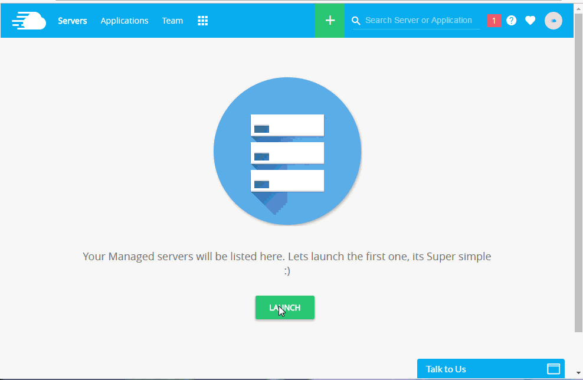
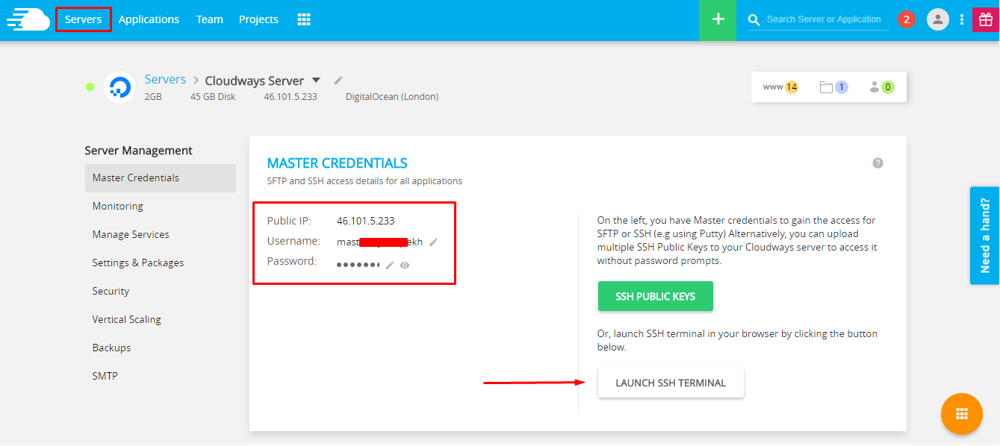
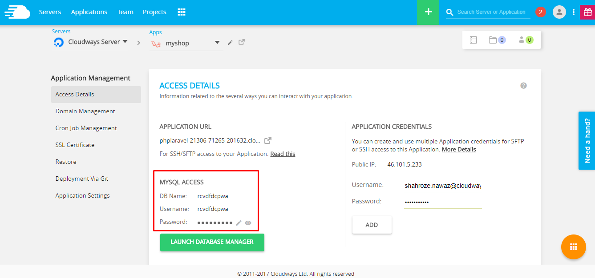
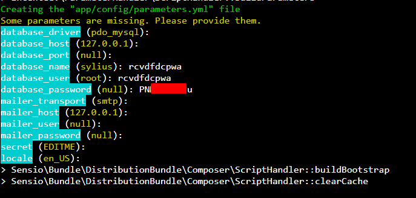
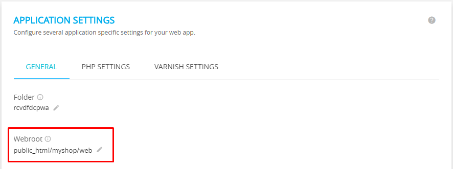

How to deploy Sylius to Cloudways PHP Hosting?
==============================================

Cloudways is a managed hosting platform for custom PHP apps and PHP frameworks such as Symfony, Laravel, Codeigniter, Yii,
CakePHP and many more. You can launch the servers on any of the five providers including DigitalOcean, Vultr, AWS, GCE and KYUP containers.

The deployment process of Sylius on Cloudways is pretty much straightforward and easy.

Now to install Sylius you need to go through series of few steps:

1. Launch Server with Custom PHP App
------------------------------------

You should `signup at Cloudways <https://platform.cloudways.com/signup>`_ to buy the PHP servers from the above mentioned providers. Simply go to the pricing page and choose your required plan.
You then need to go through the verification process. Once it done login to platform and launch your first Custom PHP application. You can follow the Gif too.

Now let’s start the process of installing Sylius on Cloudways.

2. Install the latest version of Sylius via SSH
-----------------------------------------------

Open the SSH terminal from the **Server Management tab**. You can also use PuTTY for this purpose. Find the SSH credentials under 
the **Master Credentials** heading and login to the SSH terminal:

After the login, move to the application folder using the ``cd`` command and run the following command to start installing Sylius:

.. code-block:: bash

    $ composer create-project sylius/sylius-standard myshop

The command will start installing the long list of dependencies for Sylius. Once the installation finishes, Sylius will ask for the database credentials.
You can find the database username and password in the Application Access Details.

Enter the database details in the SSH terminal:

Keep the rest of the values to default so that the config file will have the defaults Sylius settings.
If the need arises, you can obviously change these settings later.

3. Install Node Dependencies
----------------------------

Sylius requires several Node packages, which also needs to be installed and updated before setting up the shop. In addition, I also need to start and setup Gulp.

Now move to the myshop folder by using ``cd myshop`` and run the following command ``yarn install``. Once the command finishes, run the next command, ``yarn build``.

4. Install Sylius for the production environment
------------------------------------------------

Now run the following command:

.. code-block:: bash

    $ bin/console sylius:install -e prod

5. Update The Webroot of the Application
----------------------------------------

Finally, the last step is to update the webroot of the application in the Platform. Move to the **Application Settings** tab and update it.

Now open the application URL as shown in the Access Details tab.

Learn more
----------

* Cloudways PHP Hosting documentation: `How to host PHP applications on DigitalOcean via Cloudways <https://cloudways.com/blog/host-php-on-digitalocean>`_
* PHP FAQs And Features: `Know more about PHP Hosting <https://cloudways.com/en/php-cloud-hosting.php>`_
* `What You As A User Can Do With Cloudways PHP Stack <https://cloudways.com/blog/php-stack-user-guide>`_
