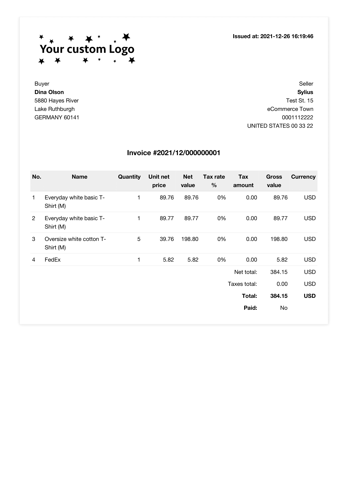
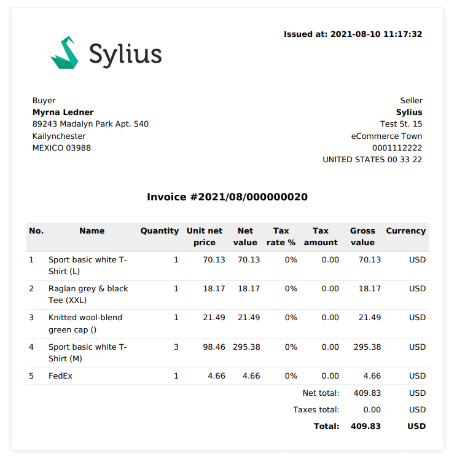
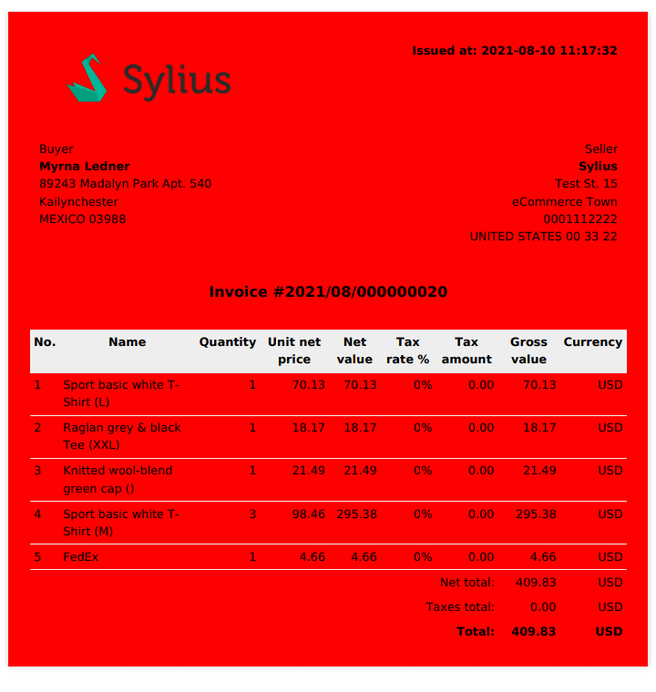
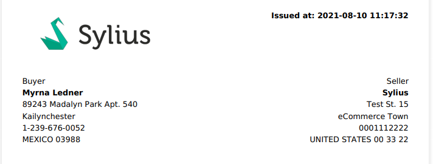
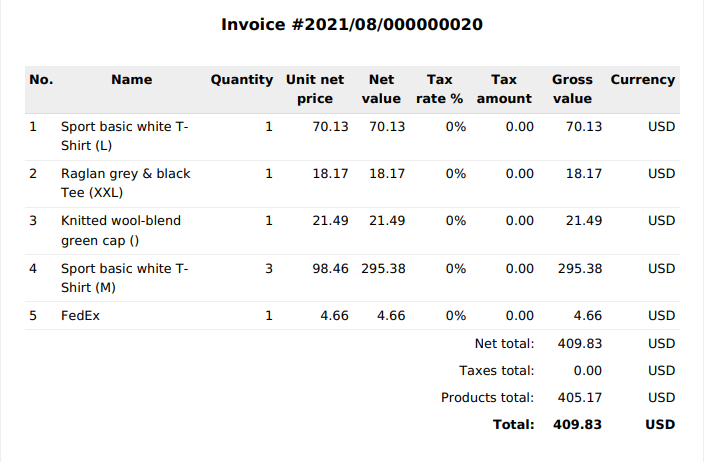

How to customize the order invoice?
===================================

.. note::

    This cookbook describes customization of a feature available only with `Sylius/InvoicingPlugin <https://github.com/Sylius/InvoicingPlugin/>`_ installed.

The invoicing plugin lets you generate invoice on admin panel and download PDF with it. This plugin also sends an email with this invoice
as well as let the administrator to delegate an email resend.

Why would you customize the invoice?
------------------------------------

Invoicing Plugin provides a generic solution for generating invoices for orders, it is enough for a basic invoicing functionality
but many shops need this feature customized for its needs.
For example, one may need to change the look of it, or add some more data.

Getting started
---------------

Before you start make sure that you have:

#. `Sylius/InvoicingPlugin <https://github.com/Sylius/InvoicingPlugin/>`_ installed.
#. `Wkhtmltopdf <https://wkhtmltopdf.org/>`_ package installed, because most of pdf generation is done with it.

How to change the logo in the Invoice?
----------------------------------------

In order to change the logo on the invoice, set up the ``SYLIUS_INVOICING_LOGO_FILE`` environment variable.

Example custom configuration:

.. code-block:: text

    SYLIUS_INVOICING_LOGO_FILE=%kernel.project_dir%/public/assets/custom-logo.png

Make sure to clear the cache each time the configuration is changed.

How to add more graphics to the Invoice?
--------------------------------------------
In case you would like to add an extra graphic to your Invoice twig template, it is super important to provide access to this file.
Let's say you would like to add second image to the Invoice.
You may face the problem that ``wkhtmltopdf`` from version 0.12.6 disables access to the local files by default.
Fortunately, there are two options to deal with it:

* Update the ``config/packages/knp_snappy.yaml`` file by adding access to local files globally:

    .. code-block:: yaml

        knp_snappy:
            pdf:
                options:
                    enable-local-file-access: true

* Specify the exact list of accessible files. As you may have noticed, the logo displays correctly even though local file access is not enabled.
  This is because we handle it by specifying the exact list of allowed files.
  The list can be replaced with the ``sylius_refund.pdf_generator.allowed_files`` parameter in the ``config/packages/_sylius.yaml``:

    .. code-block:: yaml

        sylius_invoicing:
            pdf_generator:
                allowed_files:
                    - '%env(default:default_logo_file:resolve:SYLIUS_INVOICING_LOGO_FILE)%'
                    - 'path/image.png'
                    - 'directory/with/allowed/files'

How to customize the invoice appearance?
----------------------------------------

There might be need to change how the invoices look like, f.e. there might be different logo dimension, some colours changed
on the tables, or maybe the order of fields might be changed.

First let's prepare the HTML's so we can modify them. This command will copy only the PDF template:

.. code-block:: bash

    mkdir templates/bundles/SyliusInvoicingPlugin/Invoice/Download
    cp vendor/sylius/invoicing-plugin/src/Resources/views/Invoice/Download/pdf.html.twig templates/bundles/SyliusInvoicingPlugin/Download

But you can also copy all of the templates with:

.. code-block:: bash

    mkdir templates/bundles/SyliusInvoicingPlugin
    cp -r vendor/sylius/invoicing-plugin/src/Resources/views/Invoice templates/bundles/SyliusInvoicingPlugin/

In directory ``templates/bundles/SyliusInvoicingPlugin/Invoice`` you can find now few files.

Let's modify the generated PDF. In this case we will modify the file from ``Download/pdf.html.twig``.
This is how the default PDF looks like (don't worry this is not a real address of Myrna, or is it?):

Now with some magic of HTML and CSS we can modify this template, as an example we can change the color of background to ``red`` by changing

.. code-block:: html

    <!--...-->
    

    <!--...-->
    

and after this change we are graced with this masterpiece:

.. warning::

    Every PDF that you generate is stored and then extracted so it won't be created again. If you want to see the changes
    go to ``private/invoices`` and remove the generated PDF. You should see the changes of your file when you generate it again.

.. note::

    You can also modify the view on administrator page by changing code inside ``show.html.twig`` and related templates

.. note::

    You can learn more about customizing templates at :doc:`Customization Guide </customization/index>`

How to add additional fields to invoice?
----------------------------------------

Let's say that you need (or not) some more fields. In this example we will add the customer phone number.
Because we are basing upon the existing field, there should be no problem adding it to document - just place a line into
``Download/pdf.html.twig`` file. The ``Phone Number`` field is quite nested so you need to add ``invoice.order.customer.phoneNumber``
to retrieve it:

.. code-block:: twig

    <!--...-->
        {{ invoice.billingData.city }} 
        {{ invoice.order.customer.phoneNumber }} 
        {{ invoice.billingData.countryCode}}
    <!--...-->

And as a result we can see that phone number has been added just after the city:

.. note::

    You can also create some validation (for example if customer has no phone number) so the field won't be shown.
    If you want to learn more about twig - visit `twig <https://twig.symfony.com/>`_.

How to change the appearance of invoice tables?
-----------------------------------------------

By default on lower right corner of invoice we are displaying ``total`` of ordered items and shipment.
Lets create now a new row where we will show ``Products total`` where only price for products will be shown.

First let's add the new table row between other ``totals`` in ``pdf.html.twig``

.. code-block:: twig

    <!--...-->
        <tr class="totals">
            <!--tr body-->
        </tr>

        <tr class="totals">
            <td colspan="5"></td>
            <td colspan="2" >{{ 'sylius_invoicing_plugin.ui.products_total'|trans([], 'messages', invoice.localeCode) }}:</td>
            <td>{{ '%0.2f'|format(invoice.order.itemsTotal/100) }}</td>
            <td>{{ invoice.currencyCode }}</td>
        </tr>

        <tr class="totals bold">
        </tr>
    <!--...-->

And now add the translation by creating file ``translations/messages.en.yaml`` and adding:

.. code-block:: yaml

    sylius_invoicing_plugin:
        ui:
            products_total: 'Products total'

after this changes your PDF's total table should look like this:

How to extend Invoice with custom logic?
----------------------------------------

With default behavior and some simple customization it should be quite simple to achieve the Invoice you are looking for.
But life is not so straightforward as we all would like, and you are in need to create some custom logic for your needs.
Scary process isn't it? Well not exactly, let's create some custom logic for your invoice in this step.

First we need a class with our logic that will extend current Invoice:

.. code-block:: php

    <?php

    declare(strict_types=1);

    namespace App\Entity\Invoice;

    use Doctrine\ORM\Mapping as ORM;
    use Sylius\InvoicingPlugin\Entity\Invoice as BaseInvoice;

    /**
     * @ORM\Entity
     * @ORM\Table(name="sylius_invoicing_plugin_invoice")
     */
    class Invoice extends BaseInvoice implements InvoiceInterface
    {
        public function customFunction(): mixed
        {
            /** your custom logic */
        }
    }

And if there is a need you can also create an interface that will extend the base one:

.. code-block:: php

    <?php

    declare(strict_types=1);

    namespace App\Entity\Invoice;

    use Sylius\InvoicingPlugin\Entity\InvoiceInterface as BaseInvoiceInterface;

    interface InvoiceInterface extends BaseInvoiceInterface
    {
        public function customFunction(): mixed;
    }

Now let's add those classes to the configuration:

.. code-block:: yaml

    # config/packages/_sylius.yaml
    sylius_invoicing:
    resources:
        invoice:
            classes:
                model: App\Entity\Invoice\Invoice
                interface: App\Entity\Invoice\InvoiceInterface

.. note::

    Don't forget to update your database if you are changing/adding fields.

Now you can show a new invoice table on PDF with some changes just like in chapters before.
