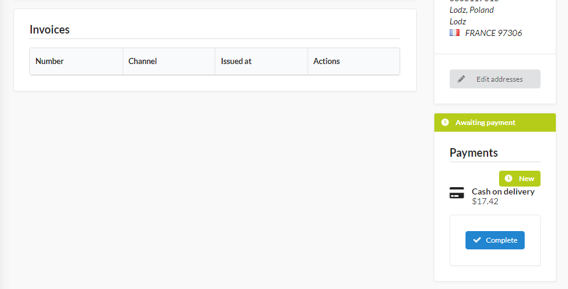

How to have the Invoice generated after the payment is paid?
============================================================

.. note::

    This cookbook describes customization of a feature available only with `Sylius/InvoicingPlugin <https://github.com/Sylius/InvoicingPlugin/>`_ installed.

The invoicing plugin lets you generate and download PDF invoices regarding orders. In its default behavior the invoice
is generated right after the customer creates and places the order.
In this cookbook, we will describe how to change this behavior, so the invoice will be created right after the order would be paid.

Why would you customize the invoice generation?
-----------------------------------------------

In the default case the order items should not be changed after completing order. But let's say that your shop is customized with some logic
which is not out of the box. Maybe one of these changes will let you change the order after it is placed?
In this case, it would be better to have an invoice generated after a particular step (in the case of this cookbook - after the order is paid).

Getting started
---------------

Before you start, make sure that you have:

#. `Sylius/InvoicingPlugin <https://github.com/Sylius/InvoicingPlugin/>`_ installed.
#. `Wkhtmltopdf <https://wkhtmltopdf.org/>`_ package installed, because most of pdf generation is done with it.

How to customize the invoice generation?
----------------------------------------

The concept is quite straightforward and it is based on Symfony events and event listeners.
We need to create 3 classes and declare them in config files.
Let's start first with EventListeners that will override the default ones:

**1.** The ``OrderPaymentPaidListener`` will create an invoice and check if it does not exist:

.. code-block:: php

    <?php

    declare(strict_types=1);

    namespace App\EventListener;

    use Sylius\InvoicingPlugin\Command\SendInvoiceEmail;
    use Sylius\InvoicingPlugin\Creator\InvoiceCreatorInterface;
    use Sylius\InvoicingPlugin\Event\OrderPaymentPaid;
    use Sylius\InvoicingPlugin\Exception\InvoiceAlreadyGenerated;
    use Symfony\Component\Messenger\MessageBusInterface;

    final class OrderPaymentPaidListener
    {
        /** @var InvoiceCreatorInterface */
        private $invoiceCreator;

        /** @var MessageBusInterface */
        private $commandBus;

        public function __construct(InvoiceCreatorInterface $invoiceCreator, MessageBusInterface $commandBus)
        {
            $this->invoiceCreator = $invoiceCreator;
            $this->commandBus = $commandBus;
        }

        public function __invoke(OrderPaymentPaid $event): void
        {
            try {
                $this->invoiceCreator->__invoke($event->orderNumber(), $event->date());
            } catch (InvoiceAlreadyGenerated $exception) {
            }

            $this->commandBus->dispatch(new SendInvoiceEmail($event->orderNumber()));
        }
    }

**2.** The ``NoInvoiceOnOrderPlacedListener`` will not do anything (what a lazy boy), but as we are changing the behavior, it still has very important role:

.. code-block:: php

    <?php

    declare(strict_types=1);

    namespace App\EventListener;

    use Sylius\InvoicingPlugin\Event\OrderPlaced;

    final class NoInvoiceOnOrderPlacedListener
    {
        public function __invoke(OrderPlaced $event): void
        {
            // intentionally left blank
        }
    }

**3.** Last but not least ``OrderPaymentPaidProducer`` which will dispatch an event at a correct moment:

.. code-block:: php

    <?php

    declare(strict_types=1);

    namespace App\Producer;

    use Sylius\Component\Core\Model\OrderInterface;
    use Sylius\Component\Core\Model\PaymentInterface;
    use Sylius\InvoicingPlugin\DateTimeProvider;
    use Sylius\InvoicingPlugin\Event\OrderPaymentPaid;
    use Symfony\Component\Messenger\MessageBusInterface;

    final class OrderPaymentPaidProducer
    {
        /** @var MessageBusInterface */
        private $eventBus;

        /** @var DateTimeProvider */
        private $dateTimeProvider;

        public function __construct(
            MessageBusInterface $eventBus,
            DateTimeProvider $dateTimeProvider
        ) {
            $this->eventBus = $eventBus;
            $this->dateTimeProvider = $dateTimeProvider;
        }

        public function __invoke(PaymentInterface $payment): void
        {
            /** @var OrderInterface|null $order */
            $order = $payment->getOrder();
            if ($order === null) {
                return;
            }

            /** @var string $number */
            $number = $order->getNumber();
            $this->eventBus->dispatch(new OrderPaymentPaid($number, $this->dateTimeProvider->__invoke()));
        }
    }

**4.** Last thing that we need to do is to register new services in a container:

.. code-block:: yaml

    # config/services.yaml
    services:
        sylius_invoicing_plugin.listener.order_payment_paid:
            class: App\EventListener\OrderPaymentPaidListener
            arguments:
                - '@sylius_invoicing_plugin.creator.invoice'
                - '@sylius.command_bus'
            tags:
                - { name: messenger.message_handler }

        sylius_invoicing_plugin.event_listener.order_placed:
            class: App\EventListener\NoInvoiceOnOrderPlacedListener
            tags:
                - { name: messenger.message_handler }

        sylius_invoicing_plugin.event_producer.order_payment_paid:
            class: App\Producer\OrderPaymentPaidProducer
            arguments:
                - '@sylius.event_bus'
                - '@sylius_invoicing_plugin.date_time_provider'
            public: true

After these changes, the invoice will be generated after the order is paid, not just after it is placed.

