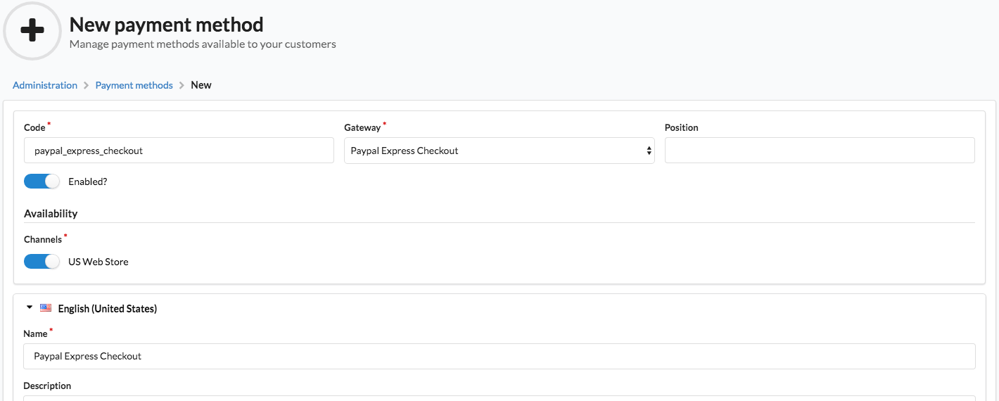

How to configure PayPal Express Checkout?
=========================================

.. warning::

    PayPal Express Checkout integration is deprecated. Take a look at the
    `PayPal Commerce Platform <https://github.com/Sylius/PayPalPlugin>`_ integration, which is now the default
    PayPal-related gateway for Sylius.

One of the most frequently used payment methods in e-commerce is PayPal. Its configuration in Sylius is really simple.

Add a payment method with the Paypal Express gateway in the Admin Panel
------------------------------------------------------------------------

.. note::

    To test this configuration properly you will need a `developer account on Paypal <https://developer.paypal.com>`_.

* Create a new payment method choosing ``Paypal Express Checkout`` gateway from the gateways choice dropdown and enable it for chosen channels.

Go to the ``https://localhost:8000/admin/payment-methods/new/paypal_express_checkout`` url.

* Fill in the Paypal configuration form with your developer account data (``username``, ``password`` and ``signature``).
* Save the new payment method.

Choosing Paypal Express method in Checkout
------------------------------------------

From now on Paypal Express will be available in Checkout in the channel you have created it for.

.. image:: ../../_images/paypal_express_checkout.png
    :align: center

**Done!**

Learn more
----------

* :doc:`Payments concept documentation </book/orders/payments>`
* `Payum - Project Documentation <https://github.com/Payum/Payum/blob/master/src/Payum/Core/Resources/docs/index.md>`_
