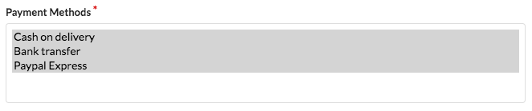

How to configure PayPal Express Checkout?
=========================================

One of the most frequently used payment methods in e-commerce is PayPal. Its configuration in Sylius is really simple.

Configure the gateway
---------------------

.. note::

    To test this configuration properly you will need a `developer account on Paypal <https://developer.paypal.com>`_.
    Use its data (``username``, ``password`` and ``signature``) in the **parameters.yml** file.

.. code-block:: yaml

    # app/config/parameters.yml
    parameters:
        paypal.express_checkout.username: TEST
        paypal.express_checkout.password: TEST
        paypal.express_checkout.signature: TEST
        paypal.express_checkout.sandbox: true

Having these parameters defined you can configure the gateway inside the ``app/config/payum.yml`` file which has to be imported in the ``app/config/config.yml``.

.. code-block:: yaml

    # app/config/payum.yml
    payum:
        gateways:
            paypal_express_checkout:
                factory: "paypal_express_checkout"
                payum.http_client: "@sylius.payum.http_client"
                username: "%paypal.express_checkout.username%"
                password: "%paypal.express_checkout.password%"
                signature: "%paypal.express_checkout.signature%"
                sandbox: "%paypal.express_checkout.sandbox%"

    sylius_payment:
        gateways:
            paypal_express_checkout: Paypal Express Checkout

.. code-block:: yaml

    # app/config/config.yml
    imports:
        - { resource: "payum.yml" }

Add a payment method with the Paypal Expresss gateway in the Admin Panel
------------------------------------------------------------------------

* Create a new payment method and choose the ``Paypal Express Checkout`` gateway for it.

Go to the ``http://localhost:8000/admin/payment-methods/new`` url.

.. image:: ../_images/paypal_express_create.png
    :align: center

Save the new method.

* Add the new method to a channel.

Go to the ``http://localhost:8000/admin/channels`` url.

Choose one of your channels and edit it.

Choosing Paypal Express method in Checkout
------------------------------------------

From now on Paypal Express will be available in Checkout in the channel you have added it to.

.. image:: ../_images/paypal_express_checkout.png
    :align: center

**Done!**

Learn more
----------

* :doc:`Payments concept documentation </book/payments>`
* `Payum - Project Documentation <https://github.com/Payum/Payum/blob/master/src/Payum/Core/Resources/docs/index.md>`_
