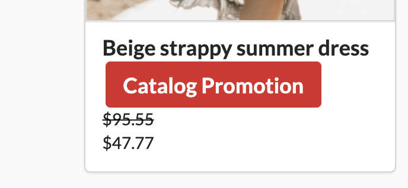
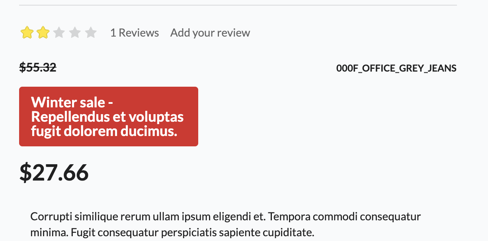
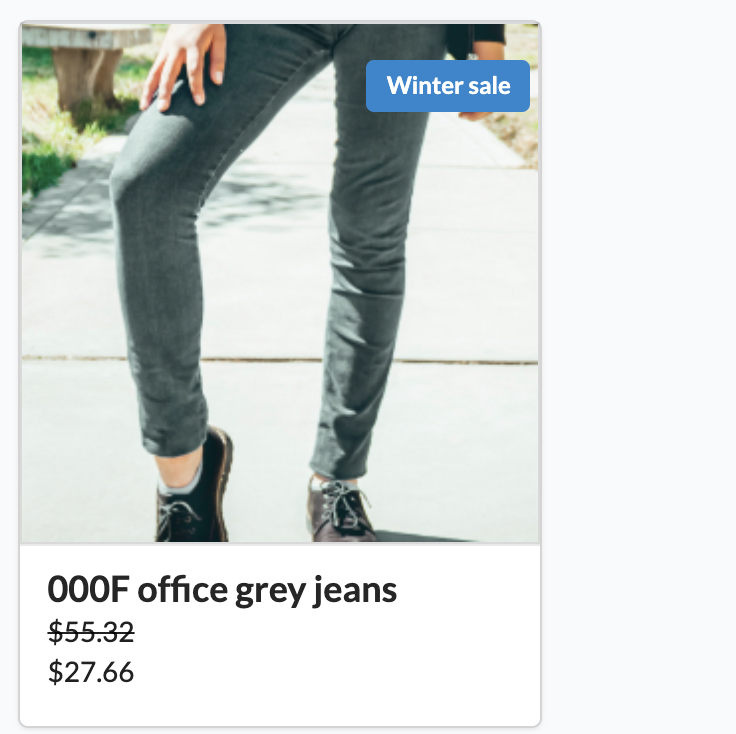

How to customize catalog promotion labels?
==========================================

To customize catalog promotion labels only what need to do is overwrite their template.

.. tip::

    Learn more about template customization :doc:`here </customization/template>`.

Change the catalog promotion labels' styles
-------------------------------------------

By default Sylius displays catalog promotion labels in two locations: on the product's index on product's card and also on the product show page.
Both places use the same template (``@SyliusShop/Product/Show/_catalogPromotionLabels.html.twig``) which you need to override with your own:
``templates/bundles/SyliusShopBundle/Product/Show/_catalogPromotionLabels.html.twig`` that will have such content:

.. code-block:: twig

    

        
            

                

                    {{ appliedPromotion.label }} - {{ appliedPromotion.description }}
                

            

        
    

How will it look after changes?

Product index:

Product show:

Of course, you can modify the styles how you need, also in your stylesheet.

Display catalog promotion labels on the product image
-----------------------------------------------------

In order to change the location of catalog promotion label on the product's card, we need to overwrite two templates.
We will remove the label from underneath the photo in product card template and then add it on the product's image.

Override the ``@SyliusShopBundle/Product/Box/_content.html.twig`` template with ``templates/bundles/SyliusShopBundle/Product/Box/_content.html.twig``:

.. code-block:: twig

    

    

        <a href="{{ path('sylius_shop_product_show', {'slug': product.slug, '_locale': product.translation.locale}) }}" class="blurring dimmable image">
            

                

                    

                        
{{ 'sylius.ui.view_more'|trans }}

                    

                

            

            
        </a>
        

            <a href="{{ path('sylius_shop_product_show', {'slug': product.slug, '_locale': product.translation.locale}) }}" class="header sylius-product-name" {{ sylius_test_html_attribute('product-name', product.name) }}>{{ product.name }}</a>

            
                
                
                
                    
<del>{{ originalPrice }}</del>

                
                
{{ price }}

            
        

    

And the ``@SyliusShopBundle/Product/_mainImage.html.twig`` with ``templates/bundles/SyliusShopBundle/Product/_mainImage.html.twig``:

.. code-block:: twig

    
        
    
        
    
        
    

    
    

    

        
        

            
                

                    

                        {{ appliedPromotion.name }}
                    

                

            
        

    

After changes:

Well done! Now you can do anything you want with the catalog promotion labels.
