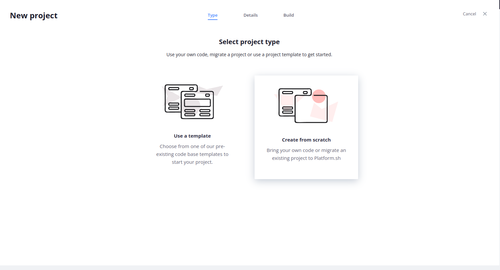
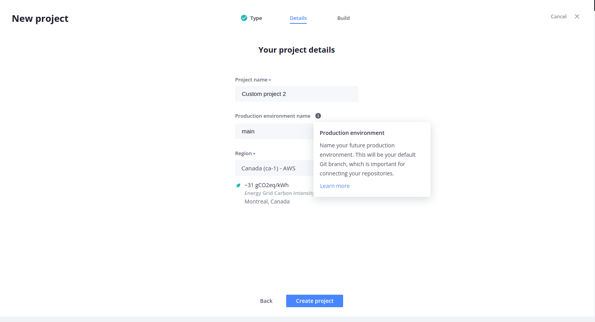

Introduction to Sylius Cloud
===========================================

Sylius Cloud is a way of efficient and scalable Sylius hosting. With Sylius Cloud you get the ability of
deploying and managing your Sylius platform with minimal DevOps knowledge. All you need to do is to configure your project
dependencies, push the application and maintain it.

What is Sylius Cloud
--------------------

Sylius Cloud is a solution based on Platform.sh - a modern PaaS (Platform-as-a-Service) which gives you ability of creating
and managing any kind of environment, starting from development, through stagings, pre-productions, up to production environment.
It's based on its own containers architecture, with gives you all that is good of performance, security and scalability at once.

Using Platform.sh as a base of Sylius Cloud adds a possibility of hosting your Sylius platform on one of the following cloud service providers:

- \- Amazon Web Services (AWS)
- \- Google Cloud Platform (GCP)
- \- Microsoft Azure
- \- OVH

With Sylius Cloud you're able to choose the service provider, server characteristics (number of CPUs, memory amount, disk size etc.)
with a clear information about costs. It's a good solution both for small, medium and huge web stores with a big traffic and number of orders.

Main Sylius Cloud concepts:

- \- Git-driven architecture - helps with setting up new environments with a simple pushing a new git branch to the specified remote. It makes you ability to create new environments fast.
- \- Infrastructure as a code - all you need to do is to write your application and a few Yaml files to create your environment. So simple and so powerful.
- \- Multi-services and multi-apps - it doesn't matter your application is monolith- or microservice-based architecture. It doesn't matter how much different external services you need (MySQL, PostgreSQL, ElasticSearch, Redis etc.) - it just works good in all cases.

Sylius Cloud configuration in Sylius
------------------------------------

All the infrastructure configuration files are placed in `Sylius-Standard <https://github.com/Sylius/Sylius-Standard>`_ project. It means you'll get it when running the command:

.. code-block:: bash

    composer create-project sylius/sylius-standard acme

The paths you should be interested in are:

- \- `.platform.app.yaml` - This file is used to define the configuration of the application itself. It specifies how the application should be built, what runtime to use, which commands to run on deployment, etc. It also includes information such as the type of application, language runtime, build and deploy hooks, and more.
- \- `.env.platform.dist` - The environment file automatically used by the application during the build process.
- \- `.platform/routes.yaml` - This file defines the routes and how traffic is routed to the application. It specifies the incoming URLs and how they should be directed to the appropriate services or applications. Routes can be configured to handle different paths, domains, or other conditions.
- \- `.platform/services.yaml` - This file is used to define additional services or dependencies required by the application. It allows defining various types of services such as databases, caches, search engines, etc., along with their configuration. Services defined in this file are automatically provisioned and integrated with the application environment.

Creating a new project and environment
--------------------------------------

Every new environment needs to be created in the Sylius Cloud Console or by using the CLI.
But first before creating an environment you need to create the project. When you're creating a new project from the Console,
to use the Sylius Cloud potential, please choose the "Create from scratch" option, as selected on the screenshot below:

|

During creating a new project you'll automatically create a new environment, which is connected to your git branch (please read the information on screenshot below):

|

When you've created the project, you're ready to create new environments. Please note that your project already have the first (production) environment just after project is being created.
Regarding of creating new environment, we assume you're a developer, so it will be more convenient for you to use the CLI command:

.. code-block:: bash

    platform environment:create

This command will prompt you to specify various options for the new environment, such as its name, type, parent environment, and more. Follow the prompts to configure the new environment according to your requirements.
Once the environment is created, you can deploy your application to it using the following command:

.. code-block:: bash

    platform push --environment=<branch_name>

Replace <branch_name> with the name of the Git branch you want to deploy.
After the deployment is complete, you can access your new environment using its unique URL, which typically follows the format:

.. code-block:: bash

    <ENVIRONMENT_NAME>-<PROJECT_ID>.<REGION>.platformsh.site

That's it! You've now created a new environment in your Sylius Cloud project and deployed your application to it. You can repeat these steps to create additional environments as needed for development, testing, or other purposes.

Developing application with Sylius Cloud
----------------------------------------

As described in previous section, you're able to create new environments by using the CLI command. Working with multiple environments is a very good point of development. It gives you a lot of advantages, like:

- \- You're able to create an environment for all your features and test how they behave on the real infrastructure.
- \- Your team mates test the features independently of other developers. They're able to create their own environment and work there.
- \- When you're using Git Flow, you're able to test how your features integrate with other functionalities, i.e., with other microservices.
- \- You and your team mates don't need to be DevOps. They only need to know a few commands in git.

Using the CLI command from offers also other positive aspects for developers and DevOps teams. It provides a streamlined and efficient way
to manage Sylius Cloud projects, environments, and deployments directly from the command line interface. With the CLI command, users can easily create,
configure, and deploy applications, reducing manual intervention and saving time. Additionally, the command provides access to a wide range of Sylius Cloud
features, including environment management, scaling, backups, and monitoring, empowering teams to efficiently manage their application lifecycle from development
to production.

Overall, the platform command enhances productivity, simplifies workflows, and enables seamless collaboration across development teams.

You're ready to go live
-----------------------

The main advantage of Sylius Cloud is to go live with your Sylius platform.
Going live with the project is a straightforward process that ensures seamless deployment and reliability. Once development and testing are complete,
deploying to production involves using Sylius Cloud's Git-based workflow to push changes to the main branch. Sylius Cloud automatically builds and deploys
the code to the production environment, ensuring zero downtime with its built-in rolling deployment strategy.

Sylius Cloud provides a comprehensive metrics dashboard where you can monitor various performance metrics of your applications and infrastructure in real-time.
The dashboard includes information such as CPU usage, memory usage, network traffic, response times, and more.

It also allows you to set up alerts based on predefined thresholds for different metrics. You can configure alerts to notify you via email, Slack,
or other communication channels when certain metrics exceed specified thresholds, helping you proactively identify and address performance issues.

You can also aggregate logs from all your application containers and services into a centralized logging system. You can view, search, and analyze
logs in real-time using the Sylius CLoud dashboard or export them to external logging services for further analysis and long-term storage.
