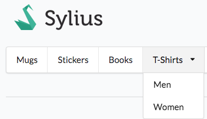

How to render a menu of taxons (categories) in a view?
======================================================

The way of rendering a menu of taxons is a supereasy reusable action, that you can adapt into any place you need.

How does it look like?
----------------------

That's a menu that you will find on the default Sylius homepage:

How to do it?
-------------

You can render such a menu wherever you have access to a ``category`` variable in the view, but also anywhere else.

The ``findChildrenAsTreeByRootCode`` method of **TaxonRepository** takes either a ``code`` or null. If the code is null it returns the whole
tree of taxons configured in the database.

To render a simple menu of categories in any twig template use:

.. code-block:: twig

    {{ render(url('sylius_shop_partial_taxon_index_by_code', {'code': 'category', 'template': '@SyliusShop/Taxon/_horizontalMenu.html.twig'})) }}

You can of course customize the template or enclose the menu into html to make it look better.

That's all. Done!

Learn more
----------

* :doc:`The Customization Guide </customization/index>`
