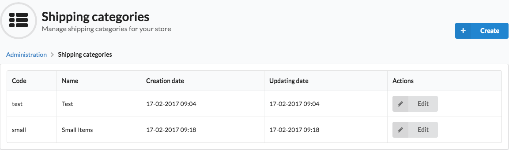

Customizing Grids
=================

.. note::

    We assume that you are familiar with grids. If not check the documentation of the :doc:`Grid Bundle </bundles/SyliusGridBundle/index>`
    and :doc:`Grid Component </components/Grid/index>` first.

Why would you customize grids?
------------------------------

When you would like to change how the index view of an entity looks like in the administration panel,
then you have to override its grid.

* remove a field from a grid
* change a field of a grid
* reorder fields
* override an entire grid

How to customize grids?
-----------------------

.. tip::

    One way to change anything in any grid in **Sylius** is to create a special file in the ``app/config/`` directory:
    ``app/config/grids.yml`` which has to be imported in the ``app/config/config.yml``.

.. code-block:: yaml

    # app/config/config.yml
    imports:
        - { resource: "grids.yml" }

How to customize fields of a grid?
^^^^^^^^^^^^^^^^^^^^^^^^^^^^^^^^^^

How to remove a field from a grid?
''''''''''''''''''''''''''''''''''

If you would like to remove a field from an existing Sylius grid, you will need to disable it in the ``app/config/grids.yml``.

Let's imagine that we would like to hide the **title of product review** field on the ``sylius_admin_product_review`` grid.

.. code-block:: yaml

    # app/config/grids.yml
    sylius_grid:
        grids:
            sylius_admin_product_review:
                fields:
                    title:
                        enabled: false

That's all. Now the ``title`` field will be disabled (invisible).

How to modify a field of a grid?
''''''''''''''''''''''''''''''''

If you would like to modify for instance a label of any field from a grid, that's what you need to do:

.. code-block:: yaml

    # app/config/grids.yml
    sylius_grid:
        grids:
            sylius_admin_product_review:
                fields:
                    date:
                        label: "When was it added?"

How to customize filters of a grid?
^^^^^^^^^^^^^^^^^^^^^^^^^^^^^^^^^^^

How to remove a filter from a grid?
'''''''''''''''''''''''''''''''''''

If you would like to remove a filter from an existing Sylius grid, you will need to disable it in the ``app/config/grids.yml``.

Let's imagine that we would like to hide the **titles filter of product reviews** on the ``sylius_admin_product_review`` grid.

.. code-block:: yaml

    # app/config/grids.yml
    sylius_grid:
        grids:
            sylius_admin_product_review:
                filters:
                    title:
                        enabled: false

That's all. Now the ``title`` filter will be disabled.

How to customize actions of a grid?
^^^^^^^^^^^^^^^^^^^^^^^^^^^^^^^^^^^

How to remove an action from a grid?
''''''''''''''''''''''''''''''''''''

If you would like to disable some actions in any grid, you just need to set its ``enabled`` option to ``false`` like below:

.. code-block:: yaml

    # app/config/grids.yml
    sylius_grid:
        grids:
            sylius_admin_product_review:
                actions:
                    item:
                        delete:
                            type: delete
                            enabled: false

How to modify an action of a grid?
''''''''''''''''''''''''''''''''''

If you would like to change the link to which an action button is redirecting, this is what you have to do:

.. warning::

    The ``show`` button does not exist in the ``sylius_admin_product`` grid by default.
    It is assumed that you already have it customized, and your grid has the ``show`` action.

.. code-block:: yaml

    # app/config/grids.yml
    sylius_grid:
        grids:
            sylius_admin_product:
                actions:
                    item:
                        show:
                            type: show
                            label: Show in the shop
                            options:
                                link:
                                    route: sylius_shop_product_show
                                    parameters:
                                        slug: resource.slug

The above grid modification will change the redirect of the ``show`` action to redirect to the shop, instead of admin show.
Also the label was changed here.

How to modify positions of fields, filters and actions in a grid?
^^^^^^^^^^^^^^^^^^^^^^^^^^^^^^^^^^^^^^^^^^^^^^^^^^^^^^^^^^^^^^^^^

For fields, filters and actions it is possible to easily change the order in which they are displayed in the grid.

See an example of fields order modification on the ``sylius_admin_product_review`` grid below:

.. code-block:: yaml

    # app/config/grids.yml
    sylius_grid:
        grids:
            sylius_admin_product_review:
                fields:
                    date:
                        position: 5
                    title:
                        position: 6
                    rating:
                        position: 3
                    status:
                        position: 1
                    reviewSubject:
                        position: 2
                    author:
                        position: 4

Customizing grids by events
---------------------------

There is also another way to customize grids: **via events**.
Every grid configuration dispatches an event when its definition is being converted.

For example, **sylius_admin_product** grid dispatches such an event:

.. code-block:: php

    sylius.grid.admin_product # For the grid of products in admin

To show you an example of a grid customization using events, we will remove a field from a grid using that method.
Here are the steps, that you need to take:

**1.** In order to remove fields from the product grid in **Sylius** you have to create a ``AppBundle\Grid\AdminProductsGridListener`` class.

In the example below we are removing the ``images`` field from the ``sylius_admin_product`` grid.

.. code-block:: php

    <?php

    namespace AppBundle\Grid;

    use Sylius\Component\Grid\Event\GridDefinitionConverterEvent;

    final class AdminProductsGridListener
    {
        /**
         * @param GridDefinitionConverterEvent $event
         */
        public function removeImageField(GridDefinitionConverterEvent $event)
        {
            $grid = $event->getGrid();

            $grid->removeField('image');
        }
    }

**2.** After creating your class with a proper method for the grid customizations you need, subscribe your
listener to the ``sylius.grid.admin_product`` event in the ``AppBundle/Resources/config/services.yml``.

.. code-block:: yaml

    # AppBundle/Resources/config/services.yml
    services:
        app.listener.admin.products_grid:
            class: AppBundle\Grid\AdminProductsGridListener
            tags:
                - { name: kernel.event_listener, event: sylius.grid.admin_product, method: removeImageField }

**3.** Result:

After these two steps your admin product grid should not have the image field.

How to override an entire grid?
-------------------------------

.. tip::

    This is the other way to customize grids. If you need to change more, than just slight adjustments we do recommend
    to override an entire grid file in the ``app/Resources/`` directory.

Let's assume that you would like to modify the ``shipping_categories`` grid by removing filters and the delete action from it.

* To achieve that you need to create the ``app/Resources/SyliusAdminBundle/config/grids/shipping_category.yml`` file.

* Then into the created file copy the content of ``Sylius/Bundle/AdminBundle/Resources/config/grids/shipping_category.yml``.

* And modify it to your needs:

.. code-block:: yaml

    # app/Resources/SyliusAdminBundle/config/grids/shipping_category.yml
    sylius_grid:
        grids:
            sylius_admin_shipping_category:
                driver:
                    name: doctrine/orm
                    options:
                        class: "%sylius.model.shipping_category.class%"
                        repository:
                            method: createListQueryBuilder
                fields:
                    code:
                        type: string
                        label: sylius.ui.code
                    name:
                        type: string
                        label: sylius.ui.name
                    createdAt:
                        type: datetime
                        label: sylius.ui.creation_date
                        options:
                            format: d-m-Y H:i
                    updatedAt:
                        type: datetime
                        label: sylius.ui.updating_date
                        options:
                            format: d-m-Y H:i
                actions:
                    main:
                        create:
                            type: create
                    item:
                        update:
                            type: update

In the above example the ``delete`` action and the filters section have been removed.

* That's it! The grid has been modified and it will look like that:

Learn more
----------

* :doc:`Grid - Component Documentation </components/Grid/index>`
* :doc:`Grid - Bundle Documentation </bundles/SyliusGridBundle/index>`
