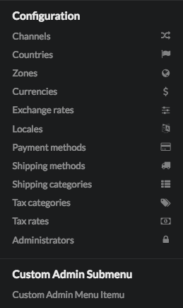
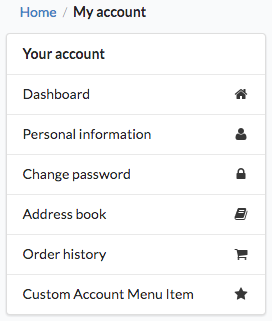

Customizing Menus
=================

Adding new positions in your menu is done **via events**.

You have got the ``Sylius\Bundle\UiBundle\Menu\Event\MenuBuilderEvent`` with ``FactoryInterface`` and ``ItemInterface`` of `KnpMenu`_, this lets you manipulate the whole menu.

You've got six events that you should be subscribing to:

.. code-block:: php

    sylius.menu.shop.account # For the menu of the MyAccount section in shop
    sylius.menu.admin.main # For the Admin Panel menu
    sylius.menu.admin.customer.show # For the buttons menu on top of the show page of the Customer (/admin/customers/{id})
    sylius.menu.admin.order.show # For the buttons menu on top of the show page of the Order (/admin/orders/{id})
    sylius.menu.admin.product.form # For the tabular menu on the left hand side of the new/edit pages of the Product (/admin/products/new & /admin/products/{id}/edit)
    sylius.menu.admin.product_variant.form # For the tabular menu on the left hand side of the new/edit pages of the ProductVariant (/admin/products/{productId}/variants/new & /admin/products/{productId}/variants/{id}/edit)

How to customize Admin Menu?
----------------------------

.. tip::

    Admin Panel menu is the one in the left expandable sidebar on the ``/admin/`` url.

**1.** In order to add items to the Admin menu in **Sylius** you have to create a ``AppBundle\Menu\AdminMenuListener`` class.

In the example below we are adding a one new item and sub-item to the Admin panel menu.

.. code-block:: php

    <?php

    namespace AppBundle\Menu;

    use Sylius\Bundle\UiBundle\Menu\Event\MenuBuilderEvent;

    final class AdminMenuListener
    {
        /**
         * @param MenuBuilderEvent $event
         */
        public function addAdminMenuItems(MenuBuilderEvent $event)
        {
            $menu = $event->getMenu();

            $newSubmenu = $menu
                ->addChild('new')
                ->setLabel('Custom Admin Submenu')
            ;

            $newSubmenu
                ->addChild('new-subitem')
                ->setLabel('Custom Admin Menu Itemu')
            ;
        }
    }

**2.** After creating your class with a proper method for the menu customizations you need, subscribe your
listener to the ``sylius.menu.admin.main`` event in the ``AppBundle/Resources/config/services.yml``.

.. code-block:: yaml

    # AppBundle/Resources/config/services.yml
    services:
        app.listener.admin.menu_builder:
            class: AppBundle\Menu\AdminMenuListener
            tags:
                - { name: kernel.event_listener, event: sylius.menu.admin.main, method: addAdminMenuItems }

**3.** Result:

After these two steps your admin panel menu should look like that, the new items appear at the bottom:

How to customize Account Menu?
------------------------------

.. tip::

    My Account panel menu is the one in the left sidebar on the ``/account/dashboard/`` url.

**1.** In order to add items to the Account menu in **Sylius** you have to create a ``AppBundle\Menu\AccountMenuListener`` class.

In the example below we are adding a one new item to **the menu in the My Account section of shop**.

.. code-block:: php

    <?php

    namespace AppBundle\Menu;

    use Sylius\Bundle\UiBundle\Menu\Event\MenuBuilderEvent;

    final class AccountMenuListener
    {
        /**
         * @param MenuBuilderEvent $event
         */
        public function addAccountMenuItems(MenuBuilderEvent $event)
        {
            $menu = $event->getMenu();

            $menu
                ->addChild('new', ['route' => 'sylius_shop_account_dashboard'])
                ->setLabel('Custom Account Menu Item')
                ->setLabelAttribute('icon', 'star')
            ;
        }
    }

As you can see above the new item can be given a route, a label and an icon.

**2.** After creating your class with a proper method for the menu customizations you need, subscribe your
listener to the ``sylius.menu.shop.account`` event in the ``AppBundle/Resources/config/services.yml``.

.. code-block:: yaml

    # AppBundle/Resources/config/services.yml
    services:
        app.listener.shop.menu_builder:
            class: AppBundle\Menu\AccountMenuListener
            tags:
                - { name: kernel.event_listener, event: sylius.menu.shop.account, method: addAccountMenuItems }

**3.** Result:

After these two steps your user account menu should look like that, the new item appears at the bottom:

How to customize Admin Customer Show Menu?
------------------------------------------

.. tip::

    Admin customer menu is the set of buttons in the right top corner on the ``/admin/customers/{id}`` url.

**1.** In order to add buttons to the Admin Customer Show menu in **Sylius** you have to create a ``AppBundle\Menu\AdminCustomerShowMenuListener`` class.

.. note::

    **This menu is build from buttons.** There are a few button types available:
    ``edit``, ``show``, ``delete``, ``link`` (default), and ``transition`` (for state machines).

    Buttons (except for the ``link`` and ``transition`` types) already have a defined color, icon and label.
    The ``link`` and ``transition`` types buttons can be customized with the ``setLabel('label')``, ``setLabelAttribute('color', 'color')``
    and ``setLabelAttribute('icon', 'icon')`` methods.

    The ``delete`` button must have also the ``resource_id`` attribute set (for csrf token purposes).

In the example below, we are adding one new button to the Admin Customer Show Menu. It has the type set, even though the ``link``
type is default to make the example easily customizable.

.. code-block:: php

    <?php

    namespace AppBundle\Menu;

    use Sylius\Bundle\AdminBundle\Event\CustomerShowMenuBuilderEvent;

    final class AdminCustomerShowMenuListener
    {
        /**
         * @param CustomerShowMenuBuilderEvent $event
         */
        public function addAdminCustomerShowMenuItems(CustomerShowMenuBuilderEvent $event)
        {
            $menu = $event->getMenu();
            $customer = $event->getCustomer();

            if (null !== $customer->getUser()) {
                $menu
                    ->addChild('impersonate', [
                        'route' => 'sylius_admin_impersonate_user',
                        'routeParameters' => ['username' => $customer->getUser()->getEmailCanonical()]
                    ])
                    ->setAttribute('type', 'link')
                    ->setLabel('Impersonate')
                    ->setLabelAttribute('icon', 'unhide')
                    ->setLabelAttribute('color', 'blue')
                ;
            }
        }
    }

**2.** After creating your class with a proper method for the menu customizations you need, subscribe your
listener to the ``sylius.menu.admin.customer.show`` event in the ``AppBundle/Resources/config/services.yml``.

.. code-block:: yaml

    # AppBundle/Resources/config/services.yml
    services:
        app.listener.admin.customer.show.menu_builder:
            class: AppBundle\Menu\AdminCustomerShowMenuListener
            tags:
                - { name: kernel.event_listener, event: sylius.menu.admin.customer.show, method: addAdminCustomerShowMenuItems }

How to customize Admin Order Show Menu?
---------------------------------------

.. tip::

    Admin order show menu is the set of buttons in the right top corner on the ``/admin/orders/{id}`` url.

**1.** In order to add buttons to the Admin Order Show menu in **Sylius** you have to create a ``AppBundle\Menu\AdminOrderShowMenuListener`` class.

.. note::

    **This menu is build from buttons.** There are a few button types available:
    ``edit``, ``show``, ``delete``, ``link`` (default), and ``transition`` (for state machines).

    Buttons (except for the ``link`` and ``transition`` types) already have a defined color, icon and label.
    The ``link`` and ``transition`` types buttons can be customized with the ``setLabel('label')``, ``setLabelAttribute('color', 'color')``
    and ``setLabelAttribute('icon', 'icon')`` methods.

    The ``delete`` button must have also the ``resource_id`` attribute set (for csrf token purposes).

In the example below, we are adding one new button to the Admin Order Show Menu. It is a ``transition`` type button,
that will let the admin fulfill the order.

.. warning::

    There is no ``sylius_admin_order_fulfill`` route in Sylius. Create this route if you need it.

.. code-block:: php

    <?php

    namespace AppBundle\Menu;

    use Sylius\Bundle\AdminBundle\Event\OrderShowMenuBuilderEvent;
    use Sylius\Component\Order\OrderTransitions;

    final class AdminOrderShowMenuListener
    {
        /**
         * @param OrderShowMenuBuilderEvent $event
         */
        public function addAdminOrderShowMenuItems(OrderShowMenuBuilderEvent $event)
        {
            $menu = $event->getMenu();
            $order = $event->getOrder();
            $stateMachine = $event->getStateMachine();

            if ($stateMachine->can(OrderTransitions::TRANSITION_FULFILL)) {
                $menu
                    ->addChild('fulfill', [
                        'route' => 'sylius_admin_order_fulfill',
                        'routeParameters' => ['id' => $order->getId()]
                    ])
                    ->setAttribute('type', 'transition')
                    ->setLabel('Fulfill')
                    ->setLabelAttribute('icon', 'checkmark')
                    ->setLabelAttribute('color', 'green')
                ;
            }
        }
    }

**2.** After creating your class with a proper method for the menu customizations you need, subscribe your
listener to the ``sylius.menu.admin.order.show`` event in the ``AppBundle/Resources/config/services.yml``.

.. code-block:: yaml

    # AppBundle/Resources/config/services.yml
    services:
        app.listener.admin.order.show.menu_builder:
            class: AppBundle\Menu\AdminOrderShowMenuListener
            tags:
                - { name: kernel.event_listener, event: sylius.menu.admin.order.show, method: addAdminOrderShowMenuItems }

How to customize Admin Product Form Menu?
-----------------------------------------

.. tip::

    Admin product form menu is the set of tabs on your left hand side on the ``/admin/products/new`` and ``/admin/products/{id}/edit`` urls.

.. warning::

    This part of the guide assumes you already know how to customize :doc:`models </customization/model>` and :doc:`forms </customization/form>`.

**1.** In order to add a new tab to the Admin Product Form menu in **Sylius** you have to create a ``AppBundle\Menu\AdminProductFormMenuListener`` class.

.. note::

    **This menu is build from tabs, each coupled with their own template containing the necessary part of the form.**

So lets say you want to add the product's manufacturer details to the tabs.
Provided you have created a new template with all the required form fields and saved it etc. as ``AppBundle\Resources\views\Admin\Product\Tab\_manufacturer.html.twig``, we will use it in the example below.

.. code-block:: php

    <?php

    namespace AppBundle\Menu;

    use Sylius\Bundle\AdminBundle\Event\ProductMenuBuilderEvent;

    final class AdminProductFormMenuListener
    {
        /**
         * @param ProductMenuBuilderEvent $event
         */
        public function addItems(ProductMenuBuilderEvent $event)
        {
            $menu = $event->getMenu();

            $menu
                ->addChild('manufacturer')
                ->setAttribute('template', '@App/Admin/Product/Tab/_manufacturer.html.twig')
                ->setLabel('Manufacturer')
            ;
        }
    }

**2.** After creating your class with a proper method for the menu customizations you need, subscribe your
listener to the ``sylius.menu.admin.product.form`` event in the ``AppBundle/Resources/config/services.yml``.

.. code-block:: yaml

    # AppBundle/Resources/config/services.yml
    services:
        app.listener.admin.product.form.menu_builder:
            class: AppBundle\Menu\AdminProductFormMenuListener
            tags:
                - { name: kernel.event_listener, event: sylius.menu.admin.product.form, method: addItems }

How to customize Admin Product Variant Form Menu?
-------------------------------------------------

.. tip::

    Admin product variant form menu is the set of tabs on your left hand side on the ``/admin/product/{productId}/variants/new`` and ``/admin/product/{productId}/variants/{id}/edit`` urls.

.. warning::

    This part of the guide assumes you already know how to customize :doc:`models </customization/model>` and :doc:`forms </customization/form>`.

**1.** In order to add a new tab to the Admin Product Variant Form menu in **Sylius** you have to create a ``AppBundle\Menu\AdminProductVariantFormMenuListener`` class.

.. note::

    **This menu is build from tabs, each coupled with their own template containing the necessary part of the form.**

So lets say you want to add the product variant's media to the tabs.
Provided you have created a new template with the required form fields and saved it etc. as ``AppBundle\Resources\views\Admin\ProductVariant\Tab\_media.html.twig``, we will use it in the example below.

.. code-block:: php

    <?php

    namespace AppBundle\Menu;

    use Sylius\Bundle\AdminBundle\Event\ProductVariantMenuBuilderEvent;

    final class AdminProductVariantFormMenuListener
    {
        /**
         * @param ProductVariantMenuBuilderEvent $event
         */
        public function addItems(ProductVariantMenuBuilderEvent $event)
        {
            $menu = $event->getMenu();

            $menu
                ->addChild('media')
                ->setAttribute('template', '@App/Admin/ProductVariant/Tab/_media.html.twig')
                ->setLabel('Media')
            ;
        }
    }

**2.** After creating your class with a proper method for the menu customizations you need, subscribe your
listener to the ``sylius.menu.admin.product_variant.form`` event in the ``AppBundle/Resources/config/services.yml``.

.. code-block:: yaml

    # AppBundle/Resources/config/services.yml
    services:
        app.listener.admin.product_variant.form.menu_builder:
            class: AppBundle\Menu\AdminProductVariantFormMenuListener
            tags:
                - { name: kernel.event_listener, event: sylius.menu.admin.product_variant.form, method: addItems }

.. _KnpMenu: https://github.com/KnpLabs/KnpMenu
