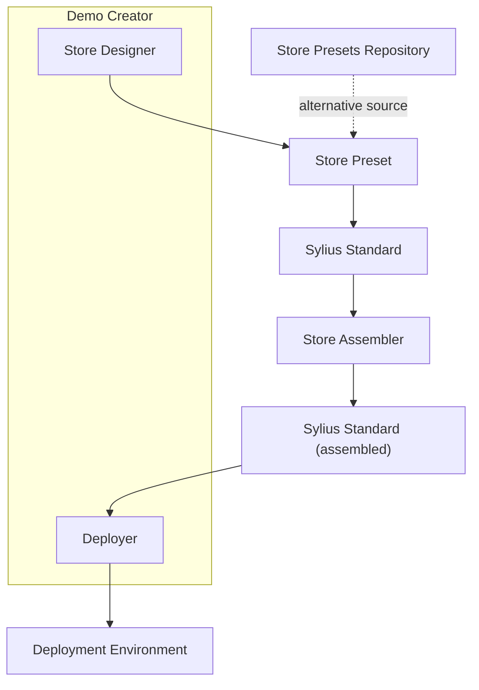
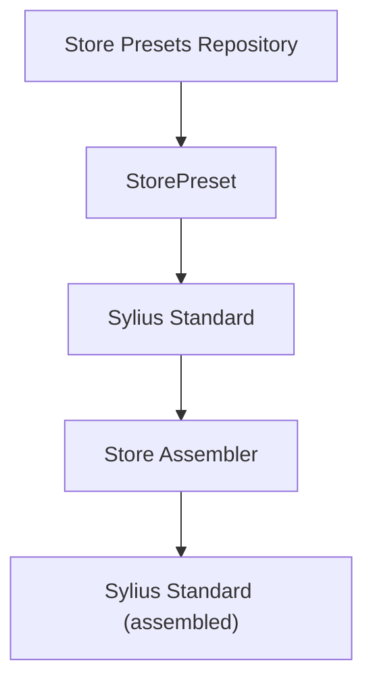

# Demo Creator


This feature is currently a proof of concept and will evolve over time. We appreciate any feedback.


## Introduction

Demo Creator lets you rapidly assemble a fully configured Sylius store without tedious manual steps. For example, imagine you need a store selling office furniture, complete with a CMS, refund functionality, and invoicing. Normally, you would have to:

1. Create a new Sylius Standard project.
2. Install each plugin individually.
3. Prepare and load fixtures (e.g., products, images).
4. Customize the storefront’s visual style.

To address this challenge, we’ve created a tool (see diagram below) that streamlines the process. Currently, it leverages a repository of predefined store presets, while the interactive store designer—featuring AI-powered fixture creation, theme customization (colors and visuals), and plugin selection—is still under development.

Below is the proposed tooling architecture:



***

## What Is a Store Preset?

A _store preset_ defines everything required to bootstrap a finely tuned Sylius store:

* **store-preset.json**: A JSON file specifying:
  * The store’s internal name.
  * Which plugins to install.
  * Theme variables (colors, logos).
  * Which fixtures to load.
* **fixtures/**: A directory containing YAML fixture definitions and any images to import (e.g., product photos).
* **themes/**: A folder with custom theme assets (e.g., logos, banners).

The directory structure for a single preset might look like this:

```
store-preset/
├── fixtures/
│   ├── fixtures.yaml
│   └── images/
│       ├── product_01.jpeg
│       └── product_02.jpeg
├── store-preset.json
└── themes/
    └── shop/
        ├── banner.png
        └── logo.png
```

#### Example store-preset.json

```json
{
  "name": "car_parts",
  "plugins": {
    "sylius/cms-plugin": "^1.0"
  },
  "themes": {
    "shop": {
      "cssVariables": {
        "--bs-btn-bg": "#5d182f",
        "--bs-btn-hover-bg": "#4a1327",
        "--bs-body-bg": "#f9f5f5",
        "--bs-text-color": "#3f0d12",
        "--bs-link-color": "#5d182f",
        "--bs-link-hover-color": "#4a1327",
        "--bs-link-color-rgb": "93, 24, 47",
        "--bs-link-hover-color-rgb": "74, 19, 39",
        "--bs-primary": "#5d182f",
        "--bs-primary-rgb": "93, 24, 47",
        "--bs-bg-opacity": "1"
      },
      "logo": "logo.png",
      "banner": "banner.png"
    }
  },
  "fixtures": {
    "suite": "car_parts"
  }
}
```

***

## Sylius Store Assembler

Sylius Store Assembler is a Symfony bundle that streamlines creating and configuring Sylius-based e-commerce stores using store presets.

### Installation

Install the package via Composer:

```bash
composer require sylius/store-assembler
```

### Enable the Bundle

If your application does not auto-register bundles, add the following entry to `config/bundles.php`:

```php
<?php
return [
    // ...
    Sylius\StoreAssemblerBundle\SyliusStoreAssemblerBundle::class => ['all' => true],
];
```

### Usage

Add the following targets to your `Makefile` for common tasks:

```makefile
sylius-store-assembler:
    vendor/bin/sylius-store-assembler

sylius-store-assembler-fixtures:
    bin/console sylius:store-assembler:fixture:prepare
    bin/console cache:clear
    bin/console cache:warmup
    bin/console sylius:store-assembler:fixture:load

sylius-store-assembler-theme:
    bin/console sylius:store-assembler:theme:prepare
    bin/console cache:clear
    bin/console cache:warmup
```

Run all steps with:

```bash
make sylius-store-assembler
```

For granular control, use individual console commands:

```bash
php bin/console sylius:store-assembler:plugin:prepare
php bin/console sylius:store-assembler:plugin:install
php bin/console sylius:store-assembler:fixture:prepare
php bin/console sylius:store-assembler:fixture:load
php bin/console sylius:store-assembler:theme:prepare
```

### Configuration

* **Plugin Manifests:** Place JSON manifests in `config/plugins/{vendor}/{plugin-name}/{major.minor}/manifest.json`.

Manifests support:

* **Steps:** List of shell commands (e.g., `composer require`).
* **Configurators:** Implementations of `Sylius\StoreAssemblerBundle\Configurator\ConfiguratorInterface`.

Example manifest:

```json
{
  "steps": [
    "yarn add some/package"
  ],
  "configurators": [
    {
      "class": "Sylius\\\\StoreAssemblerBundle\\\\Configurator\\\\YamlNodeConfigurator",
      "file": "config/packages/my_package.yaml",
      "key": "my_package.some_configuration_key.enabled",
      "value": true
    }
  ]
}
```

## Store Preset Examples

This repository provides example store presets for Sylius Store Assembler, enabling you to quickly bootstrap themed Sylius shops with predefined data and assets.

### Usage

1. Copy your chosen preset directory from `store-presets/` into the root of your Sylius Standard project.
2.  Run the StoreAssembler command to prepare and load the store preset:

    ```bash
    vendor/bin/store-assembler
    ```

This command will install any required plugins, load fixtures, and apply theme assets.

### Available Presets

* **car\_parts**: A sample store for automotive parts, complete with product fixtures, images, and theme files.

### Contributing

Contributions are welcome! To add your own store preset:

1.  Create a new folder under `store-presets/` following this structure:

    ```
    your_preset/
    ├── fixtures/
    │   ├── fixtures.yaml
    │   └── images/
    │       └── <your_image_files>
    ├── store-preset.json
    └── themes/
        └── shop/
            ├── banner.png
            └── logo.png
    ```
2. Submit a pull request with your preset and a brief description.

***

## Applying a Store Preset Locally

To try a fresh Sylius Standard project with a preset, run:

```bash
composer create-project sylius/sylius-standard:2.0.x-dev my_store
cd my_store
composer require sylius/store-assembler
vendor/bin/sylius-store-assembler --get-preset car_parts # Or replace 'car_parts' with your provided store preset
vendor/bin/sylius-store-assembler
symfony serve
```

You’ll end up with a dedicated car parts store featuring CMS, Invoicing, Refund, and Wishlist plugins—all configured automatically.

Simplified flow diagram:



***

## Deploying to Platform.sh


This workflow is experimental and evolving.


1.  **Clone and install DemoCreator**:

    ```bash
    git clone --branch main-v2 https://github.com/Sylius/DemoCreator.git
    cd DemoCreator
    composer install && yarn install
    ```
2. **Create and configure your Platform.sh project**:
   * Create a new Platform.sh project and note its Project ID.
   * Generate an API token under _Profile → API Tokens_.
3.  **Set Platform.sh credentials**:

    ```bash
    echo 'PLATFORMSH_PROJECT_ID=<YOUR_PROJECT_ID>' >> .env.local
    echo 'PLATFORMSH_CLI_TOKEN=<YOUR_API_TOKEN>' >> .env.local
    ```
4.  **Update store presets**:

    ```bash
    composer demo-creator:update-store-presets
    ```

    This pulls presets from the StorePreset repository into `DemoCreator/store-presets/`.
5.  **Run the Symfony server**:

    ```bash
    symfony serve --port=8005
    ```
6.  **Create a new store via API**:\
    Send a `POST` request to `/create-demo` with JSON payload:

    ```json
    {
      "environment": "main",
      "store": "car_parts"
    }
    ```

    ```bash
    curl -L \
      --url http://localhost:8005/create-demo \
      --header 'Accept: application/json' \
      --header 'Content-Type: application/json' \
      --data '{"environment":"main","store":"car_parts"}' --insecure
    ```

    The response returns:

    ```json
    {
      "activityId": "<activityId>",
      "url": "<url>"
    }
    ```
7.  **Check deployment state**:

    ```bash
    curl -L \
      --url http://localhost:8005/deploy-state/main/<activityId> \
      --header 'Accept: application/json' --insecure
    ```

    \
    Internally, DemoCreator will:

    * Clone the Sylius Standard 2.0 branch.
    * Apply the selected store preset.
    * Commit and push to the specified Platform.sh environment.
    * Trigger the build.\


    Use the URL provided in the response to visit your store once the build is complete.

***

## Future Plans

We plan to evolve DemoCreator into a comprehensive store preset wizard, letting you configure every key setting and sample data right from the front-end:

*   Plugin Selector

    Browse available Sylius extensions and activate or deactivate them with a single click, automatically including your choices in the store preset.
*   AI-Powered Fixtures Creator

    Enter a simple text prompt and let GPT generate YAML fixtures (products, categories, pages, etc.), attaching them to the preset as ready-to-use test data.
*   Live Theme and Fixtures Preview

    Adjust colors, logo, and CSS variables in real time and immediately preview the result in the panel—everything is saved directly into your preset.\


With these features, users can define every essential aspect of their store—from plugins and sample content to visual design—and save it all as one cohesive “store preset,” ready for instant launch or further customization.

***

## Feedback

Your input is invaluable! If you have suggestions or encounter issues:

* **Slack Community:** Join our workspace to chat with the team and other users in real time.
* **GitHub Issues:** Submit feature requests or bug reports on the [DemoCreator repository](https://github.com/Sylius/DemoCreator).

Thank you for helping us improve DemoCreator!
