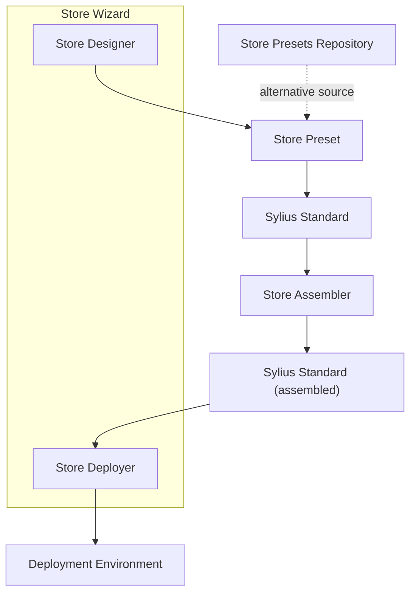

# Store Wizard

## Overview

Store Wizard automates the setup of a fully configured Sylius store—no manual steps required. Interactively **craft your preset via AI assistant** and get a ready-to-use store with products, themes, and plugins.

### Key Benefits

* **Rapid setup:** Bootstrap a new store in seconds
* **Preset library:** Predefined configurations for common use cases
* **Customization:** JSON manifests tailor plugins, fixtures, and theme variables

## Quick Start

### **Prerequisites**

1. **Symfony CLI installed** to run the local server (`symfony serve`).
2. A **fresh Sylius Standard project** created and served locally or on Platform.sh
3. **Git** installed to clone the wizard repository.

### **Run the Store Wizard**:

In your chosen, empty directory, execute:

```bash
bash <(curl -sSL https://raw.githubusercontent.com/Sylius/DemoCreator/main/install.sh)
```

Answer a few interactive questions (deployment type, API keys, etc.).

Once the script finishes:

1. Your development server will launch (or remain running).
2. The wizard UI will open in your browser—follow the on-screen steps.
3. Click **Generate & Deploy**, grab a coffee, and wait for your new store.
4. Access your live store at the URL displayed at completion.

## Architecture Overview

Store Wizard orchestrates the following workflow:

1. **Preset Storage:** Presets reside in `var/store-presets/<preset-id>/`.
2. **Copy & Assemble:** The wizard copies the chosen preset into your Sylius Standard app.
3. **Store Assembler:** Executes the Store Assembler bundle to configure the store.



***

## Store Preset

A _Store Preset_ is a directory containing all assets and data required to populate your store:

```
.
├── assets
│   ├── admin
│   │   └── styles
│   │       └── theme.scss
│   └── shop
│       ├── images
│       │   ├── banner.png
│       │   └── logo.png
│       └── styles
│           └── theme.scss
├── fixtures
│   ├── fixtures.yaml
│   ├── image_01.png
│   ├── image_02.png
│   └── ...
├── store-definition.json
├── store-details.json
└── store-preset.json

```

***

## Store Assembler

Store Assembler is a standalone Symfony bundle that streamlines the creation and configuration of Sylius-based e-commerce stores using a store preset—while Store Wizard installs this bundle at runtime, you can also integrate it directly for complete control over your store’s final setup.

### Installation

Install via Composer:

```bash
composer require sylius/store-assembler
```

If your application does not auto-register bundles, enable it in `config/bundles.php`:

```php
<?php
return [
    // ...
    Sylius\StoreAssemblerBundle\SyliusStoreAssemblerBundle::class => ['all' => true],
];
```

#### Usage

1. Place your store preset directory at the root of your Sylius project, named `store-preset/` (it must contain `store-preset.json`).
2.  Run the assembler:

    ```
    vendor/bin/sylius-store-assembler
    ```

This command reads the JSON manifest, executes defined steps, and applies configurators to build your store. You can also edit the `store-preset.json` file to adjust the list of plugins (or other configuration values), then rerun `vendor/bin/sylius-store-assembler`—the assembler will detect and install the updated plugin list automatically.

### Third-Party Plugin Support

To enable your plugin for both Store Wizard and Store Assembler, include a JSON manifest at:

```
config/plugins/{vendor}/{plugin-name}/{major.minor}/manifest.json
```

Then submit a pull request to the Store Assembler repository so your plugin manifest can be reviewed and incorporated into the official presets.

#### Manifest Structure

* **steps:** List of shell commands to execute (e.g., `composer require some/package`).
* **configurators:** Classes implementing `Sylius\StoreAssemblerBundle\Configurator\ConfiguratorInterface` to modify configuration files.

**Example:**

```json
{
  "steps": [
    "yarn add some/package"
  ],
  "configurators": [
    {
      "class": "Sylius\\\\StoreAssemblerBundle\\\\Configurator\\\\YamlNodeConfigurator",
      "file": "config/packages/my_package.yaml",
      "key": "my_package.some_configuration_key.enabled",
      "value": true
    }
  ]
}
```

### Contributing a New Preset

1.  Create a folder under `store-presets/` named after your preset:

    ```
    store-presets/your_preset/
    ├── fixtures/
    │   ├── fixtures.yaml
    │   └── images/
    │       └── <your_image_files>
    ├── store-preset.json
    └── themes/shop/
        ├── banner.png
        └── logo.png
    ```
2. Ensure your `store-preset.json` defines all required fields (name, fixtures path, asset paths, etc.).
3. Submit a pull request to the [StorePreset](https://github.com/Sylius/StorePreset) repository with a description of your preset's use case.

***

### Feedback & Support

* **Slack Community:** Join our workspace to discuss with the team and other users.
* **GitHub Issues:** Report bugs or request features on the DemoCreator repository.

Thank you for helping us improve Store Wizard! 🎉
