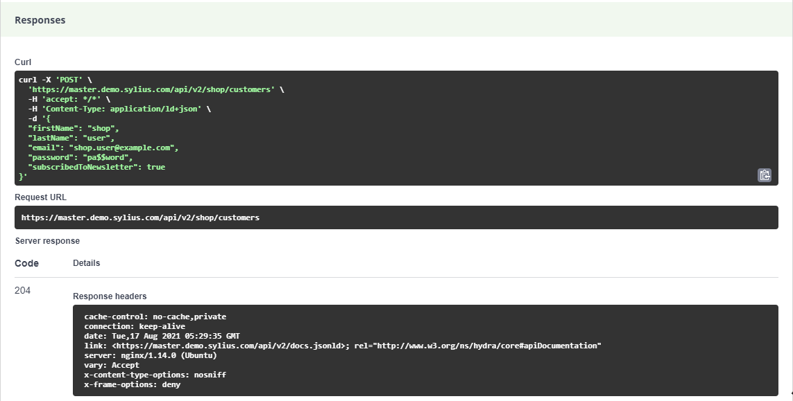
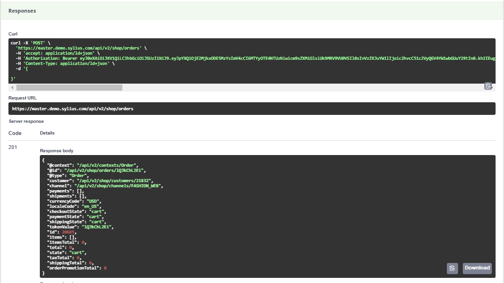
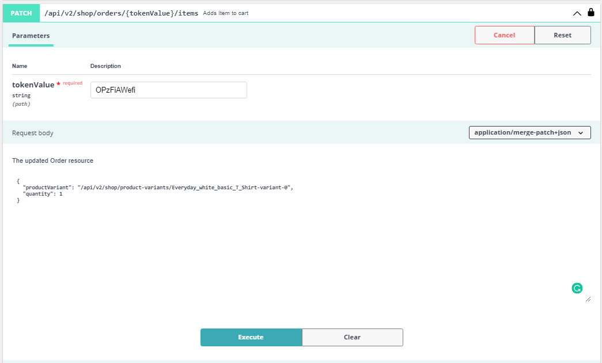
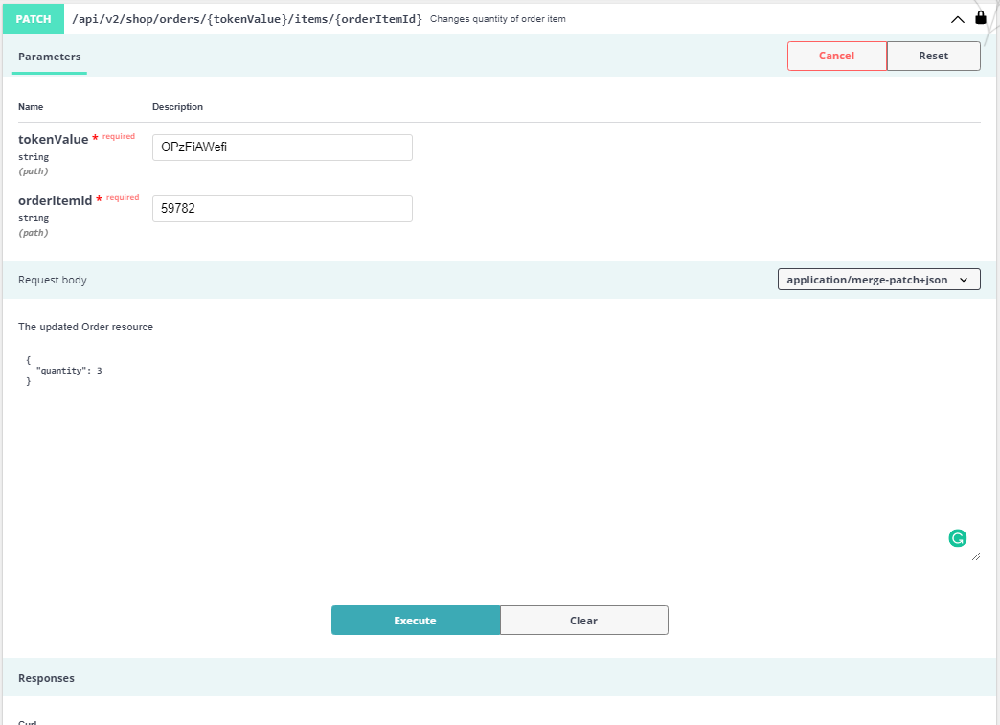
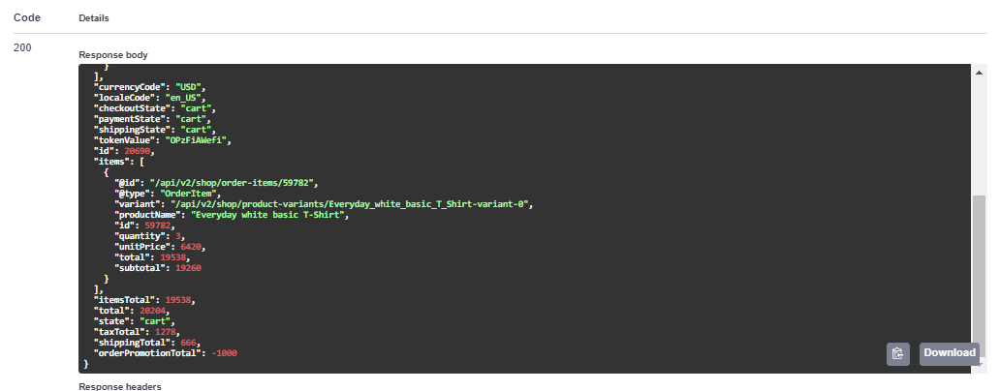
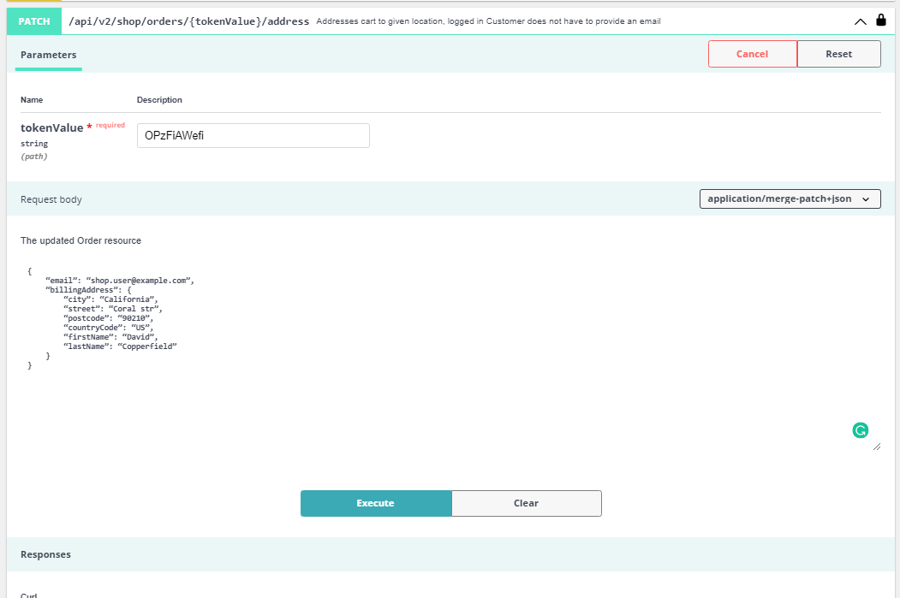
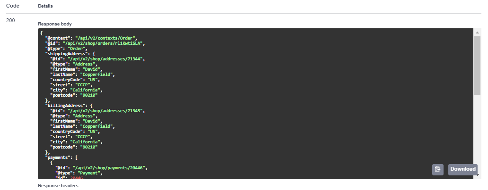
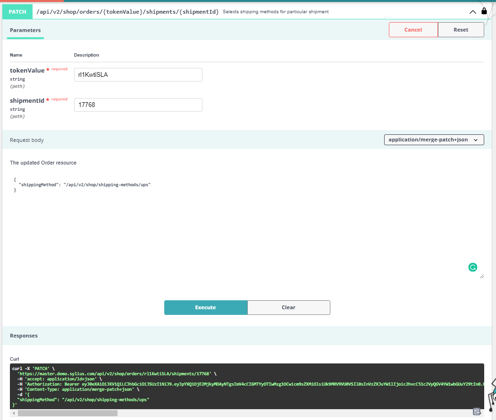
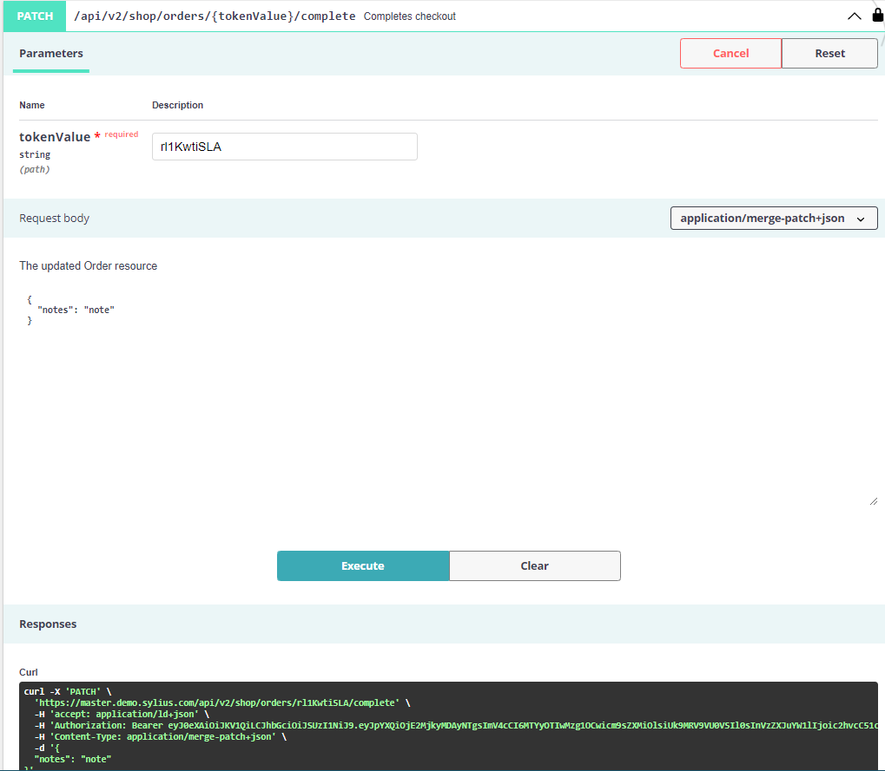

Using API
=========

Since sylius 1.8 we allow you to use our new API based on ApiPlatform.
Here are some examples of basic usage for a shop implementation.

Register a customer
-------------------

To register a customer all we need to do is a single `POST` request:

.. code-block:: bash

    curl -X 'POST' \
        'https://master.demo.sylius.com/api/v2/shop/customers' \
        -H 'accept: */*' \
        -H 'Content-Type: application/ld+json' \
        -d '{
        "firstName": "shop",
        "lastName": "user",
        "email": "shop.user@example.com",
        "password": "pa$$word",
        "subscribedToNewsletter": true
    }'

If we get response code `204`, it means our customer has been registered successfully.

Login to the shop
-----------------

Once the shop customer has been registered, we can now create a login request to get the authentication token, which will allow us to use more shop endpoints.
To get this token, lets create a simple login request:

.. code-block:: bash

    curl -X 'POST' \
        'https://master.demo.sylius.com/api/v2/shop/customers/token' \
        -H 'accept: application/json' \
        -H 'Content-Type: application/json' \
        -d '{
        "email": "shop.user@example.com",
        "password": "pa$$word"
    }'

As a response we should get code `200`, along with `token` and `customer` iri.

.. code-block:: json

    {
        "token": "string",
        "customer": "iri"
    }

.. note::

    If your shop has been customized and user first need to authenticate by `email authentication`, the token won't be returned.

With this token we are able to authenticate ourselves to use full `shop` potential of sylius API.

.. code-block:: bash

    curl -X 'METHOD' \
        'api-url' \
        -H 'accept: application/ld+json' \
        -H 'Authorization: Bearer token'

Utilising most typical operations
---------------------------------

With our customer created and authorized we are now ready to use our shop API. As we are in world of e-commerce,
there should be no doubt that most important operations are related with products, carts and orders.
In this chapter of `Using API` we will get to know with these operations on API.

Adding product to cart
----------------------

Let's make a simple process of checking out in shop API, it is possible to complete it as guest (not authenticated customer)
or as authorized shop user. For example purposes we will use the logged in shop user.

First step is to pickup a new cart:

.. code-block:: bash

    curl -X 'POST' \
      'https://master.demo.sylius.com/api/v2/shop/orders' \
      -H 'accept: application/ld+json' \
      -H 'Content-Type: application/ld+json' \
      -H 'Authorization: Bearer token' \
      -d '{
            # "localeCode": "string" (optional)
        }'

.. note::

    You can checkout your cart in different locale if needed. If no `localeCode` is provided, the channels default will be added automatically.

As a response we should get code `201`, along with default cart values and `tokenValue` which we need for next operations.

Now let's add some product to this cart, first we need the ProductVariant IRI, we can get some of the variants from

.. code-block:: bash

    curl -X 'GET' \
      'https://master.demo.sylius.com/api/v2/shop/product-variants?page=1&itemsPerPage=30' \
      -H 'accept: application/ld+json' \
      -H 'Authorization: Bearer token'

and let's take first variant `@id` from list:

.. code-block:: javascript

    // ...
    {
      "@id": "/api/v2/shop/product-variants/Everyday_white_basic_T_Shirt-variant-0",
      "@type": "ProductVariant",
      "id": 123889,
      "code": "Everyday_white_basic_T_Shirt-variant-0",
      "product": "/api/v2/shop/products/Everyday_white_basic_T_Shirt",
      "optionValues": [
        "/api/v2/shop/product-option-values/t_shirt_size_s"
      ],
      "translations": {
        "en_US": {
          "@id": "/api/v2/shop/product-variant-translations/123889",
          "@type": "ProductVariantTranslation",
          "id": 123889,
          "name": "S",
          "locale": "en_US"
        }
      },
      "price": 6420,
      "originalPrice": 6420,
      "inStock": true
    }
    // ...

Then going back to cart - let's add the variant to our cart with:

.. code-block:: bash

    curl -X 'PATCH' \
      'https://master.demo.sylius.com/api/v2/shop/orders/rl1KwtiSLA/items' \
      -H 'accept: application/ld+json' \
      -H 'Authorization: Bearer token' \
      -H 'Content-Type: application/merge-patch+json' \
      -d '{
      "productVariant": "/api/v2/shop/product-variants/Everyday_white_basic_T_Shirt-variant-0",
      "quantity": 1
    }'

And after this call the response should has code `200`, and in body we can see that the product variant has been added:

.. code-block:: bash

    {
      # Rest of orders body
      "items": [
        {
          "@id": "/api/v2/shop/order-items/59782",
          "@type": "OrderItem",
          "variant": "/api/v2/shop/product-variants/Everyday_white_basic_T_Shirt-variant-0",
          "productName": "Everyday white basic T-Shirt",
          "id": 59782,
          "quantity": 1,
          "unitPrice": 6420,
          "total": 6869,
          "subtotal": 6420
        }
      ],
      # Rest of orders body
    }

Changing product quantity
-------------------------

In this example we will use the product variant from example above. We will change the quantity of this item.
We need from the last response an `id` of product variant (it is 59782 in this example). Let's populate the
fields needed for request and call it:

.. code-block:: bash

    curl -X 'PATCH' \
      'https://master.demo.sylius.com/api/v2/shop/orders/OPzFiAWefi/items/59782' \
      -H 'accept: application/ld+json' \
      -H 'Authorization: Bearer token' \
      -H 'Content-Type: application/merge-patch+json' \
      -d '{
      "quantity": 3
    }'

And the response should return status code `200` and in items, the quantity as well as total price of this product variant should be changed:

.. code-block:: bash

    {
      # Rest of orders body
      "items": [
        {
          "@id": "/api/v2/shop/order-items/59782",
          "@type": "OrderItem",
          "variant": "/api/v2/shop/product-variants/Everyday_white_basic_T_Shirt-variant-0",
          "productName": "Everyday white basic T-Shirt",
          "id": 59782,
          "quantity": 3,
          "unitPrice": 6420,
          "total": 19538,
          "subtotal": 19260
        }
      ],
      # Rest of orders body
    }

Completing the order
--------------------

So, we have our cart with items that we want to buy. Let's finish our order by completing and placing it.
There are just few more steps to do it:

**1.** Addressing order

.. code-block:: bash

    curl -X 'PATCH' \
      'https://master.demo.sylius.com/api/v2/shop/orders/rl1KwtiSLA/address' \
      -H 'accept: application/ld+json' \
      -H 'Authorization: Bearer token' \
      -H 'Content-Type: application/merge-patch+json' \
      -d '{
        "email": "shop.user@example.com",
        "billingAddress": {
            "city": "California",
            "street": "Coral str",
            "postcode": "90210",
            "countryCode": "US",
            "firstName": "David",
            "lastName": "Copperfield"
        }
    }'

.. note::

    The shippingAddress field is optional - if no shippingAddress is provided the field will be cloned from billingAddress

Which will response with addressed cart:

**2.** Selecting Shipping/Payment Method

In case of both shipment and payment first we need to get their corresponding `id` and `method`.

We can get it from the address response or call once again all data about order by calling:

.. code-block:: bash

    curl -X 'GET' \
      'https://master.demo.sylius.com/api/v2/shop/orders/rl1KwtiSLA' \
      -H 'accept: application/ld+json' \
      -H 'Authorization: Bearer token'

In response we need to find payment and shipment where everyone of them has the required fields.

.. code-block:: bash

    "payments": [
        {
          "@id": "/api/v2/shop/payments/20446",
          "@type": "Payment",
          "id": 20446,
          "method": "/api/v2/shop/payment-methods/cash_on_delivery"
        }
    ],
    "shipments": [
        {
          "@id": "/api/v2/shop/shipments/17768",
          "@type": "Shipment",
          "id": 17768,
          "method": "/api/v2/shop/shipping-methods/ups"
        }
    ],

Let's make a shipment in this example. The required fields are `shipmentId` in URL query and `shipmentMethod` IRI in body:

.. code-block:: bash

    curl -X 'PATCH' \
      'https://master.demo.sylius.com/api/v2/shop/orders/rl1KwtiSLA/shipments/17768' \
      -H 'accept: application/ld+json' \
      -H 'Authorization: Bearer token' \
      -H 'Content-Type: application/merge-patch+json' \
      -d '{
      "shippingMethod": "/api/v2/shop/shipping-methods/ups"
    }'

which should respond with `200` status code and data about order.

And for the `Payment` the process is the same just change the:

#. Endpoint `api/v2/shop/orders/tokenValue/shipments/shipmentId` => `api/v2/shop/orders/tokenValue/payments/paymentId`
#. Body `shippingMethod` => `paymentMethod` (with method from possible payments)

Now with all the data fulfilled, let's proceed to last step.

**3.** Completing Cart

This is the last step of checkout process. Just simply call this endpoint and if you want, you can add a note to your order:

.. code-block:: bash

    curl -X 'PATCH' \
      'https://master.demo.sylius.com/api/v2/shop/orders/rl1KwtiSLA/complete' \
      -H 'accept: application/ld+json' \
      -H 'Authorization: Bearer token' \
      -H 'Content-Type: application/merge-patch+json' \
      -d '{
      "notes": "your note"
    }'

It will respond with `200` status code and data about order where `checkoutState` should be changed to `completed`:

.. code-block:: bash

    {
        # Orders body
        "currencyCode": "USD",
        "localeCode": "en_US",
        "checkoutState": "completed",
        "paymentState": "awaiting_payment",
        "shippingState": "ready",
        # Orders body
    }

And here we go - full checkout process completed with new API on Sylius. With this basic usage you should be able to
create fully functional shop frontend based on Sylius backend and logic.
