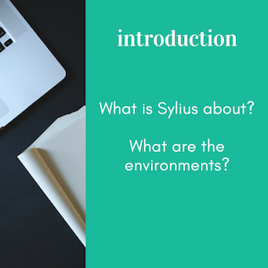
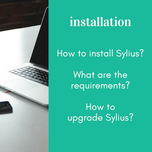
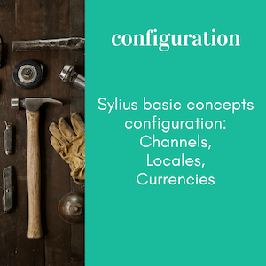
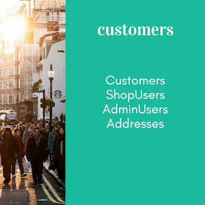
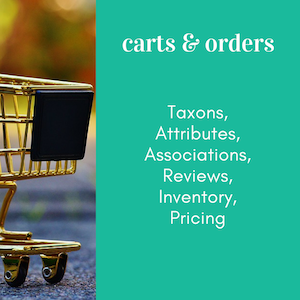

Sylius Documentation
====================

.. image:: /_images/logo.png
   :alt:   Sylius Welcome Page

`Sylius`_ is a modern e-commerce solution for PHP, based on
`Symfony Framework`_.

.. note::

    This documentation assumes you have a working knowledge of the Symfony
    Framework. If you're not familiar with Symfony, please start with
    reading the `Quick Tour`_ from the Symfony documentation.

.. tip::

   **The Book, Customization Guide, REST API Reference, Cookbook, Contribution Guide and Behat Guide**
   are chapters describing the usage of **the whole Sylius platform**, on the examples for Sylius-Standard distribution.

   For tips on using only some bundles of Sylius head to Bundles and Components docs.

The Book
--------

The Developer's guide to leveraging the flexibility of Sylius. Here you will find all the concepts used in the Sylius platform.
:doc:`The Book </book/index>` helps to understand how Sylius works.

.. image:: _images/architecture.png
   :target: `Architecture`_
   :scale: 55%

|

.. toctree::
   :hidden:

   book/index

|

The Customization Guide
-----------------------

:doc:`The Customization Guide </customization/index>` is helpful while wanting to adapt Sylius to your personal business needs.

.. toctree::
   :hidden:

   customization/index

.. include:: /customization/map.rst.inc

Sylius Plugins
--------------

The collection of Sylius Plugins together with the guide on Plugins development.
Remember that you can use all the :doc:`customization techniques </customization/index>` in Plugins.

.. toctree::
   :hidden:

   plugins/index

.. include:: /plugins/map.rst.inc

The Cookbook
------------

:doc:`The Cookbook </cookbook/index>` is a collection of specific solutions for specific needs.

.. toctree::
   :hidden:

   cookbook/index

The REST API Reference
----------------------

:doc:`The API guide </api/index>` covers the REST API of Sylius platform.

.. toctree::
   :hidden:

   api/index

.. include:: /api/map.rst.inc

The BDD Guide
-------------

In :doc:`the BDD Guide </bdd/index>` you will learn how to write clean and reusable features, contexts and pages using Behat.

.. toctree::
   :hidden:

   bdd/index

.. include:: /bdd/map.rst.inc

The Contribution Guide
----------------------

:doc:`The Contribution Guide </contributing/index>` to Sylius.

.. toctree::
   :hidden:

   contributing/index

.. include:: /contributing/map.rst.inc

Support
-------

:doc:`The Support section </support/index>` for Sylius.

.. toctree::
   :hidden:

   support/index

Components & Bundles
--------------------

:doc:`Documentation of all Sylius components and bundles </components_and_bundles/index>` useful when using them standalone.

.. toctree::
   :hidden:

   components_and_bundles/index

.. include:: /components_and_bundles/map.rst.inc

.. _Sylius: http://sylius.com
.. _`Symfony Framework`: http://symfony.com
.. _`Quick Tour`: http://symfony.com/doc/current/quick_tour
.. _`Introduction`: http://docs.sylius.com/en/latest/book/introduction/index.html
.. _`Installation`: http://docs.sylius.com/en/latest/book/installation/index.html
.. _`Architecture`: http://docs.sylius.com/en/latest/book/architecture/index.html
.. _`Configuration`: http://docs.sylius.com/en/latest/book/configuration/index.html
.. _`Customers`: http://docs.sylius.com/en/latest/book/customers/index.html
.. _`Products`: http://docs.sylius.com/en/latest/book/products/index.html
.. _`Carts & Orders`: http://docs.sylius.com/en/latest/book/orders/index.html
.. _`Themes`: http://docs.sylius.com/en/latest/book/themes/index.html
