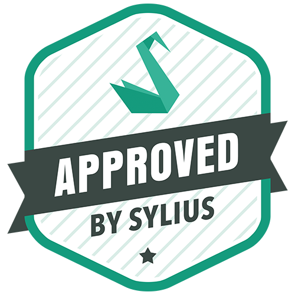

Plugins Approved by Sylius
==========================

As the Sylius eCommerce framework is an open source project it has an awesome community of users and developers.
Therefore our ecosystem flourishes with plugins created outside of our organization. These plugins can become officially
approved by us, when they meet certain requirements. Then, when accepted, they will land on the `official list of plugins
on our website <https://sylius.com/plugins/>`_.

When a plugin is approved by Sylius, you can recognize it also by this badge below in its readme file:

|

How to have a Plugin approved by Sylius?
----------------------------------------

Since Sylius is an open-source platform, there is a certain flow in order for the plugin to become officially adopted by the community.

**1.** Develop the plugin using :doc:`the official Plugin Development guide </plugins/creating-plugin>`.

**2.** Remember about the tests and code quality!

**3.** Send it to the project maintainers. It can be via email to any member of the Sylius Core team, or `the official Sylius Slack <http://sylius.com/slack>`_.

**4.** One of our Plugin Curators will contact you with the feedback regarding your plugin's code quality, test suite,
and general feeling. They will also ask you to provide some changes in the code (if needed) to make this plugin approved.

**5.** Wait for your Plugin to be featured in `the list of plugins <http://sylius.com/developers/store/plugins>`_ on the Sylius website.
