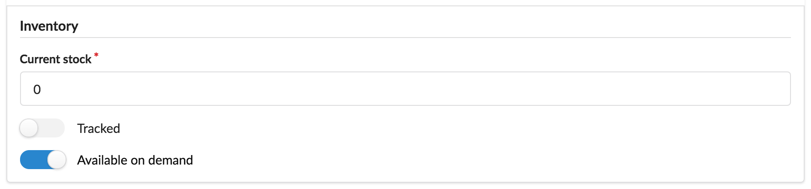

Summary
-------

Congratulations! You've created your first, fully tested and documented, customization to Sylius inside a Sylius plugin!

As a result, you should see a new field in product variant form:

As you can see, there are some things to do at the beginning of development, but now, when you are already familiar with
the whole structure, each next feature can be provided faster than the previous ones.

What's next?
************

Of course, it's only the beginning. You could think about plenty of new features associated with this new product variant
field. What could be the next step?

* :doc:`customizing a product variant grid</customization/grid>`, to see new field on the index page
* customizing template of product details page, to show information to customer if product is not available, but can be ordered on demand
* allowing to order **not available yet, but available on demand** variants and therefore
  customizing the whole :doc:`order processing</components_and_bundles/bundles/SyliusOrderBundle/processors>` and :doc:`inventory operations</components_and_bundles/bundles/SyliusInventoryBundle/services>`

and even more. The limit is only your imagination (and business value, of course!). For more inspiration, we strongly recommend
our :doc:`customizing guide</customization/index>`.

At the end, do not hesitate to contact us at contact@sylius.com when you manage to implement a new plugin.
We would be happy to check it out and add it to our `official plugins list`_!

.. note::

    Beware, that to have your plugin **officially** accepted, it needs to be created with respect to clean-code principles
    and properly tested!

Future
******

We are working hard to make creating Sylius plugins even more developer- and user-friendly. Be in touch with the
`PluginSkeleton`_ notifications and other announcements from Sylius community.
Our plugins base is growing fast - why not be a part of it?

.. _`official plugins list`: https://sylius.com/plugins/
.. _`PluginSkeleton`: https://github.com/Sylius/PluginSkeleton
