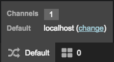
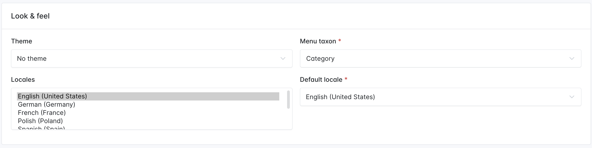
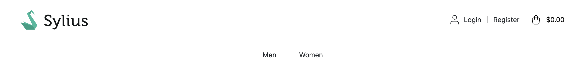
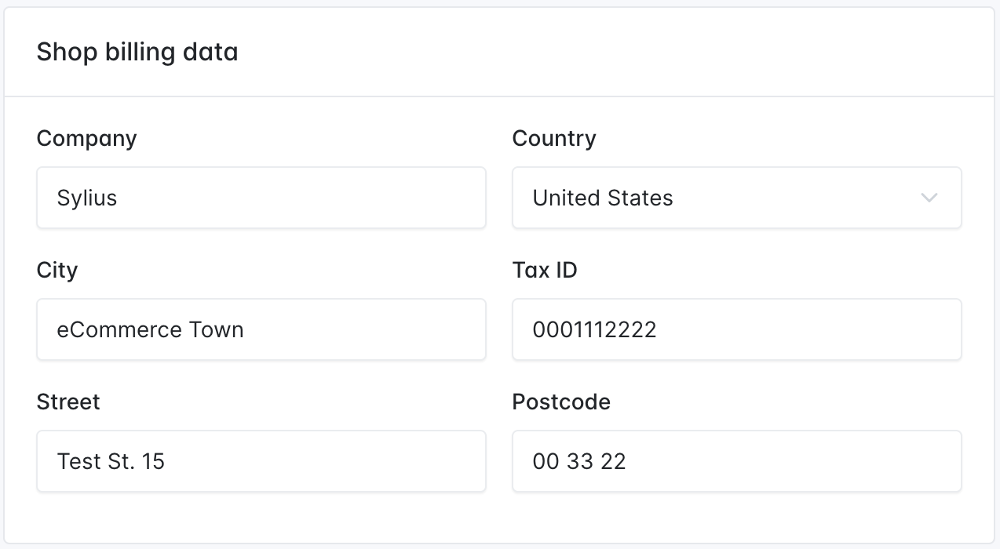
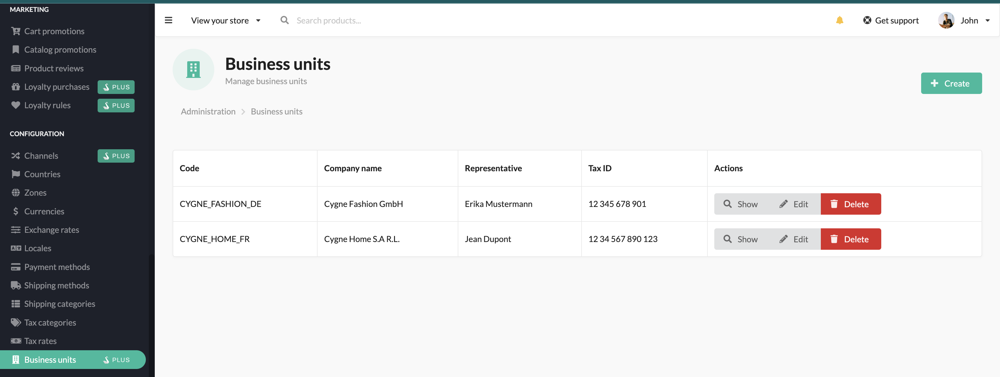
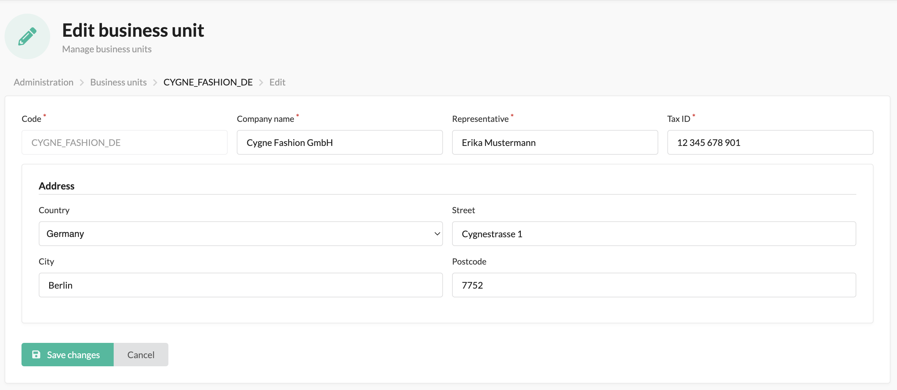
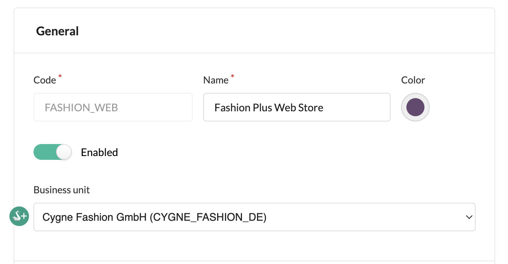

# Channels

In modern commerce, your website is rarely the only way you sell. **Channels** let you run multiple storefronts (B2C, B2B, mobile app, marketplace presence, in‑store POS, brand microsites) from a single Sylius installation and admin.

Each Channel represents one sales context with its configuration: assortment, branding, prices and taxes, languages, currencies, URL/hostname, and more. Administrators and [users are shared across channels by default](#user-content-fn-1)[^1], so you operate everything from one admin panel.

## Channel properties

A Channel is one sales context (e.g., "Web EU", "B2B US", "Mobile App"). These are the knobs you can turn, in plain language:

#### Identity & access

* **Name** – how it appears in the Admin.
* **Code** – short unique ID used by imports/integrations.
* **Hostname** – which domain points to this Channel (e.g., `eu.example.com`).

#### Language & money

* **Default language** – the language pages/emails use when nothing else is chosen.
* **Available languages** – languages shoppers can switch to.
* **Base currency** – the currency you store prices in for this Channel.
* **Enabled currencies** – extra currencies shoppers can view (prices auto‑convert for display purposes via exchange rates).

#### Catalog & presentation

* **Visible assortment** – which products/taxons are offered here (via your catalog settings and visibility rules on each product).
* **Menu root** – where the main navigation starts (pick a Taxon for the top menu).
* **Theme** – storefront theme for this Channel. Each Channel can use a different theme, so storefronts can look completely different.
* **Channel color (Admin only)** – the color label used in the administration to visually mark Channel‑related items (e.g., orders, promotions, listings). It does **not** affect the storefront.

#### Selling rules

* **Countries** – where you sell/ship.
* **Shipping methods** – options shown at checkout for this Channel.
* **Payment methods** – payment options available at checkout for this Channel.
* **Taxes** – how tax is calculated (strategy) and which zones/rates apply.
* **Promotions/pricing** – promotions and price rules that run on this Channel (set on Promotions).

#### Legal & contact

* **Shop billing data** – legal entity on invoices/refunds.
* **Contact email** – public address for customers.

#### Switches & status

* **Enabled** – whether the Channel is live.


**Developer note (quick mapping)** \
Fields behind the scenes: `code`, `name`, `hostname`, `locales` (default + available), `currencies` (base + enabled), `menuTaxon`, `enabled`, `contactEmail`, plus strategy toggles (tax calculation, pricing). \
Use the injected contexts for reads: `ChannelContextInterface`, `LocaleContextInterface`, `CurrencyContextInterface`.



In the dev environment, you can easily check what channel you are currently on in the Symfony debug toolbar.\
\



## Configure a Channel (Admin UI)

#### Create or edit a Channel

1. **Go to**: _Configuration → Channels_.
2. **Create** or **edit** a Channel.
3. Fill out the key fields:
   * **Name** & **Code**.
   * **Hostname** (e.g., `eu.example.com`). This is how Sylius resolves the Channel.
   * **Default locale** (e.g., `en_US`, `pl_PL`) and **Available locales**.
     * The storefront's interface defaults to the **Default locale**.
   * **Base currency** (e.g., `EUR`, `PLN`) and **Available currencies**.
     * Prices are displayed (and stored) in the **Base currency** (unless another enabled currency is selected).
   * **Menu taxon** in **Look & feel** to start the navigation at a specific taxon.
   * (Optional) **Shop Billing Data** (legal entity details for invoices/refunds).
4. **Save**. Visit the hostname to verify the storefront shows the expected language and prices.


**Important**

Pick the **base currency** carefully. Prices are **stored** in the base currency for a channel.

After creation, changing base currency requires a price migration (and is not supported in the UI). Treat it as effectively immutable.


<figure><figcaption></figcaption></figure>

### URLs, SEO, and fallbacks

* **Localized URLs**: By default, Sylius prefixes routes with the `_locale` (e.g., `/pl_PL/product/acme-mug`). If a URL lacks a prefix, Sylius applies the **Channel’s default locale**.
* **Translation fallback**: If a page/product has no content in the current locale, Sylius falls back to the **Channel’s default locale**.
* **Currency fallback**: The shopper is not able to select a currency that isn’t enabled. Sylius, by default, displays the **base currency;** other enabled currencies are used for display only and calculated based on exchange rates. All internal calculations always use the **base currency**.


Want plain (non‑localized) URLs? [You can disable the locale prefix at the shop routing layer and still keep multiple locales for content.](../../shop/how-to-disable-localized-urls.md)


### Different menu root

By default, Sylius will render the same menu for all channels defined in the store, which will be all the children of the taxon with the code _category_. You can customize this behavior by specifying a menu taxon in the “Look & feel” section of the desired channel.

<figure><figcaption></figcaption></figure>

With this configuration, this particular channel will expose a menu starting from the children of the chosen taxon (T-Shirt taxon in this example):

<figure><figcaption></figcaption></figure>

The rest of the channels will still render only the children of the &#x43;_&#x61;tegory_ taxon.

### Shop Billing Data

For [Invoicing](https://docs.sylius.com/en/1.13/book/orders/invoices.html) and [Credit Memo](https://docs.sylius.com/en/1.13/book/orders/refunds.html) purposes Channels are supplied with a section named Shop Billing Data, which is editable on the Channel create/update form.

<figure><figcaption></figcaption></figure>

<div data-full-width="false"><figure><figcaption></figcaption></figure></div>

#### Business Units

Sylius Plus is supplied with an enhanced version of Shop Billing Data from Sylius CE. It is also used for Invoicing and Refunds purposes. Still, it is a separate entity, that you can create outside of the Channel and then pick a previously created Business Unit on the Channel form.

<figure><figcaption></figcaption></figure>

<div data-full-width="false"><figure><figcaption></figcaption></figure></div>

<div data-full-width="false"><figure><figcaption></figcaption></figure></div>

<div data-full-width="false"><figure><figcaption></figcaption></figure></div>

## Developer guide

### **How to get the current channel?**

You can get the current channel from the channel context.

```php
$channel = $this->container->get('sylius.context.channel')->getChannel();
```


Beware! When using multiple channels, remember to configure `hostname` for **each** of them. If missing, the default context will not be able to provide an appropriate channel, resulting in an error.



The channel is by default determined based on the hostname, but you can customize that behavior. To do that you have to implement the `Sylius\Component\Channel\Context\ChannelContextInterface` and register it as a service under the `sylius.context.channel` tag. You should also add a `priority="64"` since the default ChannelContext has a `priority="0"` (and by default a `priority="0"` is assigned).



Moreover, if the channel depends mainly on the request you can implement the `Sylius\Component\Channel\Context\RequestBased\RequestResolverInterface` with its `findChannel(Request $request)` method and register it under the `sylius.context.channel.request_based.resolver` tag.


***

### Symfony Integration: Request Locale

Sylius integrates with Symfony’s request handling system and automatically sets the locale on the Symfony Request object based on the current channel.

#### How It Works

* The current channel is resolved via sylius.context.channel
* The locale is injected into Symfony’s Request object as request.locale
* All translations, validators, and templates use this locale

#### Accessing Locale and Currency in Code

In a custom service or controller:

```php
$locale = $this->get('sylius.context.locale')->getLocaleCode();
$currency = $this->get('sylius.context.currency')->getCurrencyCode();
$channel = $this->get('sylius.context.channel')->getChannel();
```

Or using Symfony’s Request object:

```php
$locale = $request->getLocale();
```


Use the Sylius context services where possible—they account for additional logic such as customer preferences or channel-specific configuration.



### Best Practices

* Always set the correct base currency when creating a channel
* Provide content and pricing in all enabled locales and currencies
* Use sylius.context.\* services to ensure compatibility with Sylius internals


[^1]: Unless you have the Multi Store module from Sylius Plus.
