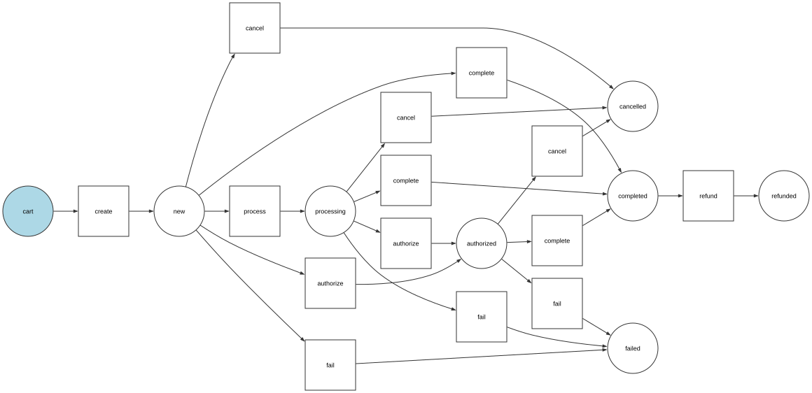
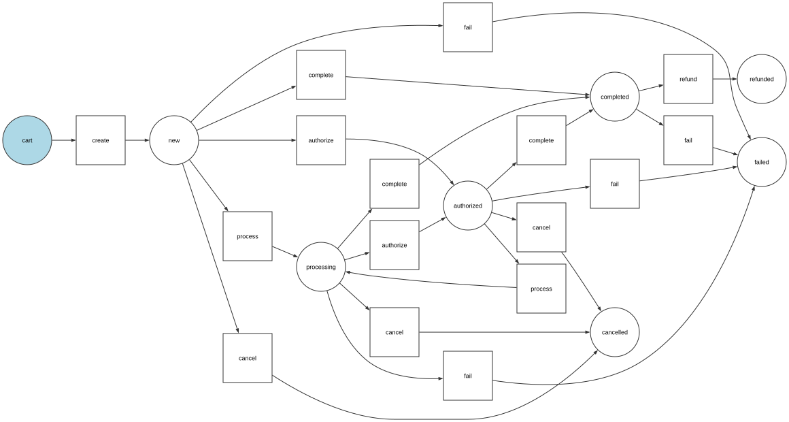

# Customizing State Machines

Sylius uses Symfony's Workflow Component to manage business processes such as order checkout and payment flows. These workflows (also called state machines) define the states an entity can be in and how transitions between these states happen.

Sylius provides predefined workflows, but many projects require customizations. This guide will walk you through how to find, extend, and modify these workflows in a clear, step-by-step way.


To get an overview of how state machines are structured and used across Sylius resources (like orders, shipments, and payments), refer to the [State Machine Architecture Guide](../the-book/architecture/state-machine.md) in the Sylius Book.


## How to find the desired state machine to customize?

#### Locate the Workflow Graph

Each workflow in Sylius is defined with a unique graph constant. For example, the **order checkout workflow** uses:

```php
Sylius\Component\Core\OrderCheckoutTransitions::GRAPH
```

#### Explore Defined Workflows

You can list all configured Sylius workflows using Symfony’s console tool:

```bash
php bin/console debug:config framework workflows | grep sylius_
```

This will display all defined workflows, their states (places), and transitions.


**Best Practice**: Always reference workflows, states, and transitions using constants (e.g., `OrderCheckoutTransitions::GRAPH`) rather than raw strings. This ensures better maintainability and fewer typos.\
You can find all the workflow constants [here](https://github.com/Sylius/Sylius/tree/v2.0.7/src/Sylius/Bundle/CoreBundle/Resources/config/app/workflow).


## Extending the existing workflows

Let’s assume you want to **add a new state** and a **custom transition** to the order checkout workflow.

#### Add a New State

Update your `config/packages/_sylius.yaml`:

```yaml
framework:
    workflows:
        !php/const Sylius\Component\Core\OrderCheckoutTransitions::GRAPH:
            places:
                - 'custom_state'
```

#### Add a New Transition

Create a transition from an existing state to the new `custom_state`:

```yaml
framework:
    workflows:
        !php/const Sylius\Component\Core\OrderCheckoutTransitions::GRAPH:
            transitions:
                custom_transition:
                    from: !php/const Sylius\Component\Core\OrderCheckoutStates::STATE_ADDRESSED
                    to: 'custom_state'
```

You can now create custom logic triggered by this transition if needed.

#### Result:

The workflow before:

<figure><figcaption></figcaption></figure>

The workflow after:

<figure><figcaption></figcaption></figure>


To learn how to generate graphs like the ones used in this guide, visit [this site](https://symfony.com/doc/current/workflow/dumping-workflows.html).


### Removing Transitions and States

Sometimes, you need to remove default transitions or states. This requires a **compiler pass** to alter Symfony's service container.

***

#### Example 1: Remove the `skip_shipping` Transition

**Step 1: Create `RemoveSkipShippingTransitionCompilerPass.php`**

```php
<?php

namespace App\DependencyInjection\Compiler;

use Sylius\Component\Core\OrderCheckoutTransitions;
use Symfony\Component\DependencyInjection\Compiler\CompilerPassInterface;
use Symfony\Component\DependencyInjection\ContainerBuilder;

final class RemoveSkipShippingTransitionCompilerPass implements CompilerPassInterface
{
    public function process(ContainerBuilder $container): void
    {
        $graph = OrderCheckoutTransitions::GRAPH;
        $transitionToRemove = OrderCheckoutTransitions::TRANSITION_SKIP_SHIPPING;

        $definition = $container->getDefinition(sprintf('state_machine.%s.definition', $graph));
        $transitions = $definition->getArgument(1);

        foreach ($transitions as $i => $ref) {
            $transitionDef = $container->getDefinition((string) $ref);
            if ($transitionDef->getArgument(0) === $transitionToRemove) {
                unset($transitions[$i]);
                break;
            }
        }

        $definition->replaceArgument(1, array_values($transitions));
    }
}
```

***

#### Example 2: Remove the `shipping_skipped` State

**Step 2: Create `RemoveShippingSkippedStateCompilerPass.php`**

```php
<?php

namespace App\DependencyInjection\Compiler;

use Sylius\Component\Core\OrderCheckoutStates;
use Sylius\Component\Core\OrderCheckoutTransitions;
use Symfony\Component\DependencyInjection\Compiler\CompilerPassInterface;
use Symfony\Component\DependencyInjection\ContainerBuilder;

final class RemoveShippingSkippedStateCompilerPass implements CompilerPassInterface
{
    public function process(ContainerBuilder $container): void
    {
        $graph = OrderCheckoutTransitions::GRAPH;
        $stateToRemove = OrderCheckoutStates::STATE_SHIPPING_SKIPPED;

        $definition = $container->getDefinition(sprintf('state_machine.%s.definition', $graph));
        $places = $definition->getArgument(0);
        $transitions = $definition->getArgument(1);

        $placeKey = array_search($stateToRemove, $places, true);
        if ($placeKey !== false) {
            unset($places[$placeKey]);
            $places = array_values($places);
        }

        foreach ($transitions as $i => $ref) {
            $transitionDef = $container->getDefinition((string) $ref);
            $from = (array) $transitionDef->getArgument(1);
            $to = $transitionDef->getArgument(2);

            if (in_array($stateToRemove, $from, true) || $to === $stateToRemove) {
                unset($transitions[$i]);
            }
        }

        $definition->replaceArgument(0, $places);
        $definition->replaceArgument(1, array_values($transitions));
    }
}
```

***

#### Register Compiler Passes

In your `Kernel.php`:

```php
protected function build(ContainerBuilder $container): void
{
    $container->addCompilerPass(new \App\DependencyInjection\Compiler\RemoveSkipShippingTransitionCompilerPass());
    $container->addCompilerPass(new \App\DependencyInjection\Compiler\RemoveShippingSkippedStateCompilerPass());
}
```

Result:

<figure><figcaption></figcaption></figure>

### Extending the existing Transitions

By default, Symfony's Workflow component does not merge configuration arrays for transitions, meaning you cannot simply add more `from` states to an existing transition using the regular `workflow` configuration in your `config/packages` files.&#x20;

To work around this limitation and programmatically extend an existing transition, such as adding new `from` places to it, you can implement a custom **Compiler Pass**.&#x20;

Here is an example of how you can dynamically add new `from` states to the existing transitions in the `sylius_payment` state machine.

#### Create a compiler pass:

```php
<?php

namespace App\DependencyInjection\Compiler;

use Symfony\Component\DependencyInjection\Compiler\CompilerPassInterface;
use Symfony\Component\DependencyInjection\ContainerBuilder;
use Symfony\Component\DependencyInjection\Definition;
use Symfony\Component\Workflow\Transition;

final class ExtendPaymentWorkflowTransitionPass implements CompilerPassInterface
{
    private const REQUIRED_TRANSITIONS = [
        ['name' => 'process', 'from' => 'authorized', 'to' => 'processing'],
        ['name' => 'fail', 'from' => 'completed', 'to' => 'failed'],
    ];

    public function process(ContainerBuilder $container): void
    {
        if (!$container->hasDefinition('state_machine.sylius_payment.definition')) {
            return;
        }

        $definition = $container->getDefinition('state_machine.sylius_payment.definition');
        $transitions = $definition->getArgument(1);

        $existingTransitions = $this->extractExistingTransitions($transitions);
        $updatedTransitions = $this->addMissingTransitions($transitions, $existingTransitions);

        $definition->setArgument(1, $updatedTransitions);
    }

    /**
     * @param array<Definition> $transitions
     *
     * @return array<string>
     */
    private function extractExistingTransitions(array $transitions): array
    {
        $existingTransitions = [];

        foreach ($transitions as $transition) {
            if (!$transition instanceof Definition) {
                continue;
            }

            $arguments = $transition->getArguments();
            if (count($arguments) < 3) {
                continue;
            }

            [$name, $froms, $tos] = $arguments;
            foreach ($froms as $from) {
                foreach ($tos as $to) {
                    $existingTransitions[] = $this->createTransitionKey($name, $from, $to);
                }
            }
        }

        return $existingTransitions;
    }

    /**
     * @param array<Definition> $transitions
     * @param array<string> $existingTransitions
     *
     * @return array<Definition>
     */
    private function addMissingTransitions(array $transitions, array $existingTransitions): array
    {
        foreach (self::REQUIRED_TRANSITIONS as $requiredTransition) {
            $transitionKey = $this->createTransitionKey(
                $requiredTransition['name'],
                $requiredTransition['from'],
                $requiredTransition['to']
            );

            if (!in_array($transitionKey, $existingTransitions, true)) {
                $transitions[] = $this->createTransitionDefinition($requiredTransition);
            }
        }

        return $transitions;
    }

    private function createTransitionKey(string $name, string $from, string $to): string
    {
        return sprintf('%s:%s:%s', $name, $from, $to);
    }

    /** @param array{name: string, from: string, to: string} $transitionConfig */
    private function createTransitionDefinition(array $transitionConfig): Definition
    {
        $transition = new Definition(Transition::class);
        $transition->setArguments([
            $transitionConfig['name'],
            [$transitionConfig['from']],
            [$transitionConfig['to']],
        ]);

        return $transition;
    }
}

```

#### Register it in your `Kernel.php`:

```php
protected function build(ContainerBuilder $container): void
{
    $container->addCompilerPass(new \App\DependencyInjection\Compiler\ExtendPaymentWorkflowTransitionPass());
}
```

#### Result:

Before:

<figure><figcaption></figcaption></figure>

After:

<figure><figcaption></figcaption></figure>

### Adding Workflow Callbacks

You can hook into workflow events using **Symfony event listeners**.

#### Example: Send an Email After Order Completion

Create a listener class:

```php
namespace App\EventListener\Workflow\OrderCheckout;

use Symfony\Component\Workflow\Event\CompletedEvent;

final class SendEmailWithGiftCodeAfterOrderCompletionListener
{
    public function __invoke(CompletedEvent $event): void
    {
        // Send gift email
    }
}
```

Register the service:

```yaml
services:
    app.listener.workflow.order_checkout.send_email_with_gift:
        class: App\EventListener\Workflow\OrderCheckout\SendEmailWithGiftCodeAfterOrderCompletionListener
        tags:
            - { name: kernel.event_listener, event: workflow.sylius_order_checkout.completed.complete, priority: 100 }
```

### Overriding Existing Workflow Listeners

To customize existing logic, redefine the listener service.

#### Example: Customize Shipping State Resolver

```yaml
services:
    sylius.listener.workflow.order_checkout.resolve_order_shipping_state:
        class: App\EventListener\Workflow\OrderCheckout\ResolveOrderShippingStateListener
        tags:
            - { name: kernel.event_listener, event: workflow.sylius_order_checkout.completed.complete, priority: 100 }
```

***

### 🔧 Debug Your Workflow Setup

Use this command to see what listeners are registered for a workflow event:

```bash
php bin/console debug:event workflow.sylius_order_checkout.completed.complete
```

***

### Optional: Legacy Winzou State Machine

If you're migrating from Sylius 1.x or using the [Winzou State Machine](https://github.com/winzou/StateMachineBundle), refer to its documentation for configuring transitions differently or to [Sylius 1.x documentation](https://old-docs.sylius.com/en/1.14/customization/state_machine.html).
